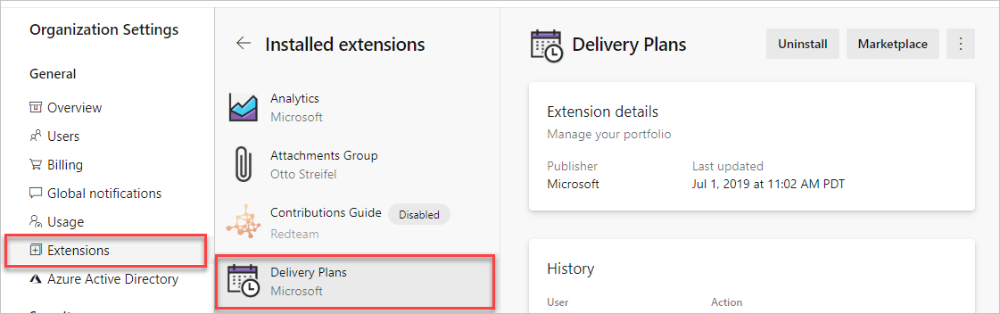
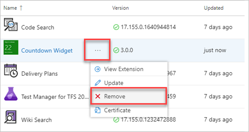

 
# Uninstall or disable extensions

[!INCLUDE [version-vsts-tfs-2015-on](../boards/_shared/version-vsts-tfs-2015-on.md)]

When you don't need an extension anymore, you can uninstall or disable the extension. This article shows you how.

> [!NOTE]
> Charges continue for a paid extension until you [reduce all users to zero (0) for this extension](../organizations/billing/change-number-paid-extension-users.md).

## Prerequisites

You must be a [Project Collection Administrator](../organizations/security/set-project-collection-level-permissions.md) with [**Edit collection-level information** permissions](../organizations/security/permissions.md#collection) to uninstall or disable extensions.

::: moniker range="azure-devops"

## Uninstall or disable extensions in Azure DevOps Services

1. Sign in to your organization (```https://dev.azure.com/{yourorganization}```).
2. Select  **Organization settings**.
   
   

3. Select **Extensions**, and then select the extension that you want to uninstall or disable.

   

4. Select **Uninstall** or select the ellipses (**...**), and then select **Disable**.

   

::: moniker-end

::: moniker range=">= tfs-2015 <= azure-devops-2019"

## Uninstall extensions from the local gallery in TFS or Azure DevOps Server

1. Navigate to the local gallery management portal, (```http://{server}/_gallery/manage```).

2. For the desired extension, select the ellipses (**...**), and then select **Remove**.

   

::: moniker-end

::: moniker range=">= tfs-2015 <= azure-devops-2019"

## Uninstall extensions in a Team Foundation Server Collection

1. Navigate to the local gallery management portal, (```http://{server}:8080/tfs/_gallery/manage```).

2. For the desired extension, select the ellipses (**...**), and then select **Remove**.

   

::: moniker-end


