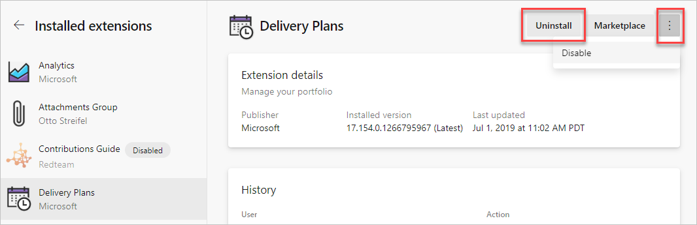

 
# Uninstall or disable extensions

[!INCLUDE [version-vsts-tfs-2015-on](../boards/_shared/version-vsts-tfs-2015-on.md)]

When you don't need an extension anymore, you can uninstall or disable this extension.

> [!NOTE]
> Charges continue for a paid extension until you [reduce all users to zero (0) for this extension](../organizations/billing/change-number-paid-extension-users.md).

## Prerequisites

You must be a [Project collection administrator](../organizations/security/set-project-collection-level-permissions.md) with [**Edit collection-level information** permissions](../organizations/security/permissions.md#collection) to uninstall or disable extensions.

## Disable or uninstall extensions

::: moniker range=">= azure-devops-2019"

1. Sign in to your organization, ```https://dev.azure.com/{yourorganization}```.

2. Select the shopping bag icon and **Manage extensions**.

   

3. Right click or choose the ellipses (...) on the extension and then choose **uninstall** or **disable**.

   

::: moniker-end

::: moniker range="<= tfs-2018"

1. Sign in to your organization, ```https://dev.azure.com/{yourorganization}```.

2. Select the shopping bag icon and **Manage extensions**.

   

3. Right click or choose the ellipses (...) on the extension and then choose **uninstall** or **disable**.

   

::: moniker-end
