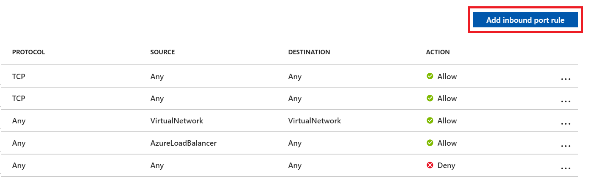
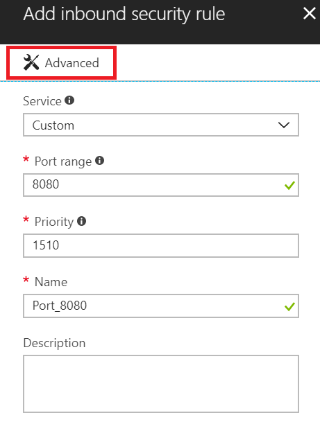
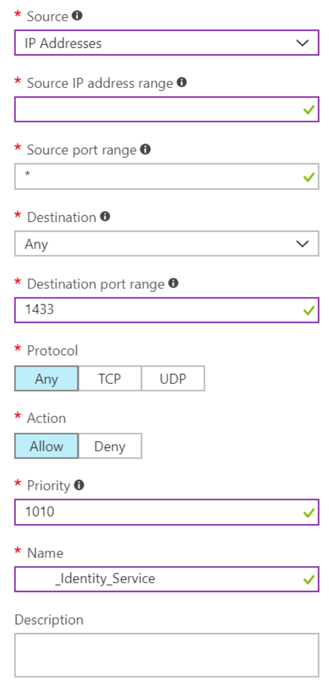
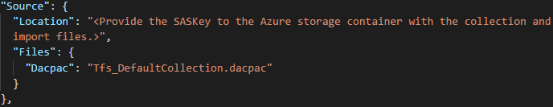
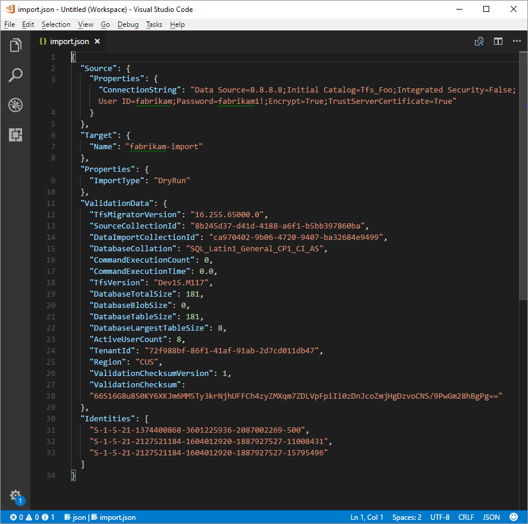

# Import large collections 

[!INCLUDE [version-azure-devops](includes/version-azure-devops.md)]

<a id="import-large-collections"></a>


For databases that the data migration tool warns are too big, a different data packaging approach is required to migrate to Azure DevOps Services. If you're unsure whether your collection exceeds the size threshold, you should run a data migration tool validation on the collection. The validation lets you know whether you need to use the SQL Azure VM method for import. 

## Determine if you can reduce the collection size

Before you proceed, we recommend checking to see whether your [old data can be cleaned up](/azure/devops/server/upgrade/clean-up-data). Over time, collections can build up very large volumes of data. This is a natural part of the DevOps process, but you might find that you don't need to retain all of the data. Some common examples of no longer relevant data are older workspaces and build results. 

Cleaning older, no-longer-relevant artifacts could remove a lot more space than you might expect, and it could determine whether you use the DACPAC import method or a SQL Azure VM. 

> [!IMPORTANT]
> After you've deleted older data, it *can't* be recovered unless you restore an older backup of the collection.

If you're under the DACPAC threshold, follow the instructions to [generate a DACPAC](migration-import.md#dacpac-file) for import. If you still can't get the database under the DACPAC threshold, you need to set up a SQL Azure VM to import to Azure DevOps Services. 

## Set up a SQL Azure VM to import to Azure DevOps Services

Let's walk through how to accomplish this. At a high level, you'll:

* Set up a SQL Azure VM.  
* (Optional) Restrict access to Azure DevOps Services IPs only.  
* Configure IP firewall exceptions.  
* Restore your database on the VM.  
* Configure your collection for import.  
* Configure the import specification file to target the VM  

## Set up a SQL Azure VM

You can set up a SQL Azure VM from the Azure portal with just a few clicks. To learn how, see [Use the Azure portal to provision a Windows virtual machine with SQL Server](/azure/azure-sql/virtual-machines/windows/create-sql-vm-portal). 

Azure DevOps Services is available in several [Azure regions](https://azure.microsoft.com/regions/services/) across the globe. 

> [!IMPORTANT]
> To ensure that the import starts successfully, it's critical to place your data in the correct region. If you set up your SQL Azure VM in a location other than the regions listed in the following table, the import will fail to start.

If you're using this import method, determine where to create your SQL Azure VM by referring to the following table. Creating your VM in a region other than those in this list is not supported for running an import.

| Desired import region | SQL Azure VM region |
| --- | --- |
| Central United States | Central US, East US, East US 2, North Central US, South Central US, West Central US, West US, West US 2 |
| Western Europe | North Europe, West Europe |
| Australia East | Australia Central, Australia East, Australia Southeast |
| Brazil South | Brazil South |
| South India | Central India, South India, West India |
| Central Canada | Canada Central, Canada East |
| Asia Pacific | Southeast Asia (Singapore) |
| UK South | UK South, UK West |

<br> 

Although Azure DevOps Services is available in multiple regions in the US, only the Central United States region accepts new organizations. Companies can't import their data into other US Azure regions at this time. 

> [!NOTE] 
> DACPAC customers should consult the region table in the ["Step 3: Upload the DACPAC file" section](migration-import.md#step-3-upload-the-dacpac-file). The preceding guidelines are for SQL Azure VMs only. 

Here are a few more SQL Azure VM configurations that we recommend:

- Use D Series VMs, because they're optimized for database operations.
- Ensure that the D Series VMs have at least 28 gigabytes (GB) of RAM. For imports, we recommend Azure D12 V2 VM sizes.
- [Configure the SQL temporary database](/sql/relational-databases/databases/move-system-databases#Examples) to use a drive other than drive C. Ideally the drive should have ample free space; at least equivalent to your database's [largest table](migration-import.md#step-2-generate-a-dacpac-file).
- If your source database is still over 1 terabyte (TB) after you've [reduced its size](/azure/devops/server/upgrade/clean-up-data), you need to [attach additional 1-TB disks](/azure/virtual-machines/windows/attach-disk-portal) and combine them into a single partition to restore your database on the VM. 
- If your collection databases are over 1 TB in size, consider using an SSD for both the temporary database and collection database. Also, consider using larger VMs with 16 virtual CPUs (vCPUs) and 128 GB of RAM.
- You need to have a public facing IP address for the service to reach this machine.

<a id="ips"></a>

## (Optional) Restrict access to Azure DevOps Services IPs only 

We highly recommend that you restrict access to your VM to only IPs from Azure DevOps Services. You do this by allowing connections only from the set of Azure DevOps Services IPs that are involved in the collection database import process. The IPs that need to be granted access to your collection database depend on the region you're importing into. The following tables can help you identify the correct IPs. The only port that's required to be opened to connections is the standard SQL connection port 1433. 

First, no matter what Azure DevOps Services region you import into, you must grant the following IP addresses access to your collection database. 

> [!NOTE] 
> In the following table, the two IP addresses listed with x.x.x.0/23 indicate a range. Allow the entire /23 range. For example, if you're importing into the Central United States region, allow the /23 range for 20.37.158.0. For IP addresses with x.x.x.0/24, allow the /24 range.

| Service | IP address |
| --- | --- |
| Azure DevOps Services Identity Service | 168.62.105.45, 40.81.42.115 |

<br> 

Next, grant access to the Regional Identity Service. You need to grant an exception for the data migration tool instance only in the region that you're importing into. 

| Service | IP address |
| --- | --- |
| Regional Identity Service - Central United States | 13.89.236.72, 52.165.41.252, 52.173.25.16, 13.86.38.60, 20.45.1.175, 13.86.36.181, 52.154.53.1, 52.158.209.56, 20.37.138.122, 20.37.158.0/23, 20.37.139.247, 20.37.158.5 |
| Regional Identity Service - West Europe | 20.67.123.240, 52.166.54.85, 13.95.233.212, 52.236.145.119, 52.142.235.223, 52.236.147.103, 23.97.221.25, 52.233.181.148, 52.149.110.153, 51.144.61.32, 52.236.147.236, 40.74.28.0/23 |
| Regional Identity Service - Australia East | 13.75.145.145, 40.82.217.103, 20.188.213.113, 104.210.88.194, 40.81.62.114, 20.37.194.0/24 |
| Regional Identity Service - Brazil South | 20.40.114.3, 191.235.90.183, 191.232.38.181, 191.233.25.175, 191.235.226.0/24 |
| Regional Identity Service - India South | 104.211.227.29, 40.81.75.130, 52.172.54.122, 52.172.49.252, 20.41.194.0/24 |
| Regional Identity Service - Canada Central | 52.237.19.6, 40.82.190.38, 52.228.82.0/243 |
| Regional Identity Service - Asia Pacific (Singapore) | 20.195.68.0/24 |
| Regional Identity Service - UK South | 40.81.159.67, 51.104.26.0/24 |

<br> 
  
Next, grant access to the data migration tool for Azure DevOps itself. You need to grant an exception for the data migration tool instance only in the region that you're importing into.  

| Service | IP address |
| --- | --- |
| Data migration tool - Central United States | 52.173.74.9, 52.165.184.188, 20.45.1.234, 13.86.39.123 |
| Data migration tool - West Europe | 40.115.43.138, 13.95.15.128, 52.236.146.105, 40.67.219.89, 40.119.145.63, 52.142.236.228, 52.142.238.75 |
| Data migration tool - Australia East | 13.75.134.204, 40.82.219.41, 20.40.124.19 |
| Data migration tool - Brazil South | 104.41.24.164, 20.40.115.123 |
| Data migration tool - India South | 13.71.120.31, 40.81.76.137 |
| Data migration tool - Canada Central | 52.237.18.100, 52.237.24.61, 40.82.191.163 |
| Data migration tool - Asia Pacific (Singapore) | 20.195.68.0/24 |
| Data migration tool - UK South | 40.81.153.223, 51.105.8.98, 51.104.26.2 |

<br> 
  
Next, grant Azure DevOps Services access. Again, you need to grant an exception for the Azure DevOps Services instance only in the region that you're importing into.  

| Service | IP address |
| --- | --- |
| Azure DevOps Services - Central United States | 13.89.236.72, 52.165.41.252, 52.173.25.16, 13.86.38.60, 20.45.1.175, 13.86.36.181, 52.158.209.56 |
| Azure DevOps Services - West Europe | 52.166.54.85, 13.95.233.212, 52.236.145.119, 52.142.235.223, 52.236.147.103, 23.97.221.25, 52.233.181.148, 52.149.110.153, 51.144.61.32, 52.236.147.236 |
| Azure DevOps Services - Australia East | 13.75.145.145, 40.82.217.103, 20.188.213.113, 104.210.88.194, 40.81.62.114 |
| Azure DevOps Services - Brazil South | 20.40.114.3, 191.235.90.183, 191.232.38.181, 191.233.25.175 |
| Azure DevOps Services - India South | 104.211.227.29, 40.81.75.130, 52.172.54.122, 52.172.49.252 |
| Azure DevOps Services - Canada Central | 52.237.19.6, 40.82.190.38 |
| Azure DevOps Services - Asia Pacific (Singapore) | 20.195.68.0/24 |
| Azure DevOps Services - UK South | 40.81.159.67, 51.105.8.98, 51.104.26.2, 51.104.26.5 |

<br> 

Next, grant Azure Pipelines Releases service access. You need to grant an exception for the Azure DevOps Services instance only in the region that you're importing into.

**Release Management IPs**  

| Service | IP address |
| --- | --- |
| Releases service - United States | 23.102.153.83, 23.101.127.247, 23.100.85.250, 13.86.39.233, 40.80.217.53, 52.232.229.122 |
| Releases service - West Europe | 13.95.223.69, 104.45.64.13 |
| Releases service - Australia East | 13.73.204.151, 20.40.176.135 |
| Releases service - Brazil South | 191.235.94.154, 20.40.116.69 |
| Releases service - India South | 52.172.15.233, 40.81.79.60 |
| Releases service - Canada Central | 52.237.28.171, 40.82.189.127 |
| Releases service - Asia Pacific (Singapore) | 20.195.68.0/24 |
| Releases service - UK South | 40.81.156.207 |

<br>   

Next, grant Azure Artifacts access. Again, you need to grant an exception for the Azure DevOps Services instance only in the region that you're importing into.  

**Azure Artifacts IPs**  

Add exceptions for all three services that make up Azure Artifacts.

| Service | IP address |
| --- | --- |
| Azure Artifacts - United States | 52.173.148.93, 104.43.253.181, 23.99.179.148, 40.80.222.154, 40.119.0.130, 40.119.0.139, 13.86.125.169, 20.41.44.47, 40.90.219.165 |
| Azure Artifacts - West Europe | 104.46.45.12, 52.236.148.212 |
| Azure Artifacts - Australia East | 13.73.100.166, 20.40.176.15, 40.81.59.69 |
| Azure Artifacts - Brazil South | 191.234.179.224, 20.40.115.214 |
| Azure Artifacts - India South | 52.172.11.191, 40.81.74.79 |
| Azure Artifacts - Canada Central | 52.237.24.224, 40.85.224.121, 13.71.189.199, 40.82.188.122 |
| Azure Artifacts - Asia Pacific (Singapore) | 20.195.68.0/24 |
| Azure Artifacts - UK South | 51.145.120.132 |

<br> 

| Service | IP address |
| --- | --- |
| Azure Artifacts Feed - United States | 52.173.251.89, 20.45.1.3, 40.67.190.224, 20.41.58.125, 40.119.1.14, 20.45.1.249 |
| Azure Artifacts Feed - West Europe | 40.118.19.43, 52.236.146.118 |
| Azure Artifacts Feed - Australia East | 13.70.143.138, 20.40.176.80 |
| Azure Artifacts Feed - Brazil South | 191.235.93.87, 20.40.116.17 |
| Azure Artifacts Feed - India South | 52.172.8.41,40.81.79.49 |
| Azure Artifacts Feed - Canada Central | 52.237.19.70, 40.82.188.254 |
| Azure Artifacts Feed - Asia Pacific (Singapore) | 20.195.68.0/24 |
| Azure Artifacts Feed - UK South | 51.145.120.49 |

<br>   

| Service | IP address |
| --- | --- |
| Azure Artifacts Blob - United States | 70.37.94.103, 40.78.129.25, 40.67.155.236, 52.230.216.163, 20.45.3.51 |
| Azure Artifacts Blob - West Europe | 23.97.221.25 |
| Azure Artifacts Blob - Australia East | 40.127.86.30, 20.188.213.113, 40.82.221.14 |
| Azure Artifacts Blob - Brazil South | 191.235.90.183 |
| Azure Artifacts Blob - India South | 52.172.54.122 |
| Azure Artifacts Blob - Canada Central | 52.237.16.145, 52.237.16.145, 52.233.38.115, 40.82.187.186 |
| Azure Artifacts Blob - Asia Pacific (Singapore) | 20.195.68.0/24 |
| Azure Artifacts Blob - UK South | 51.143.174.59, 40.81.152.41 |

<br>  

**Test Plans IPs**  

Add exceptions for Test Plans IP addresses only in the region you're migrating into.

| Service | IP address |
| --- | --- |
| Test Plans - United States | 52.253.227.131, 40.91.89.233, 20.41.47.199, 40.91.117.40, 40.91.126.113, 20.37.141.154 |
| Test Plans - West Europe | 40.119.145.57 |
| Test Plans - Australia East | 20.40.177.101 |
| Test Plans - Brazil South | 20.40.118.62 |
| Test Plans - India South | 40.81.72.10 |
| Test Plans - Canada Central | 40.82.184.28 |
| Test Plans - Asia Pacific (Singapore) | 20.195.68.0/24 |
| Test Plans - UK South | 40.81.159.9 |

<br>  

**Analytics IPs (Azure DevOps Server 2019 or later only)**  

If you included preview features with your import, add an exception for the analytics IPs only in your target import region. 

| Service | IP address |
| --- | --- |
| Analytics service - United States | 20.41.43.22, 20.36.236.83, 20.41.40.50, 52.143.251.221, 52.242.212.199, 13.86.33.148, 13.86.39.80 |
| Analytics service - West Europe | 52.236.146.143, 52.236.146.9, 52.149.108.23 |
| Analytics service - Australia East | 20.40.179.159 |
| Analytics service - Brazil South | 20.40.113.248 |
| Analytics service - India South | 40.81.73.58 |
| Analytics service - Canada Central | 40.82.185.214 |
| Analytics service - Asia Pacific (Singapore) | 20.195.68.0/24 |
| Analytics service - UK South | 40.81.159.247 |

<br> 

> [!NOTE] 
> Alternatively, you can also use [Service Tags](/azure/virtual-network/service-tags-overview) in place of explicit IP ranges. Azure Service Tags are a convenient way for customers to manage their networking configuration to allow traffic from specific Azure services. Customers can easily allow access by adding the tag name azuredevops to their network security groups or firewalls either through the portal or programmatically. 

## Configure IP firewall exceptions

Granting exceptions for the necessary IPs is handled at the Azure networking layer for your SQL Azure VM. To get started, go to your SQL Azure VM in the [Azure portal](https://ms.portal.azure.com). In **Settings**, select **Networking**. This will take you to the network interface page for your SQL Azure VM. The data migration tool requires the Azure DevOps Services IPs to be configured for inbound connections only on port 1431. You can grant exceptions for the IPs by selecting **Add inbound port rule** in the networking settings. 



On the **Add inbound security rule** pane, select **Advanced** to configure an inbound port rule for a specific IP. 



In the **Source** drop-down list, select **IP Addresses**, enter an IP address that needs to be granted an exception, set the **Destination port range** to **1433** and, in the **Name** box, enter a name that best describes the exception you're configuring. 

Depending on other inbound port rules that have been configured, you might need to change the default priority for the Azure DevOps Services exceptions so they don't get ignored. For example, if you have a "deny on all inbound connections to 1433" rule with a higher priority than your Azure DevOps Services exceptions, the data migration tool might be unable to make a successful connection to your database. 



Repeat adding inbound port rules until all necessary Azure DevOps Services IPs have been granted an exception. Missing one IP could result in your import failing to start. 

## Restore your database on the VM

After you set up and configure an Azure VM, you need to take your detached backup from your Azure DevOps Server instance to your Azure VM. Azure has [several documented methods](/azure/azure-sql/virtual-machines/windows/migrate-to-vm-from-sql-server) for how to accomplish this task. The collection database needs to be restored on your SQL instance and doesn't require Azure DevOps Server to be installed on the VM. 

## Configure your collection for import

After your collection database has been restored on your Azure VM, configure a SQL login to allow Azure DevOps Services to connect to the database to import the data. This login allows only *read* access to a single database. 

To start, open SQL Server Management Studio on the VM, and then open a new query window against the database to be imported. 

Set the database's recovery to simple: 

```sql
ALTER DATABASE [<Database name>] SET RECOVERY SIMPLE;
```

Create a SQL login for the database, and assign that login the 'TFSEXECROLE':

```sql
USE [<database name>]
CREATE LOGIN <pick a username> WITH PASSWORD = '<pick a password>'
CREATE USER <username> FOR LOGIN <username> WITH DEFAULT_SCHEMA=[dbo]
EXEC sp_addrolemember @rolename='TFSEXECROLE', @membername='<username>'
```

Following our Fabrikam example, the two SQL commands would look like the following:

```sql
ALTER DATABASE [Foo] SET RECOVERY SIMPLE;

USE [Foo]
CREATE LOGIN fabrikam WITH PASSWORD = 'fabrikamimport1!'
CREATE USER fabrikam FOR LOGIN fabrikam WITH DEFAULT_SCHEMA=[dbo]
EXEC sp_addrolemember @rolename='TFSEXECROLE', @membername='fabrikam'
```
> [!NOTE] 
> Be sure to enable [SQL Server and Windows authentication mode](/sql/database-engine/configure-windows/change-server-authentication-mode?view=sql-server-ver15#change-authentication-mode-with-ssms&preserve-view=true) in SQL Server Management Studio on the VM. If you don't enable authentication mode, the import will fail.  

## Configure the import specification file to target the VM

Update the import specification file to include information about how to connect to the SQL Server instance. Open your import specification file and make the following updates:

1. Remove the DACPAC parameter from the source files object.

    The import specification before the change is shown in the following code:
    
    
    
    The import specification after the change is shown in the following code:
    
    

1. Fill out the required parameters and add the following properties object within your source object in the specification file.

    ```json
    "Properties":
    {
        "ConnectionString": "Data Source={SQL Azure VM Public IP};Initial Catalog={Database Name};Integrated Security=False;User ID={SQL Login Username};Password={SQL Login Password};Encrypt=True;TrustServerCertificate=True" 
    }
    ```

Following the Fabrikam example, after you apply the changes, the import specification would look like the following:



Your import specification is now configured to use a SQL Azure VM for import. Proceed with the rest of preparation steps to import to Azure DevOps Services. After the import has finished, be sure to delete the SQL login or rotate the password. Microsoft does not retain the login information after the import has finished. 
 

## Related articles

- [Validation and import processes](migration-import.md)  
