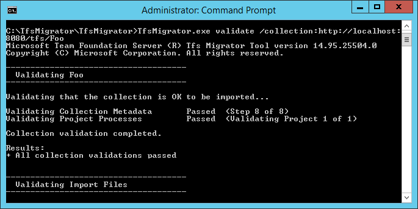
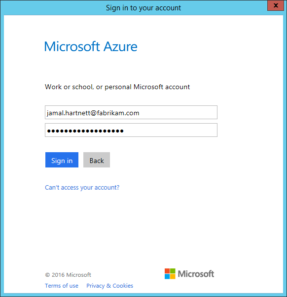
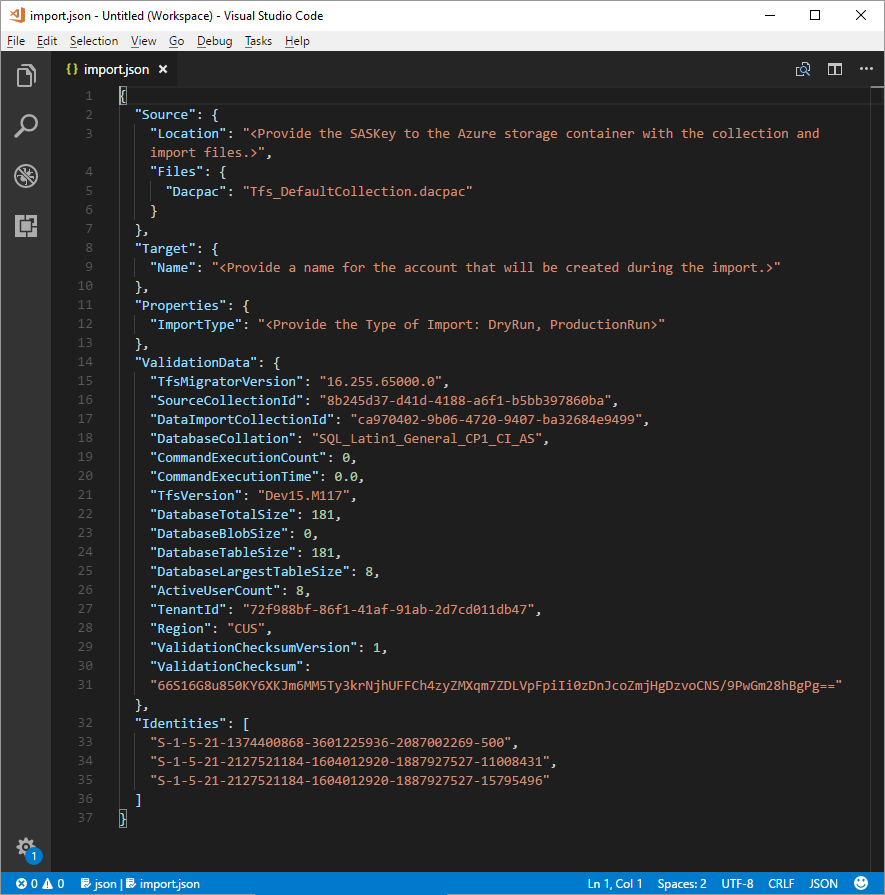
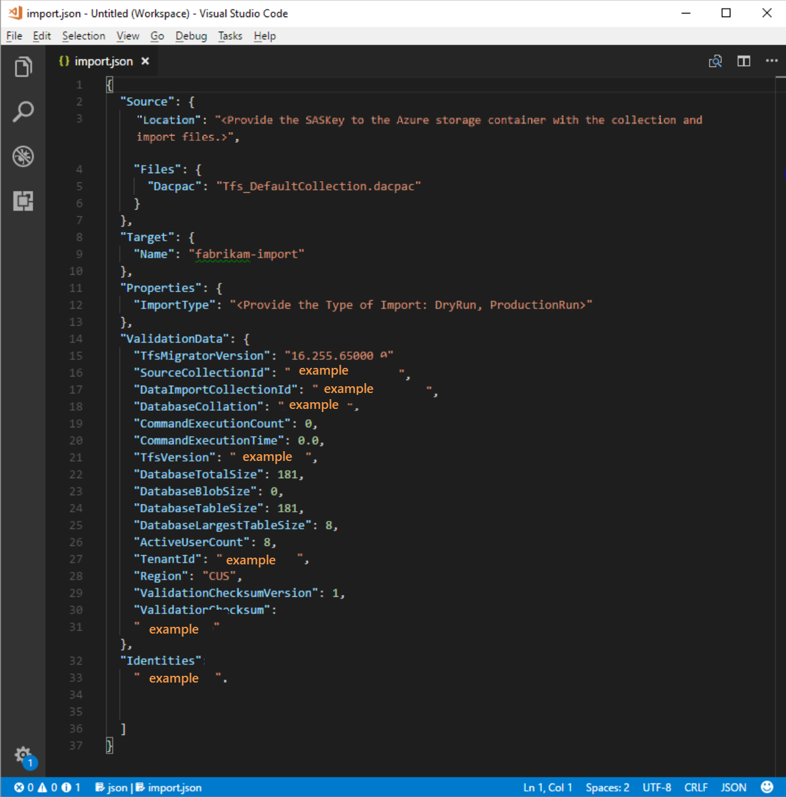
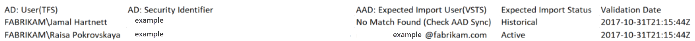
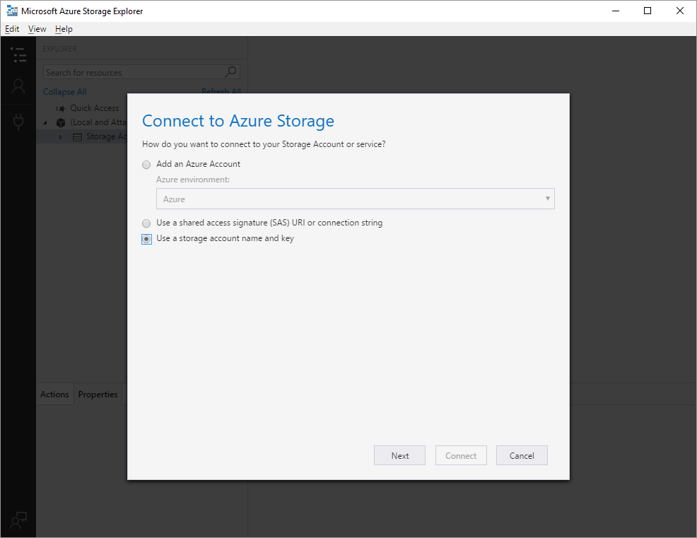
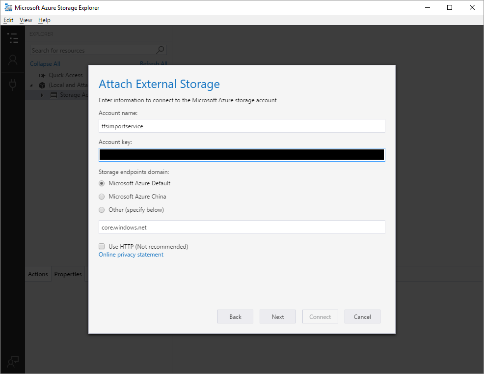
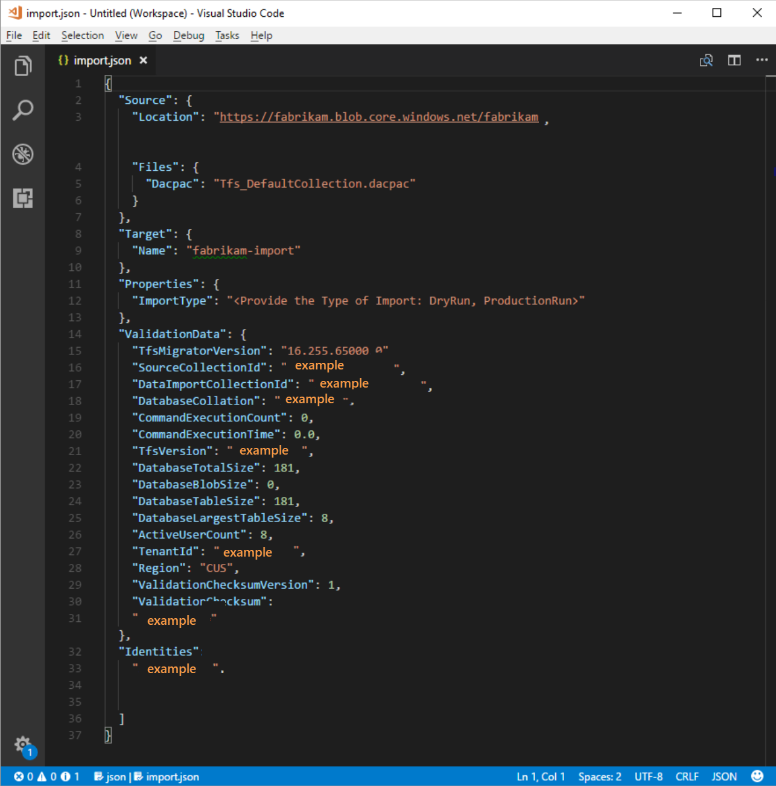

# Validation and import processes

[!INCLUDE [version-azure-devops](includes/version-azure-devops.md)]

This article walks you through the preparation that's required to get an import to Azure DevOps Services ready to run. If you encounter errors during the process, see [Troubleshoot import and migration errors](migration-troubleshooting.md).


> [!Note]
> * Visual Studio Team Services (VSTS) is now [Azure DevOps Services.](../user-guide/about-azure-devops-services-tfs.md#visual-studio-team-services-is-now-azure-devops-services)
> * With the release of Azure DevOps Server 2019, the TFS Database Import Service has been rebranded as the data migration tool for Azure DevOps. This change includes TfsMigrator (Migrator) becoming the data migration tool. This service works exactly the same as the former import service. If you're running an older version of on-premises Azure DevOps Server with the TFS branding, you can still use this feature to migrate to Azure DevOps as long as you've upgraded to one of the supported server versions.
> * Before you begin the import tasks, check to ensure that you're running a [supported version of Azure DevOps Server](migration-overview.md#supported-azure-devops-server-versions-for-import). 

We recommend that you use the [Step-by-step migration guide](https://aka.ms/AzureDevOpsImport) to progress through your import. The guide links to technical documentation, tools, and best practices.

<a id="validate-collection"></a>
## Validate a collection 

After you've confirmed that you're running the latest version of Azure DevOps Server, your next step is to validate each collection that you want to migrate to Azure DevOps Services. 

The validation step examines various aspects of your collection, including, but not limited to, size, collation, identity, and processes. 

You run the validation by using the data migration tool. To start, [download the tool](https://aka.ms/AzureDevOpsImport), copy the zip file to one of your Azure DevOps Server application tiers, and then unzip it. You can also run the tool from a different machine without Azure DevOps Server installed as long as the machine can connect to the configuration database of the Azure DevOps Server instance. An example is shown here.

1. Open a Command Prompt window on the server, and enter a cd command to change to the directory where the data migration tool is stored. Take a few moments to review the help content that's provided with the tool. 
 
   a. To view the top-level help and guidance, run the following command:

	```cmdline
	Migrator /help
	```

   b. View the help text for the command:

	```cmdline
	Migrator validate /help 
	```

1. Because this is your first time validating a collection, let's keep it simple. Your command should have the following structure:

	```cmdline
	Migrator validate /collection:{collection URL}
	```

	For example, to run against the default collection the command would look like:

	```cmdline
	Migrator validate /collection:http://localhost:8080/DefaultCollection
	```

1. To run the tool from a machine other than the Azure DevOps Server, you need the **/connectionString** parameter. The connection string parameter points to your Azure DevOps Server configuration database. As an example, if the validate command is being run by the Fabrikam corporation, the command would look like:

	```cmdline
	Migrator validate /collection:http://fabrikam:8080/DefaultCollection /tenantDomainName:fabrikam.OnMicrosoft.com /connectionString:"Data Source=fabrikam;Initial Catalog=Configuration;Integrated Security=True"
	```

	> [!Important]
    > The data migration tool *does not* edit any data or structures in the collection. It reads the collection only to identify issues. 

5.	After the validation is complete, you can view the log files and results. 

	

After all the validations pass, you can move to the next step of the import process. If the data migration tool flags any errors, you need to correct them before you proceed. For guidance on correcting validation errors, see [Troubleshoot import and migration errors](migration-troubleshooting.md). 

### Import log files  

When you open the log directory, you'll notice several logging files. 

The main log file is named *DataMigrationTool.log*. It contains details about everything that was run. To make it easier for you to focus on specific areas, a log is generated for each major validation operation. 

For example, if TfsMigrator reports an error in the "Validating Project Processes" step, you can open the *ProjectProcessMap.log* file to view everything that was run for that step instead of having to scroll through the entire log. 

You should review the *TryMatchOobProcesses.log* file only if you're trying to import your project processes to use the [inherited model](migration-processtemplates.md). If you don't want to use the inherited model, you can ignore these errors, because they won't prevent you from importing to Azure DevOps Services. 

## Generate import files

By now, you've run the data migration tool validation against the collection, and it's returning a result of "All collection validations passed." Before you take a collection offline to migrate it, you need to generate the import files. When you run the `prepare` command, you generate two import files: 

- *IdentityMapLog.csv*: Outlines your identity map between Active Directory and Azure Active Directory (Azure AD).
- *import.json*: Requires you to fill out the import specification you want to use to kick off your migration. 

### The prepare command

The `prepare` command assists with generating the required import files. Essentially, this command scans the collection to find a list of all users to populate the identity map log, *IdentityMapLog.csv*, and then tries to connect to Azure AD to find each identity's match. To do this, your company needs to use the [Azure Active Directory Connect tool](/azure/active-directory/connect/active-directory-aadconnect) (formerly known as the Directory Synchronization tool, Directory Sync tool, or DirSync.exe tool). 

If directory synchronization is set up, the data migration tool should be able to find the matching identities and mark them as *Active*. If it doesn't find a match, the identity is marked as *Historical* in the identity map log, and you'll need to investigate why the user isn't included in your directory sync. The import specification file, *import.json*, should be filled out prior to the import. 

Unlike the `validate` command, `prepare` *does* require an internet connection, because it needs to connect to Azure AD to populate the identity map log file. If your Azure DevOps Server instance doesn't have internet access, you need to run the tool from a machine that does. As long as you can find a machine with an intranet connection to your Azure DevOps Server instance and an internet connection, you can run this command. For help with the `prepare` command, run the following command:

```cmdline
Migrator prepare /help
```

Included in the help documentation are instructions and examples for running Migrator from the Azure DevOps Server instance itself and a remote machine. If you're running the command from one of the Azure DevOps Server instance's application tiers, your command should have the following structure:


```cmdline
Migrator prepare /collection:{collection URL} /tenantDomainName:{name} /region:{region}
```

```cmdline
Migrator prepare  /collection:{collection URL} /tenantDomainName:{name} /region:{region} /connectionString:"Data Source={sqlserver};Initial Catalog=Configuration;Integrated Security=True"
```

The **connectionString** parameter is a pointer to the configuration database of your Azure DevOps Server instance. As an example, if the `prepare` command is being run by the Fabrikam corporation, the command would look like:

```cmdline
Migrator prepare /collection:http://fabrikam:8080/DefaultCollection /tenantDomainName:fabrikam.OnMicrosoft.com /region:{region} /connectionString:"Data Source=fabrikam;Initial Catalog=Configuration;Integrated Security=True"
```

When the data migration tool runs the `prepare` command, it runs a complete validation to ensure that nothing has changed with your collection since the last full validation. If any new issues are detected, no import files are generated. 

Shortly after the command has started running, an Azure AD sign-in window is displayed. You need to sign in with an identity that belongs to the tenant domain that's specified in the command. Make sure that the specified Azure AD tenant is the one you want your future organization to be backed with. In our Fabrikam example, a user would enter credentials that are similar to what's shown in the following screenshot.

> [!IMPORTANT] 
> Do *not* use a test Azure AD tenant for a test import and your production Azure AD tenant for the production run. Using a test Azure AD tenant can result in identity import issues when you begin your production run with your organization's production Azure AD tenant.



When you run the `prepare` command successfully in the data migration tool, the results window displays a set of logs and two import files. In the log directory, you'll find a logs folder and two files: 

* *import.json* is the import specification file. We recommend that you take time to fill it out.
* *IdentityMapLog.csv* contains the generated mapping of Active Directory to Azure AD identities. Review it for completeness before you kick off an import.

The two files are described in greater detail in the next sections.

### The import specification file

The import specification, *import.json*, is a JSON file that provides import settings. It includes the desired organization name, storage account information, and other information. Most of the fields are autopopulated, and some fields require your input before you attempt an import.



The *import.json* file's displayed fields and required actions are described in the following table:

| Field | Description | Required action |
| --- | --- | --- |
| Source | Information about the location and names of the source data files that are used for import. | No action required. Review information for the subfield actions to follow. |
| Location | The shared access signature key to the Azure storage account that hosts the data-tier application package (DACPAC). | No action required. This field will be covered in a later step. |
| Files | The names of the files containing import data. | No action required. Review information for the subfield actions to follow. |
| DACPAC | A DACPAC file that packages the collection database to be used to bring in the data during the import. | No action required. In a later step, you'll generate this file by using your collection and then upload it to an Azure storage account. You'll need to update the file based on the name you use when you generate it later in this process. |
| Target | Properties of the new organization to import into. | No action required. Review information for the subfield actions to follow. |
| Name | The name of the organization to be created during the import. | Provide a name. The name can be quickly changed later after the import has completed.<br>**Note**: Do *not* create an organization with this name before you run the import. The organization will be created as part of the import process. |
| ImportType | The type of import that you want to run. | No action required. In a later step, you'll select the type of import to run. |
| Validation Data | Information that's needed to help drive your import experience. | The "ValidationData" section is generated by the data migration tool. It contains information that's needed to help drive your import experience. Do *not* edit the values in this section, or your import could fail to start. |

<br> 

After you complete the preceding process, you should have a file that looks like the following: 



In the preceding image, note that the planner of the Fabrikam import added the organization name *fabrikam-import* and selected CUS (Central United States) as the region for import. Other values were left as is to be modified just before the planner took the collection offline for the migration. 

> [!NOTE] 
> Dry-run imports have a '-dryrun' automatically appended to the end of the organization name. This can be changed after the import.


<a id="supported-azure-regions-for-import"></a>

### Supported Azure regions for import

Azure DevOps Services is available in several [Azure regions](https://azure.microsoft.com/regions/services/). However, not all regions where Azure DevOps Services is available are supported for import. The following table lists the Azure regions that you can select for import. Also included is the value that you need to place in the import specification file to target that region for import.  
 

| Geographic region | Azure region | Import specification value |
| --- | --- | --- |
| United States | Central United States | CUS |
| Europe | Western Europe | WEU |
| United Kingdom | United Kingdom South | UKS |
| Australia | Australia East | EAU |
| South America | Brazil South | SBR |
| Asia Pacific | South India | MA |
| Asia Pacific | Asia Pacific (Hong Kong) | EA |
| Canada | Central Canada | CC |

<br> 

### The identity map log

The identity map log is of equal importance to the actual data that you'll be migrating to Azure DevOps Services. As you're reviewing the file, it's important to understand how identity import operates and what the potential results could entail. When you import an identity, it can become either *active* or *historical*. Active identities can sign in to Azure DevOps Services, but historical identities cannot. 

#### Active identities

Active identities refer to identities that will be users in Azure DevOps Services post-import. In Azure DevOps Services, these identities are licensed and are displayed as users in the organization. The identities are marked as *active* in the **Expected Import Status** column in the identity map log file.

<a id="historical-identities"></a>
#### Historical identities

Historical identities are mapped as such in the **Expected Import Status** column in the identity map log file. Identities without a line entry in the file also become historical. An example of an identity without a line entry might be an employee who no longer works at a company. 

Unlike active identities, historical identities:
* *Don't* have access to an organization after migration.
* *Don't* have licenses.
* *Don't* show up as users in the organization. All that persists is the notion of that identity's name in the organization, so that its history can be searched later. We recommend that you use historical identities for users who no longer work at the company or who won't need further access to the organization. 

> [!NOTE]
> After an identity is imported as historical, it *can't* become active. 

### Understand the identity map log file

The identity map log file is similar to the example shown here: 



The columns in the identity map log file are described in the following table: 

> [!NOTE] 
> You and your Azure AD admin will need to investigate users that are marked as *No Match Found (Check Azure AD Sync)* to understand why they aren't part of your Azure AD Connect sync. 

| Column | Description |
| --- | --- |
| Active Directory: User (Azure DevOps Server) | The friendly display name used by the identity in Azure DevOps Server. This name makes it easier to identify which user the line in the map is referencing. |
| Active Directory: Security Identifier | The unique identifier for the on-premises Active Directory identity in Azure DevOps Server. This column is used to identify users in the collection. |
| Azure Active Directory: Expected Import User (Azure DevOps Services) | Either the expected sign-in address of the matched soon-to-be-active user or *No Match Found (Check Azure AD Sync)*, indicating that the identity wasn't found during the Azure Active Directory sync and it will be imported as historical. |
| Expected Import Status | The expected user import status: either *Active* if there's a match between your Active Directory and Azure Active Directory, or *Historical* if there isn't a match. |
| Validation Date | The last time the identity map log was validated. |

<br> 

As you read through the file, notice whether the value in the **Expected Import Status** column is *Active* or *Historical*. *Active* indicates that it's expected that the identity on this row will map correctly on import and will become active. *Historical* means that the identities will become historical on import. It's important to review the generated mapping file for completeness and correctness.

> [!IMPORTANT]  
> Your import will fail if major changes occur to your Azure AD Connect security ID sync between import attempts. You can add new users between dry runs, and you can make corrections to ensure that previously imported historical identities become active. However, changing an existing user that was previously imported as active isn't supported at this time. Doing so will cause your import to fail. An example of a change might be completing a dry-run import, deleting an identity from your Azure AD that was imported actively, re-creating a new user in Azure AD for that same identity, and then attempting another import. In this case, an active identity import will be attempted between the Active Directory and newly created Azure AD identity, but it will cause an import failure. 

1. Start by reviewing the correctly matched identities. Are all the expected identities present? Are the users mapped to the correct Azure AD identity? 

   If any values are incorrectly mapped or need to be changed, contact your Azure AD administrator to verify that the on-premises Active Directory identity is part of the sync to Azure AD and has been set up correctly. For more information, see [Integrate your on-premises identities with Azure Active Directory](/azure/active-directory/hybrid/whatis-hybrid-identity). 

1. Next, review the identities that are labeled as *historical*. This labeling implies that a matching Azure AD identity couldn't be found, for any of the following reasons:

    * The identity hasn't been set up for sync between on-premises Active Directory and Azure AD. 
    * The identity hasn't been populated in your Azure AD yet (for example, there's a new employee). 
    * The identity doesn't exist in your Azure AD instance.
    * The user who owns that identity no longer works at the company.

To address the first three reasons, you need to set up the intended on-premises Active Directory identity to sync with Azure AD. For more information, see [Integrate your on-premises identities with Azure Active Directory](/azure/active-directory/hybrid/how-to-connect-sync-change-the-configuration). You must set up and run Azure AD Connect for identities to be imported as *active* in Azure DevOps Services. 

You can ignore the fourth reason, because employees who are no longer at the company should be imported  as *historical*. 

#### Historical identities (small teams) 

> [!NOTE]
> The identity import strategy proposed in this section should be considered by small teams only. 

If Azure AD Connect hasn't been configured, you'll notice that all users in the identity map log file are marked as *historical*. Running an import this way results in all users being imported as [*historical*](#historical-identities). We strongly recommended that you configure [Azure AD Connect](/azure/active-directory/hybrid/how-to-connect-sync-change-the-configuration) to ensure that your users are imported as *active*. 

Running an import with all historical identities has consequences that need to be considered carefully. It should be considered only by teams with a small number of users and for which the cost of setting up Azure AD Connect is deemed too high. 

To import all identities as historical, follow the steps outlined in later sections. When you queue an import, the identity that's used to queue the import is bootstrapped into the organization as the organization owner. All other users are imported as historical. Organization owners can then [add the users back in](../organizations/accounts/add-organization-users.md?toc=/azure/devops/organizations/accounts/toc.json&bc=/azure/devops/organizations/accounts/breadcrumb/toc.json) by using their Azure AD identity. The added users are treated as new users. They do *not* own any of their history, and there's no way to re-parent this history to the Azure AD identity. However, users can still look up their pre-import history by searching for their \<domain>\<Active Directory username>.

The data migration tool displays a warning if it detects the complete historical identities scenario. If you decide to go down this migration path, you'll need to consent in the tool to the limitations. 

### Visual Studio subscriptions

The data migration tool can't detect Visual Studio subscriptions (formerly known as MSDN benefits) when it generates the identity map log file. Instead, we recommend that you apply the auto license upgrade feature after the import. As long as users' work accounts are [linked](/visualstudio/subscriptions/vs-alternate-identity) correctly, Azure DevOps Services automatically applies their Visual Studio subscription benefits at their first sign-in after the import. You're never charged for licenses that are assigned during the import, so this can be safely handled afterward. 

You don't need to repeat a dry-run import if users' Visual Studio subscriptions aren't automatically upgraded in Azure DevOps Services. Visual Studio subscription linking happens outside the scope of an import. As long as their work account is linked correctly before or after the import, users' licenses are automatically upgraded on their next sign-in. After their licenses have been upgraded successfully, the next time you run an import, the users are upgraded automatically on their first sign-in to the organization.  

<a id="prepare-import"></a>

## Prepare for import

By now, you have everything ready to execute on your import. You need to schedule downtime with your team to take the collection offline for the migration. When you've agreed upon a time to run the import, you need to upload to Azure both the required assets you've generated and a copy of the database. This process has five steps:

Step 1: [Take the collection offline and detach it](#step-1-detach-your-collection).  
Step 2: [Generate a DACPAC file from the collection you're going to import](#step-2-generate-a-dacpac-file).  
Step 3: [Upload the DACPAC file and import files to an Azure storage account](#step-3-upload-the-dacpac-file).  
Step 4: [Generate an SAS key to the storage account](#step-4-generate-an-sas-key).  
Step 5: [Complete the import specification](#step-5-complete-the-import-specification). 

> [!NOTE] 
> Before you perform a production import, we *strongly* recommend that you complete a dry-run import. With a dry run, you can validate that the import process works for your collection and that there are no unique data shapes present that might cause a production import failure. 

### Step 1: Detach your collection

[Detaching the collection](/azure/devops/server/admin/move-project-collection#detach-coll) is a crucial step in the import process. Identity data for the collection resides in the Azure DevOps Server instance's configuration database while the collection is attached and online. When a collection is detached from the Azure DevOps Server instance, it takes a copy of that identity data and packages it with the collection for transport. Without this data, the identity portion of the import *can't* be executed. We recommend that you keep the collection detached until the import has been completed, because there isn't a way to import the changes that occurred during the import.

If you're doing a dry run (test) import, we recommend that you reattach your collection after you back it up for import, because you won't be concerned about having the latest data for this type of import. To avoid offline time altogether, you can also choose to employ an [offline detach](/azure/devops/server/command-line/tfsconfig-cmd#offlinedetach) for dry runs. 

It's important to weigh the cost of choosing to incur zero downtime for a dry run. It requires taking backups of the collection and configuration database, restoring them on a SQL instance, and then creating a detached backup. A cost analysis could prove that taking just a few hours of downtime to directly take the detached backup is better in the long run.

<a id="dacpac-file" /> 

### Step 2: Generate a DACPAC file

DACPACs offer a fast and relatively easy method for moving collections into Azure DevOps Services. However, after a collection database size exceeds a certain threshold, the benefits of using a DACPAC start to diminish. 

> [!NOTE] 
> If the data migration tool displays a warning that you can't use the DACPAC method, you have to perform the import by using the SQL Azure virtual machine (VM) method provided in [Import large collections](migration-import-large-collections.md).  
> 
> If the data migration tool doesn't display a warning, use the DACPAC method described in this step.  


[DACPAC](/sql/relational-databases/data-tier-applications/data-tier-applications) is a feature of SQL server that allows database changes to be packaged into a single file and deployed to other instances of SQL. A DACPAC file can also be restored directly to Azure DevOps Services, so you can use it as the packaging method for getting your collection's data in the cloud. You use the SqlPackage.exe tool to generate the DACPAC file. The tool is included as part of [SQL Server Data Tools (SSDT)](/sql/ssdt/download-sql-server-data-tools-ssdt). 

Multiple versions of the SqlPackage.exe tool are installed with SSDT. The versions are stored in folders with names such as 120, 130, and 140. When you use SqlPackage.exe, it's important to use the right version to prepare the DACPAC.

* TFS 2018 imports need to use the SqlPackage.exe version from the 140 folder or higher.

If you installed SSDT for Visual Studio, you'll find your SqlPackage.exe version in one of the following folder paths:

* If you installed SSDT and integrated it with an existing installation of Visual Studio, your SqlPackage.exe folder path is similar to `C:\Program Files (x86)\Microsoft Visual Studio 14.0\Common7\IDE\Extensions\Microsoft\SQLDB\DAC\130\`.
* If you installed SSDT as a standalone installation, your SqlPackage.exe folder path is similar to `C:\Program Files (x86)\Microsoft Visual. Studio\2017\SQL\Common7\IDE\Extensions\Microsoft\SQLDB\DAC\130\`.
* If you already have an installation of SQL Server, SqlPackage.exe might already be present, and your folder path is similar to `%PROGRAMFILES%\Microsoft SQL Server\130\DAC\bin\`.

Both versions of SSDT that you can download from [SQL Server Data Tools](/sql/ssdt/download-sql-server-data-tools-ssdt) include both the 130 and 140 folders and their SqlPackage.exe versions.

When you generate a DACPAC, keep two considerations in mind: the disk that the DACPAC will be saved on and the disk space on the machine that's generating the DACPAC. You want to ensure that you have enough disk space to complete the operation. 

As it creates the package, SqlPackage.exe temporarily stores data from your collection in the temp directory on drive C of the machine you're initiating the packaging request from. 

You might find that your drive C is too small to support creating a DACPAC. You can estimate the amount of space you'll need by looking for the largest table in your collection database. DACPACs are created one table at a time. The maximum space requirement to run the generation is roughly equivalent to the size of the largest table in the collection's database. If you're saving the generated DACPAC to drive C, you also need to take into account the size of the collection database as reported in the *DataMigrationTool.log* file from a validation run.

The *DataMigrationTool.log* file provides a list of the largest tables in the collection each time the validate command is run. For an example of table sizes for a collection, see the following output. Compare the size of the largest table with the free space on the drive that hosts your temporary directory. 

> [!IMPORTANT]  
> Before you proceed with generating a DACPAC file, ensure that your collection is [detached](migration-import.md#step-1-detach-your-collection).
 

```cmdline 
[Info   @08:23:59.539] Table name                               Size in MB
[Info   @08:23:59.539] dbo.tbl_Content                          38984
[Info   @08:23:59.539] dbo.tbl_LocalVersion                     1935
[Info   @08:23:59.539] dbo.tbl_Version                          238
[Info   @08:23:59.539] dbo.tbl_FileReference                    85
[Info   @08:23:59.539] dbo.Rules                                68
[Info   @08:23:59.539] dbo.tbl_FileMetadata                     61
```

Ensure that the drive that hosts your temporary directory has at least as much free space. If it doesn't, you need to redirect the temp directory by setting an environment variable. 

```cmdline
SET TEMP={location on disk}
```

Another consideration is where the DACPAC data is saved. Pointing the save location to a far-off remote drive could result in much longer generation times. If a fast drive such as a solid-state drive (SSD) is available locally, we recommend that you target the drive as the DACPAC save location. Otherwise, it's always faster to use a disk that's on the machine where the collection database resides rather than a remote drive. 

Now that you've identified the target location for the DACPAC and ensured that you have enough space, it's time to generate the DACPAC file. 

Open a Command Prompt window and go to the SqlPackage.exe location. To generate the DACPAC, replace the placeholder values with the required values, and then run the following command:

```cmdline
SqlPackage.exe /sourceconnectionstring:"Data Source={database server name};Initial Catalog={Database Name};Integrated Security=True" /targetFile:{Location & File name} /action:extract /p:ExtractAllTableData=true /p:IgnoreUserLoginMappings=true /p:IgnorePermissions=true /p:Storage=Memory
```

* **Data Source**: The SQL Server instance that hosts your Azure DevOps Server collection database. 
* **Initial Catalog**: The name of the collection database. 
* **targetFile**: The location on the disk and the DACPAC file name. 

A DACPAC generation command that's running on the Azure DevOps Server data tier itself is shown in the following example:

```cmdline
SqlPackage.exe /sourceconnectionstring:"Data Source=localhost;Initial Catalog=Foo;Integrated Security=True" /targetFile:C:\DACPAC\Foo.dacpac /action:extract /p:ExtractAllTableData=true /p:IgnoreUserLoginMappings=true /p:IgnorePermissions=true /p:Storage=Memory
```

The output of the command is a DACPAC file that's generated from the collection database *Foo* called *Foo.dacpac*. 
 

#### Configure your collection for import

After your collection database has been restored on your Azure VM, configure a SQL login to allow Azure DevOps Services to connect to the database to import the data. This login allows only *read* access to a single database. 

To start, open SQL Server Management Studio on the VM, and then open a new query window against the database to be imported. 

Set the database's recovery to simple: 

```sql
ALTER DATABASE [<Database name>] SET RECOVERY SIMPLE;
```

Create a SQL login for the database, and assign that login the 'TFSEXECROLE':

```sql
USE [<database name>]
CREATE LOGIN <pick a username> WITH PASSWORD = '<pick a password>'
CREATE USER <username> FOR LOGIN <username> WITH DEFAULT_SCHEMA=[dbo]
EXEC sp_addrolemember @rolename='TFSEXECROLE', @membername='<username>'
```

Following our Fabrikam example, the two SQL commands would look like the following:

```sql
ALTER DATABASE [Foo] SET RECOVERY SIMPLE;

USE [Foo]
CREATE LOGIN fabrikam WITH PASSWORD = 'fabrikamimport1!'
CREATE USER fabrikam FOR LOGIN fabrikam WITH DEFAULT_SCHEMA=[dbo]
EXEC sp_addrolemember @rolename='TFSEXECROLE', @membername='fabrikam'
```
> [!NOTE] 
> Be sure to enable [SQL Server and Windows authentication mode](/sql/database-engine/configure-windows/change-server-authentication-mode?view=sql-server-ver15#change-authentication-mode-with-ssms&preserve-view=true) in SQL Server Management Studio on the VM. If you don't enable authentication mode, the import will fail.  

#### Configure the import specification file to target the VM

Update the import specification file to include information about how to connect to the SQL Server instance. Open your import specification file and make the following updates:

1. Remove the DACPAC parameter from the source files object.

    The import specification before the change is shown in the following code:
    
    
    
    The import specification after the change is shown in the following code:
    
    

1. Fill out the required parameters and add the following properties object within your source object in the specification file.

    ```json
    "Properties":
    {
        "ConnectionString": "Data Source={SQL Azure VM Public IP};Initial Catalog={Database Name};Integrated Security=False;User ID={SQL Login Username};Password={SQL Login Password};Encrypt=True;TrustServerCertificate=True" 
    }
    ```

Following the Fabrikam example, after you apply the changes, the import specification would look like the following:


Your import specification is now configured to use a SQL Azure VM for import. Proceed with the rest of preparation steps to import to Azure DevOps Services. After the import has finished, be sure to delete the SQL login or rotate the password. Microsoft does not retain the login information after the import has finished. 

### Step 3: Upload the DACPAC file

> [!NOTE] 
> If you're using the SQL Azure VM method, you need to provide only the connection string. You don't have to upload any files, and you can skip this step.  

Your DACPAC must be placed in an Azure storage container. This can be an existing container or one created specifically for your migration effort. It's important to ensure that your container is created in the right region.

Azure DevOps Services is available in multiple [regions](https://azure.microsoft.com/regions/services/). When you're importing to these regions, it's critical to place your data in the correct region to ensure that the import can start successfully. Your data must be placed in the same region that you'll be importing to. Placing the data anywhere else will result in the import being unable to start. The following table lists the acceptable regions for creating your storage account and uploading your data.

| Desired import region | Storage account region |
| --- | --- |
| Central United States | Central United States |
| Western Europe | Western Europe |
| Australia East | Australia East |
| Brazil South | Brazil South |
| India South | India South |
| Canada Central | Canada Central |
| Asia Pacific (Hong Kong) | Asia Pacific (Hong Kong) |

<br> 

Although Azure DevOps Services is available in multiple regions in the US, only the Central United States region accepts new Azure DevOps Services. You can't import your data into other US Azure regions at this time.  

You can [create a blob container](/azure/storage/common/storage-create-storage-account) from the Azure portal. After you've created the container, you need to upload the Collection DACPAC file. 

After the import has finished, you can delete the blob container and accompanying storage account. To do so, you can use tools such as [AzCopy](/azure/storage/common/storage-use-azcopy-v10) or any other Azure storage explorer tool, such as [Azure Storage Explorer](https://storageexplorer.com/). 

> [!NOTE] 
> If your DACPAC file is larger than 10 GB, we recommend that you use AzCopy. AzCopy has multithreaded upload support for faster uploads.

### Step 4: Generate an SAS key

A [shared access signature (SAS) key](/azure/storage/common/storage-sas-overview) provides delegated access to resources in a storage account. The key allows you to give Microsoft the lowest level of privilege that's required to access your data for executing the import. 

The recommended way to generate an SAS key is to use [Azure Storage Explorer](https://storageexplorer.com/). With Storage Explorer, you can easily create container-level SAS keys. This is essential, because the data migration tool does *not* support account-level SAS keys. 

> [!NOTE] 
> Do *not* generate an SAS key from the Azure portal. Azure portal-generated SAS keys are account scoped and don't work with the data migration tool. 

After you install Storage Explorer, you can generate an SAS key by doing the following:

1. Open Storage Explorer.
1. Add an account.
1. Select **Use a storage account name and key**, and then select **Connect**.

   

1. On the **Attach External Storage** pane, enter your storage account name, provide one of your two [primary access keys](/azure/storage/common/storage-create-storage-account), and then select **Connect**.

   

1. On the left pane, expand **Blob Containers**, right-click the container that stores your import files, and then select **Get Shared Access Signature**.

   

1. For **Expiry time**, set the expiration date for seven days in the future.

     

1. Under **Permissions** for your SAS key, select the **Read** and **List** check boxes. Write and delete permissions aren't required. 

    > [!NOTE]
    > * Copy and store this SAS key to place in your import specification file in the next step.
    > * Treat this SAS key as a secret. It provides access to your files in the storage container. 

### Step 5: Complete the import specification

Earlier in the process you partially filled out the import specification file generally known as *import.json*. At this point, you have enough information to complete all the remaining fields except for the import type. The import type will be covered later, in the import section. 

In the *import.json* specification file, under **Source**, complete the following fields:

* **Location**: Paste the SAS key you generated from the script and then copied in the preceding step.
* **Dacpac**: Ensure that the file, including the *.dacpac* file extension, has the same name as the DACPAC file you uploaded to the storage account. 

Using the Fabrikam example, the final import specification file should look like the following:



<a id="determine-the-type-of-import"></a> 
<a id="import-type"></a> 
### Determine the import type

Imports can be queued as either a dry run or a production run. The **ImportType** parameter determines the import type: 

- **DryRun**: Use a dry run for test purposes. The system deletes dry runs after 21 days. 
- **ProductionRun**: Use a production run when you want to keep the resulting import and use the organization full time in Azure DevOps Services after the import finishes. 

> [!TIP] 
> We always recommend that you complete a dry-run import first. 


### Dry-run organizations

Dry-run imports help teams test the migration of their collections. Organizations are expected not to remain around forever but to exist for a short time. In fact, before a production migration can be run, any completed dry-run organizations will need to be deleted. All dry-run organizations have a *limited existence and are automatically deleted after a set period of time*. Information about when the organization will be deleted is included in the success email you should receive after the import finishes. Be sure to take note of this date and plan accordingly. 

Most dry-run organizations have 15 days before they're deleted. Dry-run organizations can also have a 21-day expiration if more than 100 users have a basic or greater license at *import time*. After the specified time period, the dry-run organization is deleted. You can repeat dry-run imports as many times as you need before you do a production migration. You need to delete any previous dry runs before you attempt a new one. When your team is ready to perform a production migration, you'll need to manually delete the dry-run organization. 

For more information about post-import activities, see the [post import](migration-post-import.md) article. 

If you encounter any import problems, see [Troubleshoot import and migration errors](migration-troubleshooting.md#resolve-import-errors). 

<a id="run-an-import"></a>

## Run an import

Your team is now ready to begin the process of running an import. We recommend that you start with a successful dry-run import before you attempt a production-run import. With dry-run imports, you can see in advance how an import will look, identify potential issues, and gain experience before you head into your production run. 

> [!NOTE]
> If you need to repeat a completed production-run import for a collection, as in the event of a rollback, contact Azure DevOps Services [Customer Support](https://azure.microsoft.com/support/devops/) before you queue up another import.

> [!NOTE]
> Azure administrators can prevent users from creating new Azure DevOps organizations. If the Azure AD tenant policy is turned on, your import will fail to finish. Before you begin, verify that the policy isn't set or that there is an exception for the user that is performing the migration. For more information, see [Restrict organization creation via Azure AD tenant policy](../organizations/accounts/azure-ad-tenant-policy-restrict-org-creation.md).

### Considerations for rollback plans

A common concern for teams that are doing a final production run is what their rollback plan will be if anything goes wrong with import. This is why we highly recommend doing a dry run to make sure that you're able to test the import settings you provide to the data migration tool for Azure DevOps.

Rollback for the final production run is fairly simple. Before you queue the import, you detach the team project collection from Azure DevOps Server or Team Foundation Server, which will make it unavailable to your team members. If for any reason you need to roll back the production run and bring the on-premises server back online for your team members, you can do so. You simply attach the team project collection on-premises again and inform your team that they'll continue to work normally while your team regroups to understand any potential failures.

### Queue an import

> [!IMPORTANT] 
> Before you proceed, ensure that your collection was [detached](migration-import.md#step-1-detach-your-collection) prior to generating a DACPAC file or uploading the collection database to a SQL Azure VM. If you don't complete this step, the import will fail. In the event that your import fails, see [Troubleshoot import and migration errors](migration-troubleshooting.md). 

You start an import by using the data migration tool's **import** command. The import command takes an import specification file as input. It parses the file to ensure that the provided values are valid and, if successful, it queues an import to Azure DevOps Services. The import command requires an internet connection, but does *not* require a connection to your Azure DevOps Server instance. 

To get started, open a Command Prompt window, and change directories to the path to the data migration tool. We recommended that you take a moment to review the help text provided with the tool. Run the following command to see the guidance and help for the import command:

```cmdline
Migrator import /help
```

The command to queue an import will have the following structure:

```cmdline
Migrator import /importFile:{location of import specification file}
```

Here is an example of a completed import command:

```cmdline
Migrator import /importFile:C:\DataMigrationToolFiles\import.json
```

After the validation passes, you'll be asked to sign in to Azure AD. It's important to sign in with an identity that's a member of the same Azure AD tenant as the identity map log file was built against. The user that signs in becomes the owner of the imported organization. 

> [!NOTE]
> Each Azure AD tenant is limited to five imports per 24-hour period. Only imports that are queued count against this cap.

When your team initiates an import, an email notification is sent to the user that queued the import. About 5 to 10 minutes after it queues the import, your team can go to the organization to check on the status. After the import finishes, your team is directed to sign in, and an email notification is sent to the organization owner. 

## Related articles

- [Migrate options](migration-overview.md) 
- [Post-import](migration-post-import.md)
