# Import

[!INCLUDE [version-azure-devops](_shared/version-azure-devops.md)]

> [!Note]
> [Visual Studio Team Services (VSTS) is now Azure DevOps Services.](../user-guide/what-happened-vsts.md)
> 
> We recommend that you use the [Migration Guide](https://aka.ms/AzureDevOpsImport) to progress through your import. The guide links to the technical documentation, as needed.
>
> Be sure you're on a [supported version](migration-overview.md#supported-azure-devops-server-versions-for-import) of Azure DevOps Server before continuing with the other import tasks.
>
> With the release of Azure DevOps Server 2019 the TFS Database Import Service has been rebranded to become data migration tool for Azure DevOps. This includes TfsMigrator becoming the data migration tool or migrator for short. This service still works exactly the same as the old Import Service. If you're on an older version of on-premises with TFS as the branding you can still use this feature to migrate to Azure DevOps as long as you upgrade to one of the supported versions. 

This page walks through how to perform all of the necessary preparation work required to get an import to Azure DevOps Services ready to run.  If you encounter errors during the process be sure to review the [troubleshooting](migration-troubleshooting.md).

## Validating a Collection
Now that you've confirmed you're on the latest version of Azure DevOps Server the next step is to validate each collection you wish to migrate to Azure DevOps Services. 
Validate will examine a variety of aspects in your collection, including, but not limited to: size, collation, identity, and processes. 
Running a validation is done through the data migration tool. To start, take a copy of the [data migration tool](https://aka.ms/AzureDevOpsImport) and copy it onto one of your 
Azure DevOps Server Application Tiers (AT). Once there you can unzip it. The tool can also be run from the a different machine without Azure DevOps Server installed as long as the PC can connect to the Azure DevOps Server instance's configuration database - example below.


To get started, open a command prompt on the server and CD to the path where you have the data migration tool placed. Once there it's recommended that you take a second to review the help text provided with the tool. Run the following command to see the top level help and guidance:

```cmdline
Migrator /help
```

For this step, we'll be focusing on the validate command. To see the help text for that command simply run:

```cmdline
Migrator validate /help 
```

Since this is our first time validating a collection we'll keep it simple. Your command should have the following structure:

```cmdline
Migrator validate /collection:{collection URL}
```

For example, to run against the default collection the command would look like:

```cmdline
Migrator validate /collection:http://localhost:8080/DefaultCollection
```

Running it from a machine other than the Azure DevOps Server requires the /connectionString parameter. The connection string parameter is a pointer to your Azure DevOps Server configuration database. As an example, if the validate command was being run by the Fabrikam corporation the command would look like:

```cmdline
Migrator validate /collection:http://fabrikam:8080/DefaultCollection /tenantDomainName:fabrikam.OnMicrosoft.com /connectionString:"Data Source=fabrikam;Initial Catalog=Configuration;Integrated Security=True"
```

It's important to note that the data migration tool **DOES NOT** edit any data or structures in the collection. It only reads the collection to identify issues. 

Once the validation is complete you'll be left with a set of log files and a set of results printed to the command prompt screen. 

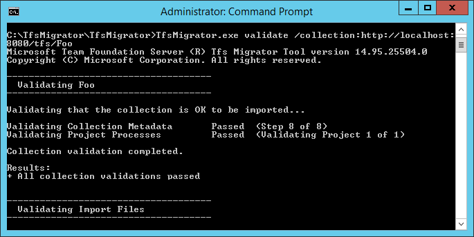


If all of the validations pass, you are ready to move onto the next step of the import process. If the data migration tool flagged any errors, they will need to be corrected before moving on. See [troubleshooting](migration-troubleshooting.md) for guidance on correcting validation errors. 


When you open up the log directory you will notice that there are several logging files. 

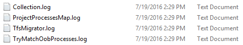

The log titled ```DataMigrationTool.log``` is going to be the main log which contains details on everything that was run. To make it easier to narrow down on specific areas, 
a log is generated for each major validation operation. For example, if TfsMigrator had reported an error in the "Validating Project Processes" step, then one can 
simply open the ```ProjectProcessMap.log``` file to see everything that was run for that step instead of having to scroll through the overall log. 
The ```TryMatchOobProcesses.log``` should only be reviewed if you're trying to import your project processes to use the [inherited model](migration-processtemplates.md). If you don't want to use the new inherited model then the errors in this file will not prevent you from doing an import to Azure DevOps Services and can be ignored. 

## Generating Import Files
By this point you will have run the data migration tool *validate* against the collection and it is returning "All collection validations passed".  Before you start taking the collection offline to migrate, there is some more preparation that needs to be completed - generating the import files. Upon running the prepare step, you will generate two import files: ```IdentityMapLog.csv``` which outlines your identity map between Active Directory (AD) and Azure Active Directory (Azure AD), and ```import.json``` which requires you to fill out the import specification you want to use to kick off your migration. 

### Prepare Command
The prepare command assists with generating the required import files. Essentially, this command scans the collection to find a list of all users to populate the identity map log, ```IdentityMapLog.csv```, and then tries to connect to Azure AD to find each identity's match. Your company will need to employ the Azure Active Directory Connect [tool](/azure/active-directory/connect/active-directory-aadconnect) (formerly known as the Directory Synchronization tool, Directory Sync tool, or the DirSync.exe tool). If directory synchronization is setup, the data migration tool should be able to find the matching identities and mark them as Active. If it doesn't find a match, the identity will be marked Historical in the identity map log and you will need to investigate why the user wasn't included in your directory sync. The Import specification file, ```import.json```, should be filled out prior to importing. 

Unlike the validate command, prepare **DOES** require an internet connection as it needs to reach out to Azure AD in order to populate the identity map log file. If your Azure DevOps Server instance doesn't have internet access, you'll need to run the tool from a different PC that does. As long as you can find a PC that has an intranet connection to your Azure DevOps Server instance and an internet connection then you can run this command. Run the following command to see the guidance for the prepare command:

```cmdline
Migrator prepare /help
```

Included in the help documentation are instructions and examples for running Migrator from the Azure DevOps Server instance itself and a remote PC. If you're running the command from one of the Azure DevOps Server instance's Application Tiers (ATs) then your command should have the following structure:


```cmdline
Migrator prepare /collection:{collection URL} /tenantDomainName:{name} /region:{region}
```

```cmdline
Migrator prepare  /collection:{collection URL} /tenantDomainName:{name} /region:{region} /connectionString:"Data Source={sqlserver};Initial Catalog=Configuration;Integrated Security=True"
```

The connection string parameter is a pointer to your Azure DevOps Server instance configuration database. As an example, if the prepare command was being run by the Fabrikam corporation the command would look like:

```cmdline
Migrator prepare /collection:http://fabrikam:8080/DefaultCollection /tenantDomainName:fabrikam.OnMicrosoft.com /region:{region} /connectionString:"Data Source=fabrikam;Initial Catalog=Configuration;Integrated Security=True"
```

Upon executing this command, the data migration tool will run a complete validate to ensure that nothing has changed with your collection since the last full validate. 
If any new issues are detected, then the import files will not be generated. Shortly after the command has started running, an Azure AD login window will appear. 
You will need to sign in with an identity that belongs to the tenant domain specified in the command. It's important to make sure that the Azure AD tenant specified 
is the one you want your future organization to be backed with. For our Fabrikam example the user would enter something similar to what's shown in the below image.

> [!IMPORTANT] 
> Do NOT use a test Azure AD tenant for a test import and your production Azure AD tenant for the production run. Using a test Azure AD tenant can result in identity import issues when you begin your production run with your organization's production Azure AD tenant.

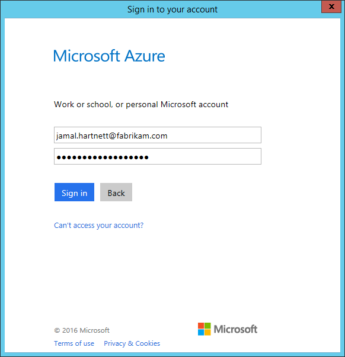

A successful run of the data migration tool prepare will result in a set of logs and two import files. 

After opening the log directory noted in the data migration tool's output you will notice that there are two files and a Logs folder. ```IdentityMapLog.csv``` 
contains the generated mapping of AD to Azure AD identities. ```import.json``` is the import specification file which needs to be filled out. 
It's recommended that you take time to fill out the import specification file, ```import.json```, and review the identity map log file, ```IdentityMapLog.csv```, for completeness before kicking off an import. 

### Import Specification File

The import specification, ```import.json```, is a JSON file which provides import settings. It includes information such as the desired organization name, storage account information, etc. Most of fields are auto-populated, some fields require user input prior to attempting an import.

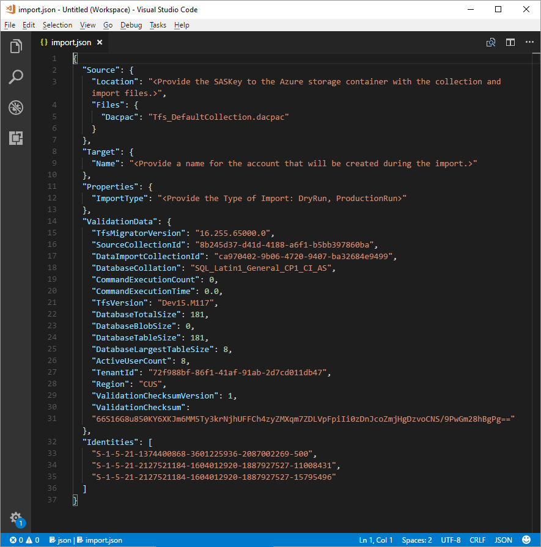

Here is the breakdown of the fields and what action needs to be taken:

|    Field              |    Explanation                                                                                             |    Action                                                                                                                                                                                                                                 |
|--------------------------------------------------|------------------------------------------------------------------------------------------|---------------------------------------------------------------------------------------|
|    Source             |    Information detailing location and names of source data files used for import.                          |    None - Review information for subfield actions below.  |
|    ValidationData     |    Contains information needed to help drive your import experience                                        |    The 'ValidationData' section is generated by the data migration tool. It contains information needed to help drive your import experience, so it's important that you don't edit the values inside of this section or your import could fail to start.   |
|    Files              |    Name of the files containing import data.                                                               |    None - Review information for subfield actions below. |
|    Target             |    Properties describing the new organization to import into.                                     |    None - Review information for subfield actions below. | 
|    Name        |    Desired name for the organization that will be created during the import.                                  |    Select a name. This name can be quickly changed later after the import has completed. Note – do **NOT** create an organization with this name before running the import. The organization will be created as part of the import process.                 |
|    Location    |    SAS Key to the Azure storage account hosting the DACPAC.                    |    None – This will be covered in a later step.                                                                                                                                                                                           |
|    Dacpac         |    A file that packages up your collection database that is used to bring the data in during import.     |    None - In a later step you'll generate this file using your collection and will upload it to an Azure storage account. It will need to be updated based on the name you use when generating the DACPAC later in this process.    |    
|    ImportType        |    The type of import that you want to run.      |    None - In a later step you will select the type of import to run. |
 

After following the above instructions, you should have a file that looks somewhat like the below. 

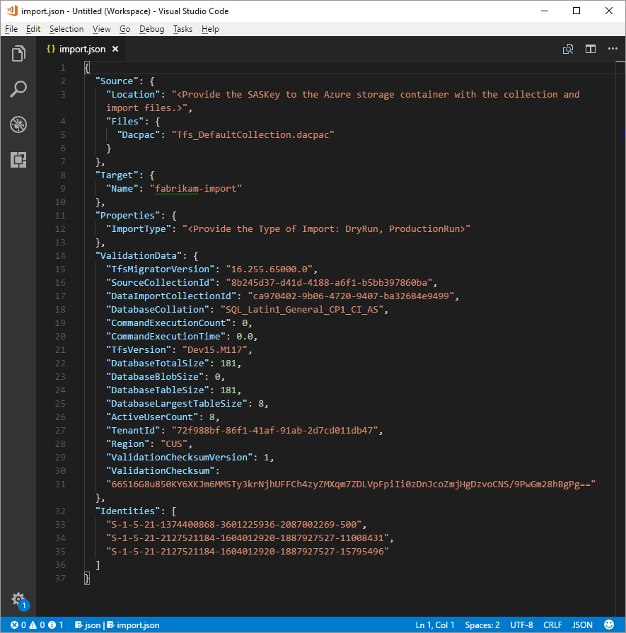

In this case, the user planning the Fabrikam import added the organization name "Fabrikam-Import" and selected the Central US region in the Target object. Other values were left as is to be modified just before taking the collection offline for the migration. 

> [!NOTE]   
> Dry run imports will have a '-dryrun' automatically appended to the end of the organization's name. This can be changed post import.


<a id="supported-azure-regions-for-import"></a>
### Supported Azure Regions for Import
Azure DevOps Services is available in several Azure [regions](https://azure.microsoft.com/regions/services/). However, not all Azure regions that Azure DevOps Services is present in are supported for import. The following table details the Azure regions that can be selected for import. Also included is the value which needs to be placed in the import specification file to target that region for import.  
 

|    Geographic Region            |    Azure Region                |  Import Specification Value |
|---------------------------------|--------------------------------|-----------------------------|
|    United States                |    Central United States       |      CUS                    |
|    Europe                       |    Western Europe              |      WEU                    |
|.   United Kingdom.              |    United Kingdom South        |      UKS                    |
|    Australia                    |    Australia East              |      EAU                    |
|    South America                |    Brazil South                |      SBR                    |
|    Asia Pacific                 |    South India                 |      MA                     |
|    Asia Pacific                 |    East Asia (Hong Kong)       |      EA                     |
|    Canada                       |    Central Canada              |      CC                     |

### Identity Map Log
Arguably the identity map log is of equal importance to the actual data that you will be migrating to Azure DevOps Services. When reviewing the file it's important to understand how identity import operates and what the potential results could entail. When importing an identity, they could either end up becoming active or historical. The difference between active and historical identities is that active identities can log into Azure DevOps Services whereas historical identities cannot. It's important to note that once imported as a historical identity, there is no way to move that identity to become active. 

#### Active Identities
Active identities refer to identities that will be users in Azure DevOps Services post-import. On Azure DevOps Services, these identities will be licensed and show up as a user in the organization after migration. These identities are marked as 'active' in the "Expected Import Status" column in the identity map log file.

<a id="historical-identities"></a>
#### Historical Identities
These are identities that are mapped as 'historical' in the "Expected Import Status" column in the identity map log file. Also, identities that have no line entry present in the file will also become historical. An example of an identity with no entry would be an employee that no longer works at a company. 
Historical Identities do **NOT** have access to an organization after migration, do **NOT** have a licenses, and do **NOT** show up as a user in the organization. All that is persisted is the notion of that identity's name in the organization. This way their history can be searched at a later date. It's recommended that historical identities be used for users that are no longer at the company or won't ever be needing access to the organization. Identities imported historically **CANNOT** be migrated later to become active identities. 

### Understanding an Identity Map Log
After opening the identity map log file, you will be presented with something similar to the below example. 

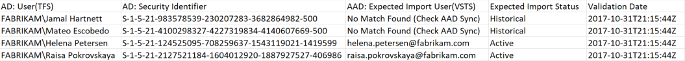

The table below explains what each column is used for. 


> [!NOTE]   
> Users marked as "No Match Found (Check Azure AD Sync)" who you wanted to be added as full organization members will need to be investigated with your Azure AD admin to see why they aren't part of your Azure AD Connect sync. 


|    Column                           |    Explanation                                                                                                                                                                                                                                               |
|-------------------------------------|--------------------------------------------------------------------------------------------------------------------------------------------------------------------------------------------------------------------------------------------------------------|
|    AD - User (Azure DevOps Server)                             |    Friendly display name used by the identity in   Azure DevOps Server. Makes it easier to identify which user the line in the map is   referencing.                                                                                                                         |
|    AD - Security Identifier    |    The unique identifier for the on-prem AD identity   in Azure DevOps Server. This column is used to identify users in the collection.                                                                                                                                      |
|    Azure AD - Expected Import User (Azure DevOps Services)    |    Either the expected sign in address of the matched soon to be active user or "No Match Found (Check Azure AD Sync)" indicating that the identity was not found in during AAd sync and will be imported as historical.                                                                                                                                                                |
|    Expected Import Status               |    The expected user import status, either "Active" if there was a match between your AD and Azure AD or "Historical" if we could not match the AD identity in your Azure AD.                                                                                                                                                                                                        |
|    Validation Date                  |    Last time the identity map log was validated.                                                                                                                                                                                                                 |

Reading through the file you will notice the Expected Import Status column has either 'Active' or 'Historical'. Active indicates that it's expected that the identity on this row will map correctly on import and will become active. Historical will become historical identities on import. It's important that you review the generated mapping file for completeness and correctness.

> [!IMPORTANT]  
> Your import will fail if major changes occur to your Azure AD Connect SID sync between import attempts. New users can be added between dry runs, and corrections to ensure previously imported historical identities become active are also OK. However, changing an existing user that was previously imported as active is not supported at this time. Doing so will cause your import to fail. For example, completing a dry run import, deleting an identity from your Azure AD that was imported actively, recreating a new user in Azure AD for that same identity, and attempt another import. In this case an active identity import will be attempted between the AD and newly created Azure AD identity, but it will cause an import failure as this isn't supported. 

Start by reviewing the correctly matched identities. Are all of the expected identities present? Are the users mapped to the correct Azure AD identity? If any values are incorrectly mapped or need to be changed then you'll need to contact your Azure AD administrator to check whether the on-premises Active Directory (AD) identity is part of the sync to Azure AD and has setup correctly. Check the [documentation](https://aka.ms/vstsaadconnect "Integrating your on-premises identities with Azure Active Directory") on setting a sync between your on-premises Active Directory (AD) and Azure AD. 

Next, review the identities that are labeled as 'Historical'. This implies that a matching Azure AD identity couldn't be found. This could be for one of four reasons.

1. The identity hasn't been setup for sync between on-premises Active Directory (AD) and Azure AD. 
2. The identity hasn't been populated in your Azure AD yet; new employee scenario. 
3. The identity simply doesn't exist in your Azure AD.
4. The user that owned that identity no longer works at the company.

In the first three cases the desired on-premises Active Directory (AD) identity will need to be set up for sync with Azure AD. Check the [documentation](https://aka.ms/azureadconnect "Integrating your on-premises identities with Azure Active Directory") on setting a sync between your on-premises Active Directory (AD) and Azure AD. It's required that Azure AD Connect be setup and run for identities to be imported as active in Azure DevOps Services. The final case can generally be ignored as employees no longer at your company should be imported historically. 
#### Historical Identities (Small Teams) 

> The identity import strategy proposed in this section should only be considered by small teams. 

In cases where the Azure AD Connect hasn't been configured, you will notice that all users in the identity map log file will be marked as 'Historical'. Running an import this way will result in all users getting imported [historically](#historical-identities). It's strongly recommended that you configure [Azure AD Connect](https://aka.ms/azureadconnect) to ensure that your users are imported as active. 

> Running an import with all historical identities has consequences which need to be considered carefully. It should only be considered by teams with a small number of users were the cost of setting up an Azure AD Connect is deemed too high. 

To import with all historical identities, simply follow the steps outlined in later sections. When queuing an import, the identity that is used to queue the import will be bootstrapped into the organization as the organization owner. All other users will be imported historically. The organization owner will then be able to [add users](../organizations/accounts/add-organization-users.md?toc=/azure/devops/organizations/accounts/toc.json&bc=/azure/devops/organizations/accounts/breadcrumb/toc.json) back in using their Azure AD identity. Users added will be treated as new users. They will **NOT** own any of their history and there is no way to re-parent this history to the Azure AD identity. However, users can still lookup their pre-import history by searching for {domain}\{AD username}.

The data migration tool will warn if it detects the complete historical identities scenario. If you decide to go down this migration path you will need to consent in the tool to the limitations. 

### Visual Studio Subscriptions
The data migration tool is unable to detect Visual Studio subscriptions (formerly known as MSDN benefits) when generating the identity map log file. Instead, it's recommended that you leverage the auto license upgrade feature post import. As long as a user's work account is [linked](https://aka.ms/LinkVSSubscriptionToAADAccount) correctly, Azure DevOps Services will automatically apply their Visual Studio subscription benefits on their first login post import. You're never charged for licenses assigned during import, so this can be safely handled post import. 

You don't need to repeat a dry run import if users don't automatically get upgraded to use their Visual Studio Subscription in Azure DevOps Services. Visual Studio Subscription linking is something that happens outside of the scope of an import. As long as the work account gets linked correctly before or after the import then the user will automatically have their license upgraded on the next sign in. Once they've been upgraded successfully, next time you import the user will be upgraded automatically on the first sign in to the organization.  

## Getting Ready to Import
By this point you will have everything ready to execute on your import. You will need to schedule downtime with your team to the take the collection offline for the migration. Once you have an agreed upon a time to run the import you need to get all of the required assets you have generated and a copy of the database uploaded to Azure. This process has five steps:

1.	Take the collection offline and detach it.
2.	Generate a DACPAC from the collection you're going to import.
3.	Upload the DACPAC and import files to an Azure storage account.
4.	Generate a SAS Key to that storage account.
5.	Fill out the last fields in the import specification. 


> [!NOTE]   
> We **strongly** recommend that your organization complete a dry run import before performing a production import. Dry runs allow you to validate that the import process works for your collection and that there are no unique data shapes present which might cause a production import failure. 

### Detaching your Collection
[Detaching the collection](/azure/devops/server/admin/move-project-collection#detach-coll) is a crucial step in the import processes. Identity data for the collection resides in the Azure DevOps Server server's configuration database while the collection is attached and online. When a collection is detached from the Azure DevOps Server instance it will take a copy of that identity data and package it up with the collection for transport. Without this data the identity portion of the import **CANNOT** be executed. It's recommended that the collection stay detached until the import has been completed, as there isn't a way to import the changes which occurred during the import.

If you're running a dry run (test) import, it's recommended to reattach your collection after backing it up for import since you won't be concerned about having the latest data for this type of import. You could also choose to employ an [offline detach](/azure/devops/server/ref/command-line/tfsconfig-cmd#offlinedetach) for dry runs to avoid offline time all together. It's important to weigh the cost involved with going the zero downtime route for a dry run. It requires taking backups of the collection and configuration database, restoring them on a SQL instance, and then creating a detached backup. A cost analysis could prove that taking just a few hours of downtime to directly take the detached backup is better in the long run.


<a id="generating-a-dacpac" />
### Generating a DACPAC

> [!IMPORTANT]  
> Before proceeding, ensure that your collection was [detached](migration-import.md#detaching-your-collection) prior to generating a DACPAC.

> [!NOTE]   
> If the data migration tool didn't warn that your collection was too big, use the DACPAC method outlined below. Otherwise see the section on importing large collections at https://aka.ms/AzureDevOpsImportLargeCollection.

Data-tier Application Component Packages ([DACPAC](/sql/relational-databases/data-tier-applications/data-tier-applications)) is a feature in SQL server that allows database changes to be packaged into a single file and deployed to other instances of SQL. It can also be restored directly to Azure DevOps Services and is therefore utilized as the packaging method for getting your collection's data in the cloud. You're going to use the SqlPackage.exe tool to generate the DACPAC. This tool is included as part of the [SQL Server Data Tools](/sql/ssdt/download-sql-server-data-tools-ssdt). 

There are multiple versions of SqlPackage.exe installed with SQL Server Data Tools, located under folders with names such as 120, 130, and 140. When using SqlPackage.exe it is important to use the right version to prepare the DACPAC.

* TFS 2018 imports need to use SqlPackage.exe from the 140 folder or higher.

If you installed SQL Server Data Tools (SSDT) for Visual Studio, you can find SqlPackage.exe in one of the following locations.

* If you installed SSDT and integrated it with an existing installation of Visual Studio, SqlPackage.exe is located in a folder similar to: `C:\Program Files (x86)\Microsoft Visual Studio 14.0\Common7\IDE\Extensions\Microsoft\SQLDB\DAC\130\`
* If you installed SSDT and did a stand-alone installation, SqlPackage.exe is located in a folder similar to: `C:\Program Files (x86)\Microsoft Visual Studio\2017\SQL\Common7\IDE\Extensions\Microsoft\SQLDB\DAC\130\`
* If you already have an installation of SQL Server, SqlPackage.exe may already be present, and located in a folder similar to: `%PROGRAMFILES%\Microsoft SQL Server\130\DAC\bin\`

Both of the versions of SSDT that you can download from [SQL Server Data Tools](/sql/ssdt/download-sql-server-data-tools-ssdt) include both the 130 and 140 folders with their respective versions of SqlPackage.exe.

When generating a DACPAC there are two considerations that you'll want to keep in mind, the disk that the DACPAC will be saved on and the space on disk for the machine performing the DACPAC generation. Before generating a DACPAC you'll want to ensure that you have enough space on disk to complete the operation. While creating the package, SqlPackage.exe temporarily stores data from your collection in the temp directory on the C: drive of the machine you initiate the packaging request from. Some users might find that their C: drive is too small to support creating a DACPAC. Estimating the amount of space you'll need can be found by looking for the largest table in your collection database. As DACPACs are created one table at a time. The maximum space requirement to run the generation will be roughly equivalent to the size of the largest table in the collection's database. You will also need to take into account the size of the collection database as reported in DataMigrationTool.log file from a validation run, if you choose to save the generated DACPAC on the C: drive.

DataMigrationTool.log provides a list of the largest tables in the collection each time the validate command is run. See the example below for a sample output showing table sizes for a collection. Compare the size of the largest table with the free space on the drive hosting your temporary directory. 

```cmdline 
[Info   @08:23:59.539] Table name                               Size in MB
[Info   @08:23:59.539] dbo.tbl_Content                          38984
[Info   @08:23:59.539] dbo.tbl_LocalVersion                     1935
[Info   @08:23:59.539] dbo.tbl_Version                          238
[Info   @08:23:59.539] dbo.tbl_FileReference                    85
[Info   @08:23:59.539] dbo.Rules                                68
[Info   @08:23:59.539] dbo.tbl_FileMetadata                     61
```

Ensure that the drive hosting your temporary directory has at least that much free space. If it doesn't then you'll need to redirect the temp directory by setting an environment variable. 

```cmdline
SET TEMP={location on disk}
```

Another consideration is where the DACPAC data is saved. Pointing the save location to a far off remote drive could result in much longer generation times. It's recommended that if a fast drive, such as an SSD, is available locally that you target that drive as the DACPAC's save location. Otherwise, it's always faster to use a disk that's on the machine where the collection database is residing over a remote drive. 

Now that you've identified the target location for the DACPAC and ensured that you'll have enough space, it's time to generate the DACPAC file. Open a command prompt and navigate to the location where SqlPackage.exe is located. Taking the command example below, replace the required values and generate the DACPAC

```cmdline
SqlPackage.exe /sourceconnectionstring:"Data Source={database server name};Initial Catalog={Database Name};Integrated Security=True" /targetFile:{Location & File name} /action:extract /p:ExtractAllTableData=true /p:IgnoreUserLoginMappings=true /p:IgnorePermissions=true /p:Storage=Memory
```

* **Data Source** - SQL Server instance hosting your Azure DevOps Server collection database. 
* **Initial Catalog** - Name of the collection database. 
* **targetFile** - Location on disk + name of DACPAC file. 

Below is an example of the DACPAC generation command that is running on the Azure DevOps Server data tier itself:

```cmdline
SqlPackage.exe /sourceconnectionstring:"Data Source=localhost;Initial Catalog=Foo;Integrated Security=True" /targetFile:C:\DACPAC\Foo.dacpac /action:extract /p:ExtractAllTableData=true /p:IgnoreUserLoginMappings=true /p:IgnorePermissions=true /p:Storage=Memory
```

The output of the command will be a DACPAC that is generated from the collection database Foo called Foo.dacpac. 

### Importing Large Collections

> [!NOTE]   
> If the data migration tool warns that you can't use the DACPAC method then you will have to import using the SQL Azure VM method outlined below. If the data migration tool didn't warn that your collection was too big, use the DACPAC method outlined above.

DACPACs offer a fast and relatively simplistic method for moving collections into Azure DevOps Services. However, once a collection database crosses a certain size threshold the benefits of using a DACPAC start to diminish. For databases that the data migration tool warns are too big, a different data packaging approach is required to migrate to Azure DevOps Services. If you're unsure if your collection is over the size threshold then you should run a data migration tool validate on the collection. The validation will let you know if you need to use the SQL Azure VM method for import or not. 

Before going any further, it's always recommended to see if [old data can be cleaned up](/azure/devops/server/upgrade/clean-up-data). Over time collections can build up very large volumes of data. This is a natural part of the DevOps process. However, some of this data might no longer be relevant and doesn't need to be kept around. Some common examples are older workspaces and build results. Cleaning older, no longer relevant artifacts might remove a lot more space than one would expect. It could be the difference between using the DACPAC import method or having to use a SQL Azure VM. It's important to note that once you deleted older data that it **CANNOT** be recovered without restoring an older backup of the collection.

If you are under the DACPAC threshold, follow the instructions to [generate a DACPAC](#generating-a-dacpac) for import. If you're still unable to get the database under the DACPAC threshold then you will need to setup a SQL Azure VM to import to Azure DevOps Services. We'll walk through how to accomplish this end-to-end. At a high-level the steps covered include:

1. Setting up a SQL Azure VM
2. Optionally, we recommend restricting access to just Azure DevOps Services IPs
3. Restoring your database on the VM
4. Creating an identity to connect to the collection database
5. Configuring your import specification file to use a SQL connection string 

#### Creating the SQL Azure VM
Setting up a SQL Azure VM can be done from the Azure portal with just a few clicks. Azure has a [tutorial](https://azure.microsoft.com/documentation/articles/virtual-machines-windows-portal-sql-server-provision/) on how to setup and configure a SQL Azure VM. 

Azure DevOps Services is available in several Azure [regions](https://azure.microsoft.com/regions/services/) across the globe. When importing to these regions it's critical that you place your data in the correct region to ensure that the import can start correctly. Setting up your SQL Azure VM in a location other than the ones recommended below will result in the import failing to start.

Use the table below to decide where you should create you SQL Azure VM if you're using this method to import. Creating your VM in a region outside of the list below is not supported for running an import.

|    Desired Import Region        |    SQL Azure VM Region         |
|---------------------------------|--------------------------------|
|    Central United States        |    Central United States       |
|    Western Europe               |    Western Europe              |
|    Australia East               |    Australia East              |
|    Brazil South                 |    Brazil South                |
|    South India                  |    South India                 |
|    Central Canada               |    Central Canada              |
|    East Asia (Hong Kong)        |    East Asia (Hong Kong)       |

> While Azure DevOps Services is available in multiple regions in the United States, only the Central United States region is accepting new organizations. Customers will not be able to import their data into other United States Azure regions at this time. 

> [!NOTE]   
> DACPAC customers should consult the region table in the [uploading DACPAC and import files section](#uploading-the-dacpac). The above guidelines are for SQL Azure VMs only. 

Below are some additional recommended configurations for your SQL Azure VM.

1. It's recommended that D Series VMs be used as they're optimized for database operations.
2. Ensure that the D Series VM has at least 28GBs of ram. Azure D12 V2 VM sizes are recommended for imports.
3. [Configure](/sql/relational-databases/databases/move-system-databases#a-nameexamplesa-examples) the SQL temporary database to use a drive other than the C drive. Ideally this drive should have ample free space; at least equivalent to your database's [largest table](migration-import.md#generating-a-dacpac).
4. If your source database is still over 1TB after [reducing the size](/azure/devops/server/upgrade/clean-up-data) then you will need to [attach](/azure/virtual-machines/windows/attach-disk-portal) additional 1TB disks and combine them into a single partition to restore your database on the VM. 
5. Collection databases over 1TB in size should consider using Solid State Drives (SSDs) for both the temporary database and collection database. 

#### Azure DevOps Services IPs 

It's highly recommended that you restrict access to your VM to only IPs from Azure DevOps Services. This can be accomplished by allowing connections only from the set of Azure DevOps Services IPs that are involved in the collection database import process. The IPs that need to be granted access to your collection database will depend on what region you're importing into. The tables below will help you identify the correct IPs. The only port that is required to be opened to connections is the standard SQL connection port 1433.

First, no matter what Azure DevOps Services region you import into the following IP must be granted access to your collection database. 

|    Service                                      |    IP               |
|-------------------------------------------------|---------------------|
|    Azure DevOps Services Identity Service       |    168.62.105.45, 40.81.42.115    |

Next you will need to grant access to the Regional Identity Service. You only need to grant an exception for the data migration tool instance in the region that you're importing into. 

|    Service                                                 |    IP                                                                                                                         |
|------------------------------------------------------------|-------------------------------------------------------------------------------------------------------------------------------|
|    Regional Identity Service - Central United States       |    23.99.230.232, 104.43.253.175, 40.122.66.150, 40.122.117.178, 23.99.212.58, 23.99.214.58, 20.37.139.247, 20.37.138.167, 20.37.138.122                                   |
|    Regional Identity Service - West Europe                 |    52.232.119.33, 104.46.44.17, 40.114.142.95, 51.144.180.30, 51.145.130.146, 40.113.97.58, 52.232.113.92, 40.74.51.167       |
|    Regional Identity Service - Australia East              |    13.70.121.123, 52.187.228.246                                                                                              |
|    Regional Identity Service - Brazil South                |    N\A                                                                                                                        |
|    Regional Identity Service - India South                 |    104.211.226.91, 104.211.207.31, 40.81.75.134                                                                                             |
|    Regional Identity Service - Canada Central              |    13.88.230.114, 40.85.244.98, 40.82.185.245                                                                                                |
|    Regional Identity Service - East Asia (Hong Kong)       |    23.98.36.60, 40.83.79.159, 40.81.28.194   
|    Regional Identity Service - UK South                    |    51.105.8.98                                                                                               |

Next you will need to grant access to the data migration tool for Azure DevOps itself. You only need to grant an exception for the data migration tool instance in the region that you're importing into.  

|    Service                                      |    IP                                                      |
|-------------------------------------------------|------------------------------------------------------------|
|    Data migration tool - Central United States       |    52.173.74.9, 52.165.184.188, 20.45.1.234, 13.86.39.123  |
|    Data migration tool - West Europe                 |    40.115.43.138, 13.95.15.128, 52.236.146.105, 40.67.219.89, 40.119.145.63, 52.142.236.228, 52.142.238.75              |
|    Data migration tool - Australia East              |    13.75.134.204, 40.82.219.41, 20.40.124.19                             |
|    Data migration tool - Brazil South                |    104.41.24.164, 20.40.115.123                            |
|    Data migration tool - India South                 |    13.71.120.31, 40.81.76.137                              |
|    Data migration tool - Canada Central              |    52.237.18.100, 52.237.24.61, 40.82.191.163              |
|    Data migration tool - East Asia (Hong Kong)       |    13.75.106.194, 40.81.27.181                             |
|    Data migration tool - UK South                    |    40.81.153.223                                                        |
  
Next you will need to grant Azure DevOps Services access. Again, you only need to grant an exception for the Azure DevOps Services instance in the region that you're importing into.  

|    Service                                                       |    IP                                                                                  |
|------------------------------------------------------------------|----------------------------------------------------------------------------------------|
|    Azure DevOps Services - Central United States                 |    13.89.236.72, 52.165.41.252, 52.173.25.16, 13.86.38.60, 20.45.1.175, 13.86.36.181   |
|    Azure DevOps Services - West Europe                           |    52.166.54.85, 13.95.233.212, 52.236.145.119, 52.142.235.223, 52.236.147.103, 23.97.221.25, 52.233.181.148, 52.149.110.153         |
|    Azure DevOps Services - Australia East                        |    13.75.145.145, 40.82.217.103, 20.188.213.113, 104.210.88.194, 40.81.62.114                                                        |
|    Azure DevOps Services - Brazil South                          |    20.40.114.3, 191.235.90.183, 191.232.38.181, 191.233.25.175                                                                         |
|    Azure DevOps Services - India South                           |    104.211.227.29, 40.81.75.130, 52.172.54.122, 52.172.49.252                                                        |
|    Azure DevOps Services - Canada Central                        |    52.237.19.6, 40.82.190.38                                                           |
|    Azure DevOps Services - East Asia (Hong Kong)                 |    52.175.28.40, 40.81.25.218, 13.94.26.58                                                          |
|    Azure DevOps Services - UK South                              |    40.81.159.67                                 |

Next you will need to grant Azure Pipelines Releases service access. You only need to grant an exception for the Azure DevOps Services instance in the region that you're importing into.

**Release Management IPs**

|    Service                                    |    IP                                                                        |
|-----------------------------------------------|------------------------------------------------------------------------------|
|    Releases service - United States           |    23.102.153.83, 23.101.127.247, 23.100.85.250, 13.86.39.233, 40.80.217.53  |
|    Releases service - West Europe             |    13.95.223.69, 104.45.64.13                                                |
|    Releases service - Australia East          |    13.73.204.151, 20.40.176.135                                              |
|    Releases service - Brazil South            |    191.235.94.154, 20.40.116.69                                              |
|    Releases service - India South             |    52.172.15.233, 40.81.79.60                                                |
|    Releases service - Canada Central          |    52.237.28.171, 40.82.189.127                                              |
|    Releases service - East Asia (Hong Kong)   |    13.107.6.175, 40.81.29.43                                                 |
|    Releases service - UK South                |    40.81.156.207                                                                          |

Next you will need to grant Azure Artifacts access. Again, you only need to grant an exception for the Azure DevOps Services instance in the region that you're importing into.  

**Azure Artifacts IPs**

You will need to add exceptions for all three services that make up Azure Artifacts.

|    Service                                         |    IP                                                                                                                                  |
|----------------------------------------------------|----------------------------------------------------------------------------------------------------------------------------------------|
|    Azure Artifacts - United States              |    52.173.148.93, 104.43.253.181, 23.99.179.148, 40.80.222.154, 40.119.0.130, 40.119.0.139,  13.86.125.169, 20.41.44.47, 40.90.219.165 |
|    Azure Artifacts - West Europe                |    104.46.45.12, 52.236.148.212                                                                                                        |
|    Azure Artifacts - Australia East             |    13.73.100.166, 20.40.176.15, 40.81.59.69                                                                                            |
|    Azure Artifacts - Brazil South               |    191.234.179.224, 20.40.115.214                                                                                                      |
|    Azure Artifacts - India South                |    52.172.11.191, 40.81.74.79                                                                                                          |
|    Azure Artifacts - Canada Central             |    52.237.24.224, 40.85.224.121, 13.71.189.199, 40.82.188.122                                                                          |
|    Azure Artifacts - East Asia (Hong Kong)      |    52.229.175.18, 65.52.162.53, 40.83.74.71, 40.81.27.130                                                                              |
|    Azure Artifacts - UK South                   |    51.145.120.132                                                                               |

|    Service                                         |    IP                                                                              |
|----------------------------------------------------|------------------------------------------------------------------------------------|
|    Azure Artifacts Feed - United States         |    52.173.251.89, 20.45.1.3, 40.67.190.224, 20.41.58.125, 40.119.1.14, 20.45.1.249 |
|    Azure Artifacts Feed - West Europe           |    40.118.19.43, 52.236.146.118                                                    |
|    Azure Artifacts Feed - Australia East        |    13.70.143.138, 20.40.176.80                                                     |
|    Azure Artifacts Feed - Brazil South          |    191.235.93.87, 20.40.116.17                                                     |
|    Azure Artifacts Feed - India South           |    52.172.8.41,40.81.79.49                                                         |
|    Azure Artifacts Feed - Canada Central        |    52.237.19.70, 40.82.188.254                                                     |
|    Azure Artifacts Feed - East Asia (Hong Kong) |    52.229.163.155, 40.81.28.59, 40.81.59.77                                        |
|    Azure Artifacts Feed - UK South              |    51.145.120.49                                                                               |

|    Service                                          |    IP               |
|-----------------------------------------------------|---------------------|
|    Azure Artifacts Blob - United States          |    70.37.94.103, 40.78.129.25, 40.67.155.236, 52.230.216.163     |
|    Azure Artifacts Blob - West Europe            |    23.97.221.25     |
|    Azure Artifacts Blob - Australia East         |    40.127.86.30, 20.188.213.113, 40.82.221.14   |
|    Azure Artifacts Blob - Brazil South           |    191.235.90.183   |
|    Azure Artifacts Blob - India South            |    52.172.54.122    |
|    Azure Artifacts Blob - Canada Central         |    52.237.16.145, 52.237.16.145, 52.233.38.115, 40.82.187.186     |
|    Azure Artifacts Blob - East Asia (Hong Kong)  |    13.94.26.58      |
|    Azure Artifacts Blob - UK South               |    51.143.174.59, 40.81.152.41              |
 

#### Configuring IP Firewall Exceptions

Granting exceptions for the necessary IPs is handled at the Azure networking layer for your SQL Azure VM. To get started you will need to navigate to your SQL Azure VM on the [Azure portal](https://ms.portal.azure.com). Then select 'Networking' from the settings. This will take you to the network interface page for your SQL Azure VM. The data migration tool requires the Azure DevOps Services IPs to be configured for inbound connections only on port 1433. Exceptions for the IPs can be made by selecting "Add inbound port rule" from the networking settings. 

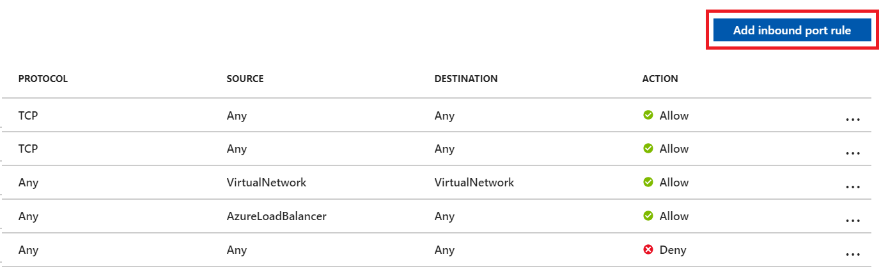

Select advanced to configure an inbound port rule for a specific IP. 

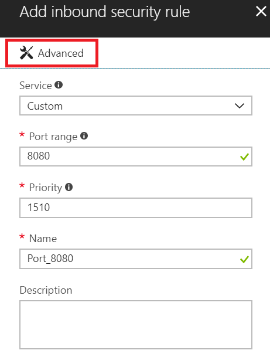

Set the source to "IP Addresses", enter one of the IPs that need to be granted an exception, set the destination port range to 1433, and provide a name that best describes the exception you're configuring. Depending on other inbound port rules that have been configured, the default priority for the Azure DevOps Services exceptions might need to be changed so they don't get ignored. For example, if you have a deny on all inbound connections to 1433 rule with a higher priority than your Azure DevOps Services exceptions, the data migration tool might not be able to make a successful connection to your database. 

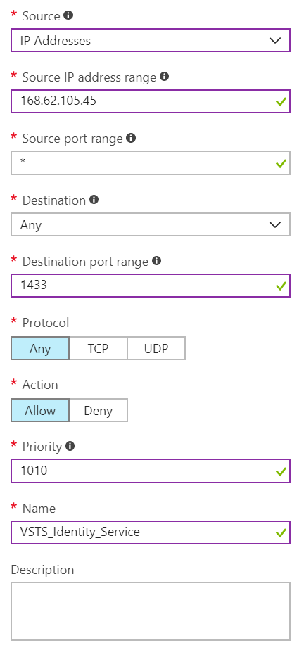

You will need to repeat adding inbound port rules until all necessary Azure DevOps Services IPs have been granted an exception. Missing one IP could result in your import failing to start. 

#### Restoring your Database on the VM

After setting up and configuring an Azure VM, you will need to take your detached backup from your Azure DevOps Server instance to your Azure VM. Azure has several methods [documented](https://azure.microsoft.com/documentation/articles/virtual-machines-windows-migrate-sql/) for how to accomplish this task. The collection database needs to be restored on SQL and doesn't require Azure DevOps Server to be installed on the VM. 

#### Configuring your Collection for Import

Once your collection database has been restored onto your Azure VM, you will need to configure a SQL login to allow Azure DevOps Services to connect to the database to import the data. This login will only allow **read** access to a single database. Start by opening SQL Server Management Studio on the VM and open a new query window against the database that will be imported. 

You will need to set the database's recovery to simple: 

```sql
ALTER DATABASE [<Database name>] SET RECOVERY SIMPLE;
```

Next you will need to create a SQL login for the database and assign that login the 'TFSEXECROLE':

```sql
USE [<database name>]
CREATE LOGIN <pick a username> WITH PASSWORD = '<pick a password>'
CREATE USER <username> FOR LOGIN <username> WITH DEFAULT_SCHEMA=[dbo]
EXEC sp_addrolemember @rolename='TFSEXECROLE', @membername='<username>'
```

Following our Fabrikam example the two SQL commands would look like the following:

```sql
ALTER DATABASE [TFoo] SET RECOVERY SIMPLE;

USE [Foo]
CREATE LOGIN fabrikam WITH PASSWORD = 'fabrikamimport1!'
CREATE USER fabrikam FOR LOGIN fabrikam WITH DEFAULT_SCHEMA=[dbo]
EXEC sp_addrolemember @rolename='TFSEXECROLE', @membername='fabrikam'
```

#### Configure the Import Specification File to Target the VM
The import specification file will need to be updated to include information on how to connect to the SQL instance. Open your import specification file and make the following updates:

Remove the DACPAC parameter from the source files object.

**Before**

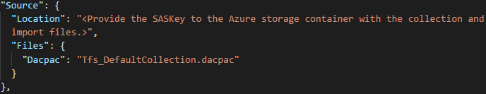

**After**

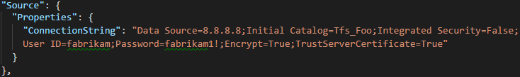

Fill out the required parameters and add the following properties object within your source object in the specification file.

```json
"Properties":
{
    "ConnectionString": "Data Source={SQL Azure VM IP};Initial Catalog={Database Name};Integrated Security=False;User ID={SQL Login Username};Password={SQL Login Password};Encrypt=True;TrustServerCertificate=True" 
}
```

Following the Fabrikam example, the import specification would look like the following after applying the changes:

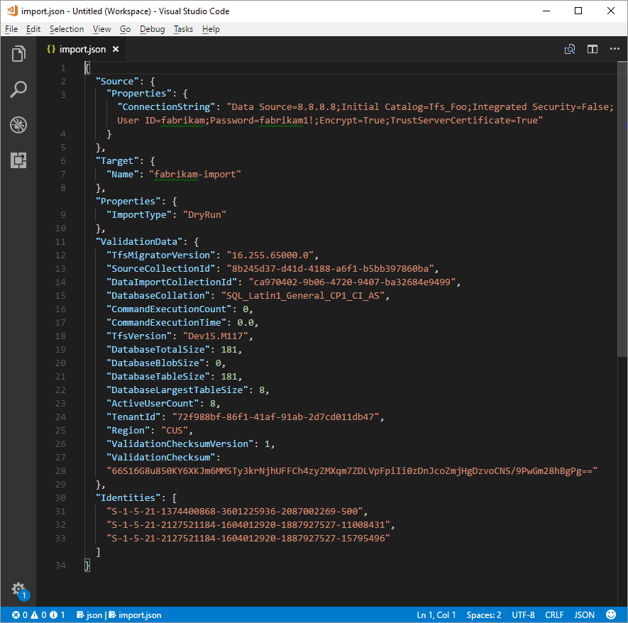

Your import specification is now configured to use a SQL Azure VM for import! Proceed with the rest of preparation steps to import to Azure DevOps Services. Once the import has completed be sure to delete the SQL login or rotate the password. Microsoft does not hold onto the login information once the import has completed. 

### Uploading the DACPAC

> [!NOTE]   
> If you're using the SQL Azure VM method then you only need to provide the connection string. You will not have to upload any files and can skip this step.  

Your DACPAC will need to be placed in an Azure storage container. This can be an existing container or one created specifically for your migration effort. It is important to ensure your container is created in the right region.

Azure DevOps Services is available in multiple [regions](https://azure.microsoft.com/regions/services/). When importing to these regions it's critical that you place your data in the correct region to ensure that the import can start successfully. Your data needs to be placed into the same region that you will be importing into. Placing it somewhere else will result in the import being unable to start. The below table covers the acceptable regions to create your storage account and upload your data.

|    Desired Import Region        |    Storage Account Region      |
|---------------------------------|--------------------------------|
|    Central United States        |    Central United States       |
|    Western Europe               |    Western Europe              |
|    Australia East               |    Australia East              |
|    Brazil South                 |    Brazil South                |
|    India South                  |    India South                 |
|    Canada Central               |    Canada Central              |
|    East Asia (Hong Kong)        |    East Asia (Hong Kong)       |

While Azure DevOps Services is available in multiple regions in the United States, only the Central United States region is accepting new Azure DevOps Services. Customers will not be able to import their data into other United States Azure regions at this time.  

[Creating a blob container](/azure/storage/common/storage-create-storage-account) can be done from the Azure portal. Once the container has been created you will need to upload the following file:
* Collection DACPAC 

After the import has been completed you can delete the blob container and accompanying storage account.

This can be accomplished using tools like [AzCopy](https://azure.microsoft.com/documentation/articles/storage-use-azcopy/) or any other Azure storage explorer tool like [Microsoft Azure Storage Explorer](https://storageexplorer.com/). 

> [!NOTE]   
> If your DACPAC is larger than 10GB then it's recommended that you use AzCopy. AzCopy has multi-threaded upload support for faster uploads.

### Generating SAS Key
A Shared Access Signature ([SAS](https://azure.microsoft.com/documentation/articles/storage-dotnet-shared-access-signature-part-1/)) Key provides delegated access to resources in a storage account. This allows you to give Microsoft the lowest level of privilege required to access your data for executing the import. 

The recommended way to generate a SAS Key is the [Microsoft Azure Storage Explorer](https://storageexplorer.com/). Storage Explorer allows you to easily create container level SAS Keys. This is essential as the data migration tool does NOT support account level SAS Keys. 

>**NOTE**: Do NOT generate a SAS Key from the Azure portal. Azure portal generated SAS Keys are account scoped and will not work with the data migration tool. 

After installing Storage Explorer you can complete the following steps to generate a SAS Key:

* Open the Microsoft Azure Storage Explorer after installation
* Add an account
* Choose "Use a storage account name and key"

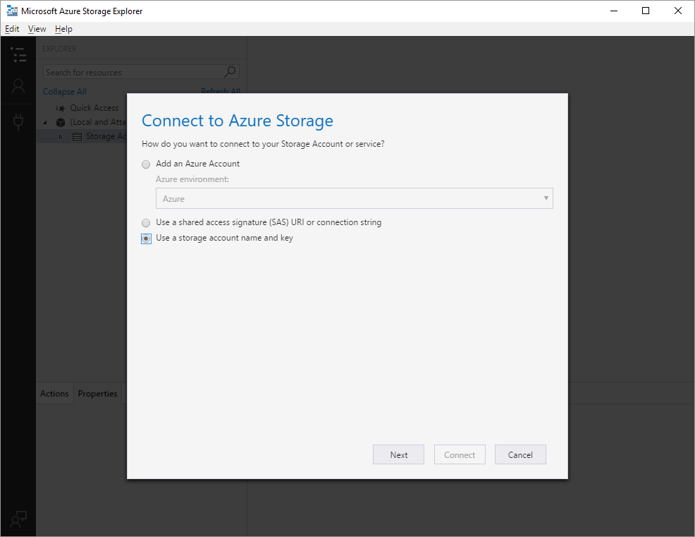

* Enter your storage account name, provide one of your two [primary access keys](/azure/storage/common/storage-create-storage-account#manage-your-storage-account-keys), and connect

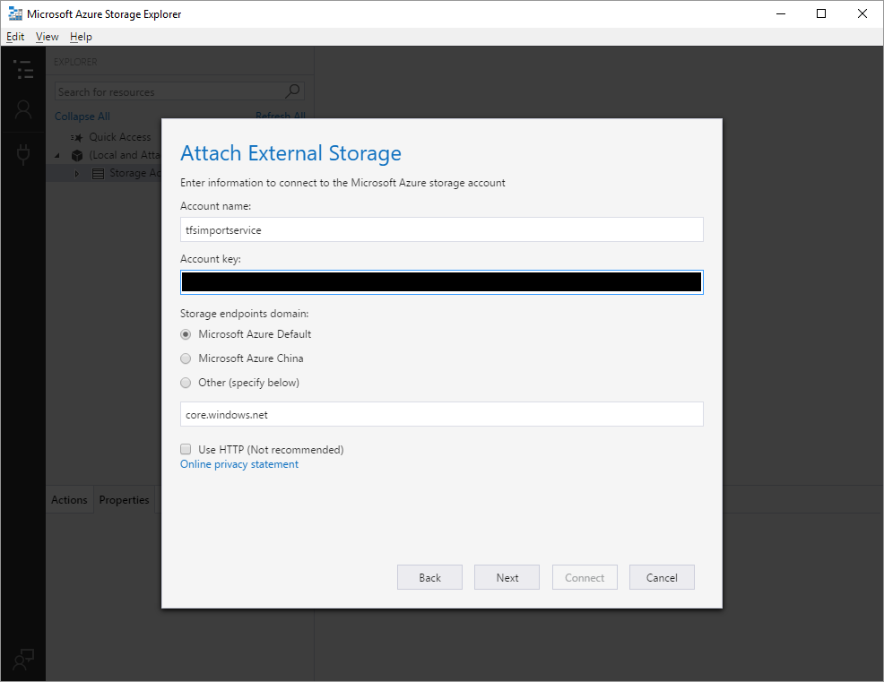

* Expand out the blob containers, select the container with your import files, and choose to generate a "Shared Access Signature"

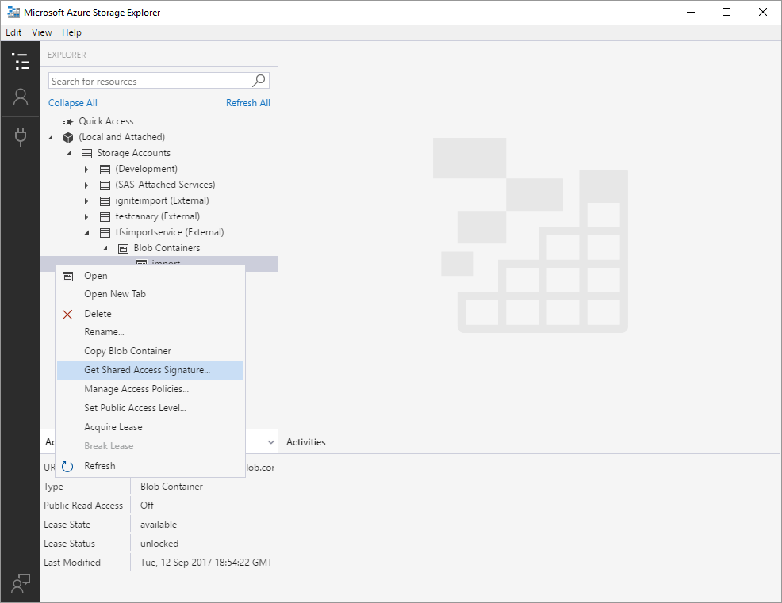

* Ensure that your SAS Key has read and list permissions. Write and delete permissions are NOT required 
* Set the expiration for 7 days into the future

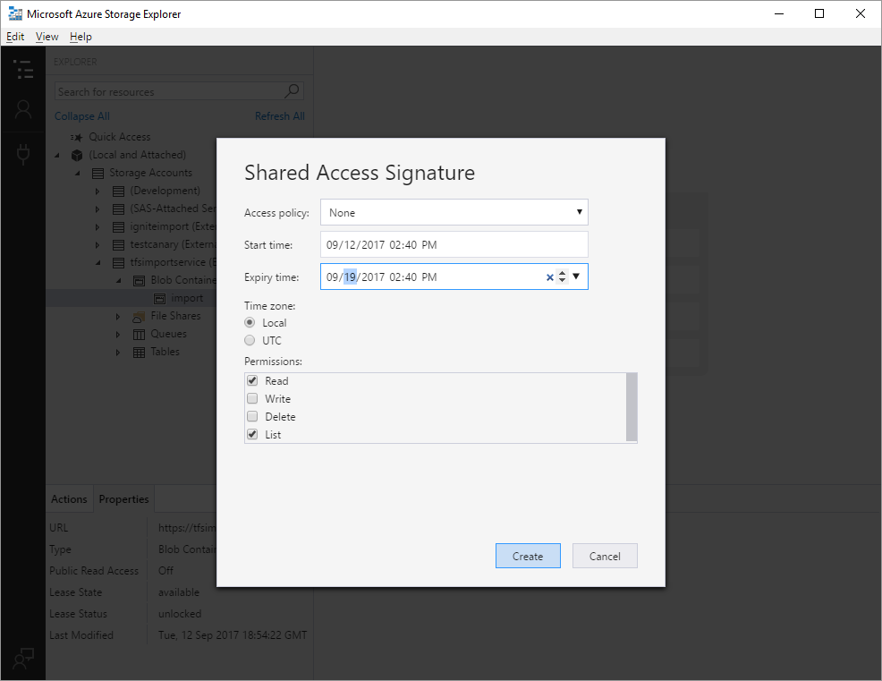

Copy and hold onto this SAS Key as you will need to place it in your import specification file during the next step. 

> Ensure that you treat this SAS Key as a secret. It provides access to your files in the storage container. 

### Completing the Import Specification
Earlier in the process you partially filled out the import specification file generally known as ```import.json```. At this point you have enough information to fill out all of the remaining fields expect for the import type. The import type will be covered in the import section below. Open your import specification file and fill out the following fields.

* **Location** - Place the SAS Key generated from the script in the last step here.
* **Dacpac** - Ensure the name in field is the same as the DACPAC file you uploaded to the storage account. Including the ".dacpac" extension. 

Using the Fabrikam example, the final import specification file should look like the following:

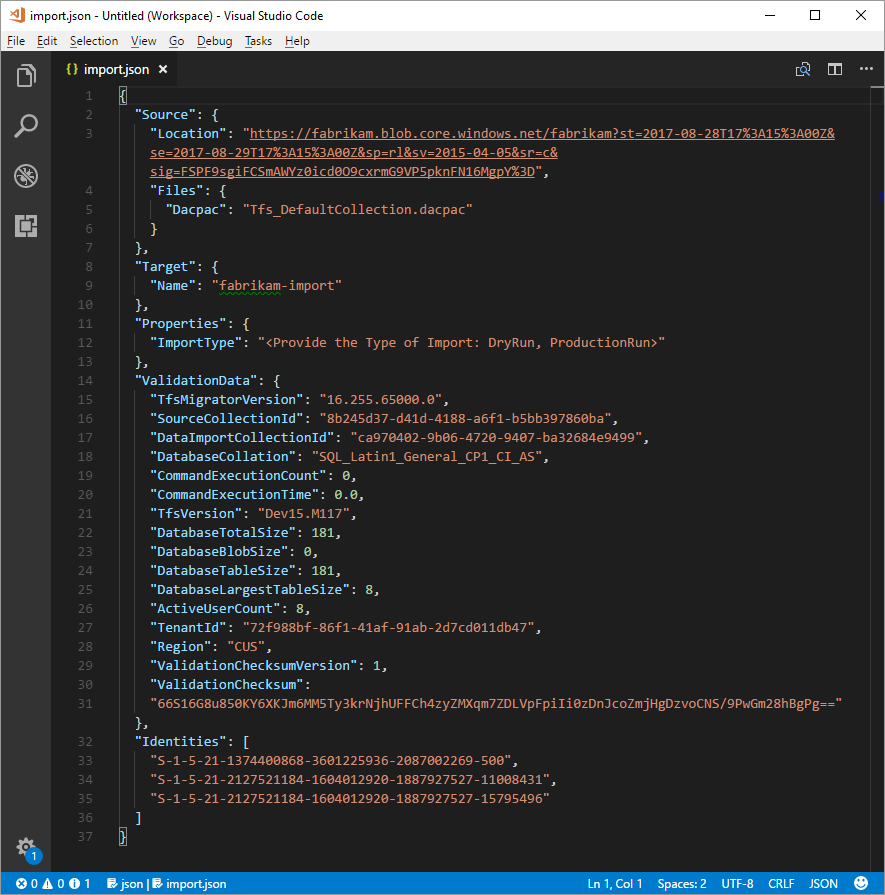

### Determining the Type of Import 
Imports can either be queued as a dry or production run. Dry runs are for testing and production runs are when your team intends to use the organization full time in Azure DevOps Services once the import completes. Determining which type of import to be run is based off the value you provide for the import type parameter. 

> It's always recommended that you complete a dry run import first.   

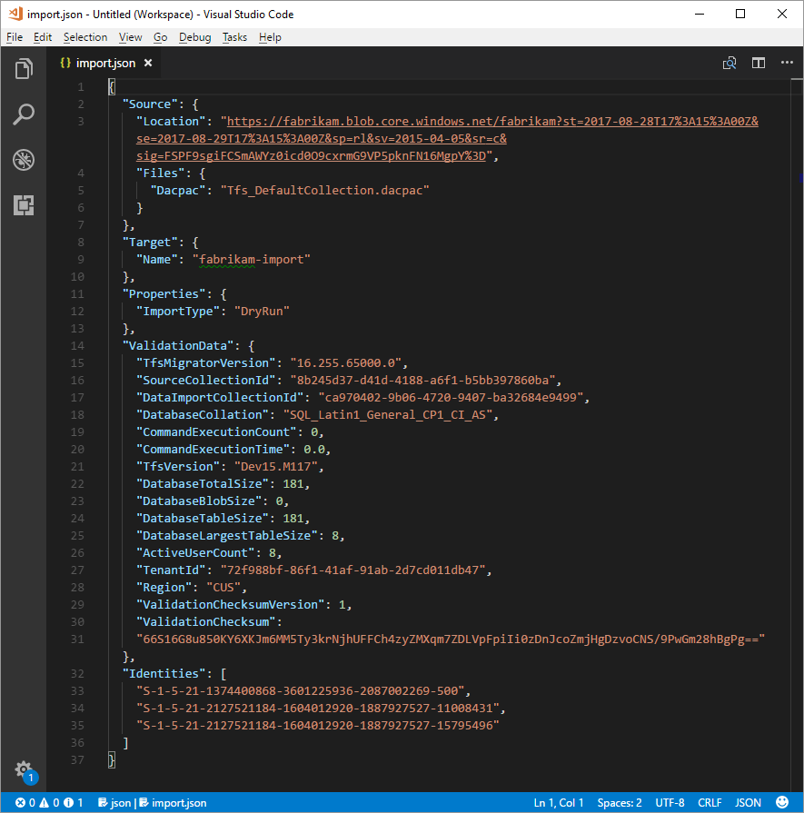

### Dry Run Organizations
Dry run imports help teams to test the migration of their collections. It's not expected that these organizations will remain around forever, but rather to exist for a small time frame. In fact, before a production migration can be run, any completed dry run organizations will need to be deleted. All dry run organizations have a **limited existence and will be automatically deleted after a set period of time**. When the organization will be deleted is included in the success email received after the import completes. Be sure to take note of this date and plan accordingly. 

Most dry run organizations will have 15 days before they're deleted. Dry run organizations can also have a 21 day expiration if more than 100 users are licenses basic or higher at **import time**. Once that time period passes the dry run organization will be deleted. Dry run imports can be repeated as many times as you need to feel comfortable before doing a production migration. A previous dry run attempt still needs to be deleted before attempting a new dry run migration. If your team is ready to perform a production migration before then you will need to manually delete the dry run organization. 

Be sure to check out the [post import](migration-post-import.md) documentation for additional details on post import activities. Should your import encounter any problems, be sure to review the [import troubleshooting](migration-troubleshooting.md#dealing-with-import-errors) steps. 

## Running an Import
The great news is that your team is now ready to begin the process of running an import. It's recommended that your team start with a dry run import and then finally a production run import. Dry run imports allow your team to see how the end results of an import will look, identify potential issues, and gain experience before heading into your production run. 

> [!NOTE]
> Repeating a production run import of a completed import for a collection, such as in the event of a rollback, requires reaching out to Azure DevOps Services [Customer Support](https://azure.microsoft.com/support/devops/) before queuing another import.

### Considerations for Roll Back Planning
A common concern that teams have for the final production run is to think through what the rollback plan will be if anything goes wrong with import. This is also why we highly recommend doing a dry run to make sure you are able to test the import settings you provide to the data migration tool for Azure DevOps.

Rollback for the final production run is fairly simple. Before you queue the import, you will be detaching the team project collection from Team Foundation Server which will make it unavailable to your team members. If for any reason, you need to roll back the production run and have Team Foundation Server come back online for your team members, you can simply attach the team project collection on-premises again and inform your team that they will continue to work as normal while your team regroups to understand any potential failures.

### Queueing an Import

> [!IMPORTANT] 
> Before proceeding, ensure that your collection was [detached](migration-import.md#detaching-your-collection) prior to generating a DACPAC or uploading the collection database to a SQL Azure VM. If you didn't complete this step the import will fail. 
>
> In the event your import fails, see the following [guidance](migration-troubleshooting.md). 

Starting an import is done by using the data migration tool's import command. The import command takes an import specification file as input. It will parse through the file to ensure the values which have been provided are valid, and if successful, it will queue an import to Azure DevOps Services. The import command requires an internet connection, but does **NOT** require a connection to your Azure DevOps Server instance. 

To get started, open a command prompt and CD to path where you have the data migration tool placed. Once there it's recommended that you take a second to review the help text provided with the tool. Run the following command to see the guidance and help for the import command:

```cmdline
Migrator import /help
```

The command to queue an import will have the following structure:

```cmdline
Migrator import /importFile:{location of import specification file}
```

Here is an example of a completed import command:

```cmdline
Migrator import /importFile:C:\DataMigrationToolFiles\import.json
```

Once the validation passes you will be asked to sign into to Azure AD. It's important that you sign in with an identity that is a member of the same Azure AD as the identity map log file was built against. The user that signs in will become the owner of the imported organization. 

> [!NOTE]
> Imports are limited to 5 against a single Azure AD tenant per 24 hour period. Only imports that are queued count against this cap.

After the import starts the user that queued the import will receive an email. Around 5-10 minutes after queueing the import your team will be able to navigate to the organization to check on the status. Once the import completes your team will be directed to sign in. The owner of the organization will also receive an email when the import finishes. 
