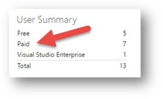

# Post import

[!INCLUDE [version-azure-devops](_shared/version-azure-devops.md)]

> [!NOTE]
> It's recommended that you use the [Migration Guide](https://aka.ms/AzureDevOpsImport) to progress through your import. The guide links to the technical documentation as needed.
>
> With the release of Azure DevOps Server 2019 the TFS Database Import Service has been rebranded to become data migration tool for Azure DevOps. This includes TfsMigrator becoming the data migration tool or migrator for short. This service still works exactly the same as the old Import Service. If you're on an older version of on-premises with TFS as the branding you can still use this feature to migrate to Azure DevOps as long as you upgrade to one of the supported versions. 

An organization is ready for use once an import has completed successfully. However, there are common tasks that you should perform before opening the organization up to all of your users. Below is a list of the most common after import tasks that should be completed. Tasks are listed in recommended order of completion. 

## Immediately After Import
Immediately after the organization becomes available you will want to take a small team and perform spot checks on the organization. It's recommended that this team consists of the project collection administrators. This shouldn't be an in-depth check, but rather making sure that major pieces from your collection were brought over. Did your source code get imported? Are you seeing your build history? Are all of our area paths still present? It's best to confirm these artifacts are present before opening the organization to the entirety of your user base. 

After spot checking the organization you will want to consider if you want to rename it. [Renaming an organization](../organizations/accounts/rename-organization.md) is a simple operation, but it has [large impacts](https://support.microsoft.com/kb/2793597) on users currently using the organization. Some examples being Team Explore connections breaking or bookmarks no longer working. Getting a rename out of the way while it's just a small group of users using the organization allows the rest of the users to come in and configure their connections once. 

## Set up Billing

To pay for users or services in Azure DevOps Services, like hosted build and deployment agents, you'll need to set up billing for your organization. You can do this when you make your first purchase by selecting an Azure subscription that you'd like to use for billing. This links the subscription to your organization, so that all future purchases for your organization will use the same Azure subscription for billing.

## Manage Users and Access

Your organization includes 5 free users with [Basic](https://visualstudio.microsoft.com/products/visual-studio-team-services-feature-matrix-vs) access. Basic includes features like Git and Team Foundation version control, tools for agile planning and Java teams, and more. Also, you can add [Visual Studio subscribers](https://visualstudio.microsoft.com/products/how-to-buy-vs) for free - they get basic features plus additional features, based on their subscription level. Add [Stakeholder](https://visualstudio.microsoft.com/products/visual-studio-team-services-feature-matrix-vs) for free, too-they can access your work items and view your backlogs.

This means that you shouldn't have to take any other import steps if your identity mapping file has just 5 users with Basic access, Visual Studio subscriptions, and Stakeholder access. If you have more than 5 users with Basic access, you'll need to [pay for these users in your organization](../organizations/billing/buy-basic-access-add-users.md). Just make sure to do this before the end of the calendar month when you import. Otherwise, these users' feature access will change from Basic to Stakeholder on the 1st day of the next calendar month. To find out how many additional users you'll need to pay for, visit your organization (```https://dev.azure.com/{yourorganization}/_user```) so you can find the number of paid users that you've assigned:



Dry run imports do not have their licenses reset on the 1st of the month. Unlike production imports, their grace period extends for the life of the organization. So you don't need to worry about purchasing licenses while testing out an import. 

## Builds
Next, you will want to configure your build agents. As part of the migration, all of your build pipelines have been brought over, but agents and pools need to be reconfigured against the new organization. Azure DevOps Services offers the ability to use a Microsoft-hosted pool of build agents that you can use, or you can connect your self-hosted build agent(s). It's important to note that only one self-hosted build agent is included for free. After that there is a [fee](https://visualstudio.microsoft.com/products/visual-studio-team-services-pricing-vs.aspx) for having additional self-hosted build agents. To pay for Microsoft-hosted and self-hosted build agents you will need to link a subscription to your organization. See the following resources for details on performing this task:

* [Build Agents](../pipelines/agents/agents.md) 

If you plan on using your existing on-premises private build agents, there is one more recommended step that needs to be taken after registering them to your new organization. Clearing their cache will ensure that you don't encounter any build issues related to older TFVC or Git pointers to your on-premises collection. See [refreshing caches on client computers](/azure/devops/server/admin/backup/refresh-data-caches) for details on how to accomplish this task. 

## Release Management
If you used Release Management in Azure DevOps Server then your release pipelines and history data will be included with your import. However, like builds, [agents](../pipelines/agents/agents.md) and pools need to be reconfigured against the new organization. 

## Azure Artifacts
If you used Azure Artifacts in your collection, then you will need to install the Azure Artifacts [extension](https://marketplace.visualstudio.com/items?itemName=ms.feed#) in your organization post import to view your Azure Artifacts data. 

## Notifying the Team
After getting your builds running and license subscription configured, it's recommended that the organization be opened up to all users for validation. This is when individual users can ensure that all of the content is in place, they have the right access level, and that they can pull code. Be sure to point users to our [documentation](../organizations/accounts/set-up-vs.md) on connecting to Azure DevOps Services from all of our supported IDEs and Team Explorer.  Users of TFVC with local workspaces will need to remap their workspaces against the new organization and Git users will have to reconfigure their remotes to be able to pull code. If anything is reported as missing from the migrated organization, please reach out to [AzureDevOpsImport@microsoft.com](mailto:AzureDevOpsImport@microsoft.com). For other functional issues, please reach out to [customer support](https://visualstudio.microsoft.com/support/).  
