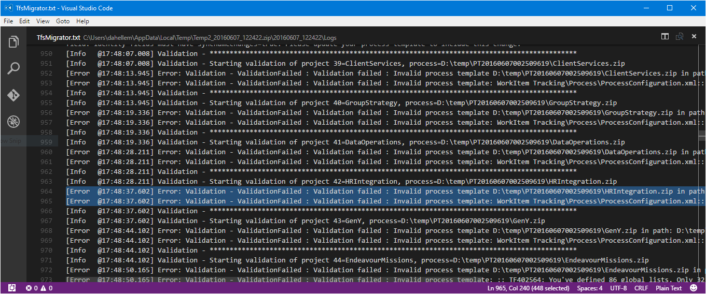
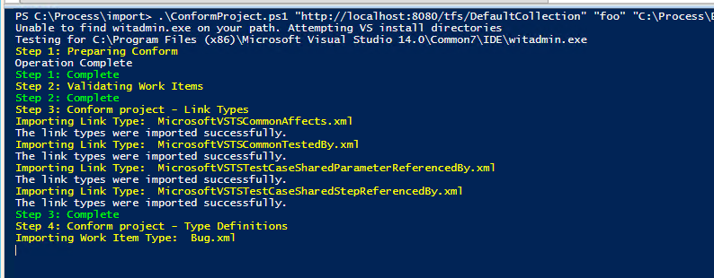

# Process templates

[!INCLUDE [version-azure-devops](_shared/version-azure-devops.md)]

> [!NOTE]
> It's recommended that you use the [Migration Guide](https://aka.ms/AzureDevOpsImport) to progress through your import. The guide links to the technical documentation as needed.
>
> With the release of Azure DevOps Server 2019 the TFS Database Import Service has been rebranded to become data migration tool for Azure DevOps. This includes TfsMigrator becoming the data migration tool or migrator for short. This service still works exactly the same as the old Import Service. If you're on an older version of on-premises with TFS as the branding you can still use this feature to migrate to Azure DevOps as long as you upgrade to one of the supported versions. 

The data migration tool could flag errors which need to be corrected before you start a migration. Below are the most common process related errors that you may encounter when preparing for a migration. After you have corrected each error, you will need to run the data migration tool's validate command again.

<a id="process-validation-types"></a>
## Process Validation Types
During the validation, the data migration tool will determine the target process model for each project. If the project was created with the Agile, Scrum, or CMMI process template, and was never customized, the project will use the Inheritance process model. In all other cases, the data migration tool considers the project as customized, and the project will use the Hosted XML process model. When the Hosted XML process is the targeted process model, the data migration tool validates if the customizations can be migrated. The data migration tool generates two files during the validation: 

**DataMigrationTool.log** - Contains the set of process validation errors found in the collection. You must fix all these process errors to proceed with your migration.
    
**TryMatchOobProcesses.log** - Lists for each project the target process model - Inheritance or Hosted XML. For projects that are set to target the Hosted XML process model, it explains why they are considered to be customized. You don't have to fix these errors, but they give you guidance what to do in case you want to migrate into the Inheritance process model. Note that once a collection is imported, it is not possible to migrate a project to the Inheritance process model. That is on our roadmap for end of 2018.
    
Most customers have a mix of projects that have been customized (i.e. custom fields) and projects that are using an OOB process template. The data migration tool checks each project and validates it accordingly. It is very possible you will have some projects that will be mapped to an OOB process and some projects will use the Hosted XML for their process customization.

We recommend that for any project that has not been customized, that you review the TryMatchOobProcesses.log to determine if there are any errors. If so, make the adjustments accordingly so that the project can be mapped to an OOB process upon data import.

## Update to a System Process

If you started with an older version of Azure DevOps Server\TFS, odds are your projects are still using an older process template. If those projects have not been updated using the [Configure Features Wizard](../reference/configure-features-after-upgrade.md?toc=/azure/devops/reference/toc.json&bc=/azure/devops/reference/breadcrumb/toc.json) then the data migration tool will find process errors. In some rare cases, if your process is so old, even the Configure Features Wizard will not resolve the errors.

Here are some examples of error messages you will probably receive:

```no-highlight
Invalid process template: WorkItem Tracking\Process\ProcessConfiguration.xml:: TF402571: Required element PortfolioBacklog is missing from Process Configuration.
Invalid process template: WorkItem Tracking\Process\ProcessConfiguration.xml:: TF402571: Required element BugWorkItems is missing from Process Configuration.
Invalid process template: WorkItem Tracking\Process\ProcessConfiguration.xml:: TF402571: Required element FeedbackRequestWorkItems is missing from Process Configuration.
Invalid process template: WorkItem Tracking\Process\ProcessConfiguration.xml:: TF402571: Required element FeedbackResponseWorkItems is missing from Process Configuration.
Invalid process template: WorkItem Tracking\Process\ProcessConfiguration.xml:: TF402574: ProcessConfiguration doesn't specify required TypeField Team.
Invalid process template: WorkItem Tracking\Process\ProcessConfiguration.xml:: TF402574: ProcessConfiguration doesn't specify required TypeField RemainingWork.
Invalid process template: WorkItem Tracking\Process\ProcessConfiguration.xml:: TF402574: ProcessConfiguration doesn't specify required TypeField Order.
Invalid process template: WorkItem Tracking\Process\ProcessConfiguration.xml:: TF402574: ProcessConfiguration doesn't specify required TypeField Effort.
Invalid process template: WorkItem Tracking\Process\ProcessConfiguration.xml:: TF402574: ProcessConfiguration doesn't specify required TypeField Activity.
Invalid process template: WorkItem Tracking\Process\ProcessConfiguration.xml:: TF402574: ProcessConfiguration doesn't specify required TypeField ApplicationStartInformation.
Invalid process template: WorkItem Tracking\Process\ProcessConfiguration.xml:: TF402574: ProcessConfiguration doesn't specify required TypeField ApplicationLaunchInstructions.
Invalid process template: WorkItem Tracking\Process\ProcessConfiguration.xml:: TF402574: ProcessConfiguration doesn't specify required TypeField ApplicationType.
Invalid process template: WorkItem Tracking\Process\ProcessConfiguration.xml:: TF400572: The Project Process Settings must be configured for this feature to be used.
```

If you have never customized your project (added fields, work item types, etc.), then fixing these is actually pretty simple.

> If you customized your process, then this approach will not work. You will need to manually change the process templates so that your customizations do not get overwritten.

First, make sure you know what process your project started as. Is it Scrum, Agile or CMMI? In this example, let us assume Agile. Now go to https://github.com/Microsoft/process-customization-scripts and download the repo. In this instance, we are going to focus on contents in the "Import" folder.

Use the "ConformProject.ps1" script to conform a project of your choosing to the Agile system process. This will update the entire project to be Agile.

```
.\ConformProjects.ps1 "<collection url>" "<project name>" "c:\process-customization-scripts\import\agile" 
```

Make sure you do this for each and every project. 

<a id="dealing-with-process-errors"></a>
## Dealing with Process Errors

Are your process templates customized? Are you using an older outdated process template? If so, you will most likely have process validation errors. The data migration tool does an exhaustive check against your process templates. It checks to make sure that it is valid for Azure DevOps Services. Odds are you will need to make some adjustments and apply them to your collection.

> If you are using an OOB Agile, Scrum, or CMMI process you probably won't see any errors in DataMigrationTool.log. Instead, check the TryMatchOobProcesses.log for errors. If you are error free then your project will map to an OOB process.

There are variety of customizations that will not work in Azure DevOps Services. Make sure you review the [list of customizations](../organizations/settings/work/import-process/differences.md?toc=/azure/devops/reference/toc.json&bc=/azure/devops/reference/breadcrumb/toc.json) that are supported. 

If you have projects that are using an older process template, the data migration tool will find several errors. This is because your process templates have not been updated to match the most recent process templates. To start, try running the [Configure Features Wizard](../reference/configure-features-after-upgrade.md?toc=/azure/devops/reference/toc.json&bc=/azure/devops/reference/breadcrumb/toc.json) for each project. This will attempt to update your process templates with the most recent features. Doing so should drastically reduce the error count. 

Finally, make sure you have [witadmin](../reference/witadmin/witadmin-customize-and-manage-objects-for-tracking-work.md?toc=/azure/devops/reference/toc.json&bc=/azure/devops/reference/breadcrumb/toc.json) on the machine that you intend to use to fix the process errors. This can be your local desktop. Witadmin is used in the automated scripts and is required whenever making changes to the process templates.

### Step 1 - Review Errors
DataMigrationTool.log file will be generated and contains the list of errors that the validation process found. To view the logs, open DataMigrationTool.log file. Search for the string "Validation - Starting validation of project 1". Each project is validated so you will need to scan through all the projects. Examine any lines that have a prefix of "[Error ...".



We have documented the majority of the [validation errors](../organizations/settings/work/import-process/resolve-errors.md?toc=/azure/devops/reference/toc.json&bc=/azure/devops/reference/breadcrumb/toc.json). For each validation error we have provided the error number, description, and the method to resolve. 

### Step 2 - Fix Errors
Now you know what projects have errors, the details of those errors, and how to fix them. Fixing the errors requires that you to change the xml and apply the changes back into the project. 

> We do not suggest using the TFS Power Tools. It is highly recommended that you modify the XML manually.

To get the process template from the project add the /SaveProcesses parameter when running the data migration tool command.

```cmdline
Migrator validate /collection:{collection URL} /SaveProcesses
```

This command will extract the xml from the project and place it into the same folder as the logs. Extract the zip files to your local machine so that you can edit the files.

Now you need to fix the xml. Use the logs from the ```DataMigrationTool.log``` file to determine the errors for each project.


Some errors will require you to do use a [witadmin changefield](../reference/witadmin/manage-work-item-fields.md?toc=/azure/devops/reference/toc.json&bc=/azure/devops/reference/breadcrumb/toc.json) command. Changing a field name is the most common example. To save yourself some time, we recommend you run the ```witadmin changefield ...``` command and then re-run the data migration tool tool. Doing this will re-export the xml with the corrected names. Otherwise you will need manually fix the fields in the xml as well.

Once you make a fix then you need to conform. Conform is defined as taking the XML you just changed and applying it back into Azure DevOps Server. To do this, depending on the changes you made, you will need to run one or more [witadmin](../reference/witadmin/witadmin-customize-and-manage-objects-for-tracking-work.md?toc=/azure/devops/reference/toc.json&bc=/azure/devops/reference/breadcrumb/toc.json) commands. To make this easier for you, we created a PowerShell script to automate the process. The script contains all of the witadmin commands needed to conform the entire process.

You can get the scripts at https://github.com/Microsoft/process-customization-scripts. Use the import/ConformProject.ps1 script.

```cmdline
.\conformproject.ps1 "<collection url>" "<project name>" "<process template folder>"
```


When the script has completed you need to re-run the data migration tool to validate the collection. Follow steps 1 - 3 until the data migration tool generates no more validation errors.

> If you are new to xml and witadmin, we suggest you make one fix at a time and then conform. Continue this loop until all errors are resolved. 

### Common Validation Errors

#### VS402841: Field X in work item type Bug has syncnamechanges=false but has rules making it an identity field. Identity fields must have syncnamechanges=true. Please update your process template to include this change.

In Azure DevOps Services we added a rule so that every identity field must have the syncnamechanges=true attribute. In AzureDevOpsServer that rule does not apply. Therefore, the data migration tool will identify this as an issue. Don't worry, making this change on Azure DevOps Server on-prem will not cause any harm.

To fix this you will need to run the witadmin changefield command. Syntax for the command will look something like this:

```cmdline
witadmin changefield /collection:http://AdventureWorksServer:8080/tfs/DefaultCollection /n:fieldname /syncnamechanges:true
```

For more information on the changefield command see https://msdn.microsoft.com/library/dd236909.aspx

#### TF402556: For field System.IterationId to be well defined, you must name it Iteration ID and set its type to Integer.

This error is typical for old process templates that have not been updated in some time. Try running the [configure features wizard](../reference/configure-features-after-upgrade.md?toc=/azure/devops/reference/toc.json&bc=/azure/devops/reference/breadcrumb/toc.json) on each project. Alternatively you can run the follow witadmin command: 

```cmdline
witadmin changefield /collection:http://AdventureWorksServer:8080/tfs/DefaultCollection /n:fieldname /name:newname
```
#### TF402571: Required element BugWorkItems is missing from Process Configuration.

This error typically occurs when a process has not been updated in a while. Try running the [configure features wizard](../reference/configure-features-after-upgrade.md?toc=/azure/devops/reference/toc.json&bc=/azure/devops/reference/breadcrumb/toc.json) on each project to resolve.

#### TF402564: You've defined XX global lists. Only 64 are allowed.

By default, Azure DevOps Services will support 64 global lists. You will typically run across this error if you have a large amount of build pipelines. The global list named Builds - **TeamProjectName** gets created for each new build pipeline. You will need remove the outdated global lists.

### Additional Resources

* [witadmin](../reference/witadmin/witadmin-customize-and-manage-objects-for-tracking-work.md?toc=/azure/devops/reference/toc.json&bc=/azure/devops/reference/breadcrumb/toc.json)
* [Differences between Azure DevOps Services and Azure DevOps Server process template customizations](../organizations/settings/work/import-process/differences.md?toc=/azure/devops/reference/toc.json&bc=/azure/devops/reference/breadcrumb/toc.json)
* [Configure features after Azure DevOps Server upgrade](../reference/configure-features-after-upgrade.md?toc=/azure/devops/reference/toc.json&bc=/azure/devops/reference/breadcrumb/toc.json)
* [Resolve validation errors](../organizations/settings/work/import-process/resolve-errors.md?toc=/azure/devops/reference/toc.json&bc=/azure/devops/reference/breadcrumb/toc.json)
* [Defining global lists in Azure DevOps Server](../reference/xml/define-global-lists.md?toc=/azure/devops/reference/toc.json&bc=/azure/devops/reference/breadcrumb/toc.json)
* [Process customization PowerShell scripts](https://github.com/Microsoft/process-customization-scripts)