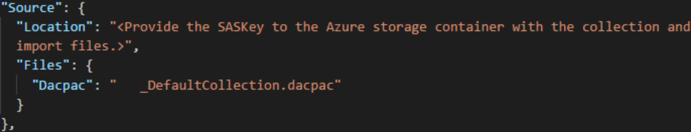
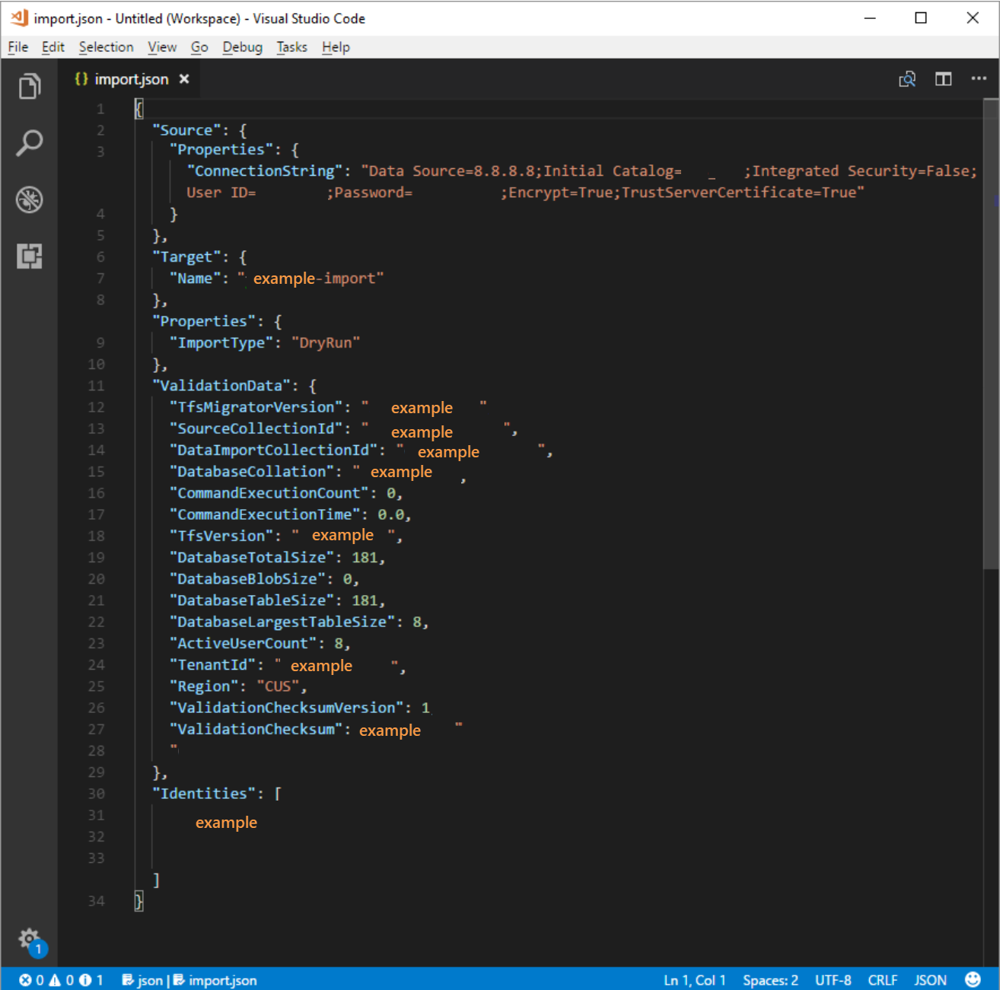

# Do test run migration

Your team is now ready to begin the process of starting a test run of your migration and then finally a full production migration. In this phase, we discuss the final steps to queue a migration in addition to other tasks that typically come up at the end of the migration project. 

:::image type="content" source="media/test-run-stage-migration-highres.png" alt-text="Diagram highlighting the Prerequisites stage in sequential stages.":::

## Prerequisites 

Complete the [Prepare test run phase](migration-prepare-test-run.md) before you begin a test run migration. 

> [!IMPORTANT]
> To ensure a smooth migration process, perform one or more test run imports. A test run import lasts for 45 days for testing and validation. After 45 days, the test run times out and gets removed, requiring you to start over if needed.
> The more time that passes between the test run and production run, the more the service might change, potentially introducing errors that a fresh test run would catch. You can rerun the test run import as many times as needed. Each import begins from the initial state of the imported database, as it's not possible for changes from one import to persist to another.
> Note the following points:
> - You can't extend a test run indefinitely
> - You can't promote a test run to a production run
> - A test run gets deleted if any of the following occur:
>   - The test run times out
>   - A new test run with the same name is run
>   - A production run starts
>   - The organization is manually deleted via organization settings

## Validate a collection 

Validate each collection that you want to migrate to Azure DevOps Services. The validation step examines various aspects of your collection, including, but not limited to, size, collation, identity, and processes. 

Run the validation by using the Data Migration Tool. 
1. [Download the Data Migration Tool](https://azure.microsoft.com/products/devops/migrate/).
2. Copy the zip file to one of your Azure DevOps Server application tiers.
3. Unzip the file. 
   You can also run the tool from a different machine without Azure DevOps Server installed, as long as the machine can connect to the configuration database of the Azure DevOps Server instance.
4. Open a Command Prompt window on the server, and enter a cd command to change to the directory where the Data Migration Tool is stored. Take a few moments to review the help content for the tool. 
 
   a. To view the top-level help and guidance, run the following command.

	```cmdline
	Migrator /help
	```

   b. View the help text for the command.

	```cmdline
	Migrator validate /help 
	```

5. As your first time validating a collection, your command should have the following simple structure.

	```cmdline
	Migrator validate /collection:{collection URL} /tenantDomainName:{name} /region:{region}
	```

	Where `{name}` provides the name of your Microsoft Entra tenant, for example, to run against the *DefaultCollection* and the *fabrikam* tenant, the command would look like the following example.

	```cmdline
	Migrator validate /collection:http://localhost:8080/DefaultCollection /tenantDomainName:fabrikam.OnMicrosoft.com /region:{region}
	```

6. To run the tool from a machine other than the Azure DevOps Server, you need the **/connectionString** parameter. The connection string parameter points to your Azure DevOps Server configuration database. As an example, if the validated command runs by the Fabrikam corporation, the command would look like.

	```cmdline
	Migrator validate /collection:http://fabrikam:8080/DefaultCollection /tenantDomainName:fabrikam.OnMicrosoft.com /region:{region} /connectionString:"Data Source=fabrikam;Initial Catalog=Configuration;Integrated Security=True"
	```

	> [!Important]
    > The Data Migration Tool *does not* edit any data or structures in the collection. It reads the collection only to identify issues. 

7.	After the validation is complete, you can view the log files and results. 

	:::image type="content" source="media/migration-import/tfsmigratorConsole.png" alt-text="Screenshot of the validation results and logs in the Command Prompt window.":::

    During validation, you receive a warning if some of your pipelines contain per-pipeline retention rules. Azure DevOps Services uses a [project-based retention model](../pipelines/policies/retention.md?view=azure-devops&preserve-view=true) and doesn't support per-pipeline retention policies. If you proceed with the migration, the policies aren't carried over to the hosted version. Instead, the default project-level retention policies apply. Retain builds important to you to avoid their loss.

   After all the validations pass, you can move to the [next step of the migration process](#import-log-files). If the Data Migration Tool flags any errors, correct them before you proceed. For guidance on correcting validation errors, see [Troubleshoot migration and migration errors](migration-troubleshooting.md). 

### Import log files  

When you open the log directory, you might notice several logging files. 

The main log file is named *DataMigrationTool.log*. It contains details about everything that was run. To make it easier for you to focus on specific areas, a log generates for each major validation operation. 

For example, if TfsMigrator reports an error in the "Validating Project Processes" step, you can open the *ProjectProcessMap.log* file to view everything that was run for that step instead of having to scroll through the entire log. 

Review the *TryMatchOobProcesses.log* file only if you're trying to migration your project processes to use the inherited model. If you don't want to use the inherited model, you can ignore these errors, because they don't prevent you from importing to Azure DevOps Services. For more information, see the [Validate phase of migration](migration-validate.md). 

## Generate migration files

The Data Migration Tool validated the collection and it's returning a result of "All collection validations passed." Before you take a collection offline to migrate it, generate the migration files. When you run the `prepare` command, you generate two migration files: 

- *IdentityMapLog.csv*: Outlines your identity map between Active Directory and Microsoft Entra ID.
- *migration.json*: Requires you to fill out the migration specification you want to use to kick off your migration. 

### Prepare command

The `prepare` command assists with generating the required migration files. Essentially, this command scans the collection to find a list of all users to populate the identity map log, *IdentityMapLog.csv*, and then tries to connect to Microsoft Entra ID to find each identity's match. To do so, your company needs to use the [Microsoft Entra Connect tool](/azure/active-directory/connect/active-directory-aadconnect) (formerly known as the Directory Synchronization tool, Directory Sync tool, or DirSync.exe tool). 

If directory synchronization is set up, the Data Migration Tool should find the matching identities and mark them as *Active*. If there are no matches, the identity is marked as *Historical* in the identity map log, so you must investigate why the user isn't included in your directory sync. The migration specification file, *migration.json*, should be populated before the migration. 

Unlike the `validate` command, `prepare` *does* require an internet connection, because it needs to connect to Microsoft Entra ID to populate the identity map log file. If your Azure DevOps Server instance doesn't have internet access, run the tool from a machine that does. As long as you can find a machine with an intranet connection to your Azure DevOps Server instance and an internet connection, you can run this command. For help with the `prepare` command, run the following command:

```cmdline
Migrator prepare /help
```

Included in the help documentation are instructions and examples for running the `Migrator` command from the Azure DevOps Server instance itself and a remote machine. If you're running the command from one of the Azure DevOps Server instance's application tiers, your command should have the following structure:

```cmdline
Migrator prepare /collection:{collection URL} /tenantDomainName:{name} /region:{region}
```

```cmdline
Migrator prepare  /collection:{collection URL} /tenantDomainName:{name} /region:{region} /connectionString:"Data Source={sqlserver};Initial Catalog=Configuration;Integrated Security=True"
```

The **connectionString** parameter is a pointer to the configuration database of your Azure DevOps Server instance. As an example, if the Fabrikam corporation runs the `prepare` command, the command looks like the following example:

```cmdline
Migrator prepare /collection:http://fabrikam:8080/DefaultCollection /tenantDomainName:fabrikam.OnMicrosoft.com /region:{region} /connectionString:"Data Source=fabrikam;Initial Catalog=Configuration;Integrated Security=True"
```

When the Data Migration Tool runs the `prepare` command, it runs a complete validation to ensure that nothing changed with your collection since the last full validation. If any new issues are detected, no migration files are generated. 

Shortly after the command starts running, a Microsoft Entra sign-in window displays. Sign in with an identity that belongs to the tenant domain, which is specified in the command. Make sure that the specified Microsoft Entra tenant is the one you want your future organization to be backed with. In our Fabrikam example, a user enters credentials that are similar to the following example screenshot.

> [!IMPORTANT] 
> Don't use a test Microsoft Entra tenant for a test migration and your production Microsoft Entra tenant for the production run. Using a test Microsoft Entra tenant can result in identity migration issues when you begin your production run with your organization's production Microsoft Entra tenant.

When you run the `prepare` command successfully in the Data Migration Tool, the results window displays a set of logs and two migration files. In the log directory, find a logs folder and two files: 

* *migration.json* is the migration specification file. We recommend that you take time to fill it out.
* *IdentityMapLog.csv* contains the generated mapping of Active Directory to Microsoft Entra identities. Review it for completeness before you kick off a migration.

The two files are described in greater detail in the next sections.

### The migration specification file

The migration specification, *migration.json*, is a JSON file that provides migration settings. It includes the desired organization name, storage account information, and other information. Most of the fields are autopopulated, and some fields require your input before you attempt a migration.


The *migration.json* file's displayed fields and required actions are described in the following table:

| Field | Description | Required action |
| --- | --- | --- |
| Source | Information about the location and names of the source data files that are used for migration. | No action required. Review information for the subfield actions to follow. |
| Location | The shared access signature key to the Azure storage account that hosts the data-tier application package (DACPAC). | No action required. This field is covered in a later step. |
| Files | The names of the files containing migration data. | No action required. Review information for the subfield actions to follow. |
| DACPAC | A DACPAC file that packages the collection database to be used to bring in the data during the migration. | No action required. In a later step, you create this file by using your collection and then upload it to an Azure storage account. Update the file based on the name you use when you generate it later in this process. |
| Target | Properties of the new organization to migration into. | No action required. Review information for the subfield actions to follow. |
| Name | The name of the organization to be created during the migration. | Provide a name. The name can be quickly changed later after the migration completed.<br>**NOTE**: *Don't* create an organization with this name before you run the migration. The organization is created as part of the migration process. |
| ImportType | The type of migration that you want to run. | No action required. In a later step, select the type of migration to run. |
| Validation Data | Information needed to help drive your migration experience. | The Data Migration Tool generates the "ValidationData" section. It contains information to help drive your migration experience. Don't* edit the values in this section, or your migration could fail to start. |

After you complete the preceding process, you should have a file that looks like the following example. 


In the preceding image, the planner of the Fabrikam migration added the organization name *fabrikam-import* and selected CUS (Central United States) as the geographical location for migration. Other values were left as is to be modified just before the planner took the collection offline for the migration. 

> [!NOTE] 
>  Test run imports have a '-dryrun' automatically appended to the end of the organization name, which you can change after the migration.

### Supported Azure regions for migration

Azure DevOps Services is available in several [Azure geographical locations](https://azure.microsoft.com/explore/global-infrastructure/products-by-region/). But, not all locations where Azure DevOps Services is available are supported for migration. The following table lists the Azure geographical locations that you can select for migration. Also included is the value that you need to place in the migration specification file to target that geography for migration.  
 
| Geographical location | Azure geographical location | Import specification value |
| --- | --- | --- |
| United States | Central United States | CUS |
| Europe | Western Europe | WEU |
| United Kingdom | United Kingdom South | UKS| 
| Australia | Australia East | EAU |
| South America | Brazil South | SBR |
| Asia Pacific | South India | MA |
| Asia Pacific | Southeast Asia (Singapore) | SEA |
| Canada | Central Canada | CC |

### The identity map log

The identity map log is of equal importance to the actual data that you migrate to Azure DevOps Services. As you're reviewing the file, it's important to understand how identity migration operates and what the potential results could entail. When you migrate an identity, it can become either *active* or *historical*. Active identities can sign in to Azure DevOps Services, but historical identities can't. 

#### Active identities

Active identities refer to user identities in Azure DevOps Services post-migration. In Azure DevOps Services, these identities are licensed and are displayed as users in the organization. The identities are marked as *active* in the **Expected Import Status** column in the identity map log file.

<a id="historical-identities"></a>

#### Historical identities

Historical identities are mapped as such in the **Expected Import Status** column in the identity map log file. Identities without a line entry in the file also become historical. An example of an identity without a line entry might be an employee who no longer works at a company. 

Unlike active identities, historical identities:
* *Don't* have access to an organization after migration.
* *Don't* have licenses.
* *Don't* show up as users in the organization. All that persists is the notion of that identity's name in the organization, so that its history can be searched later. We recommend that you use historical identities for users who no longer work at the company or who don't need further access to the organization. 

> [!NOTE]
> After an identity is imported as historical, it *can't* become active. 

### Understand the identity map log file

The identity map log file is similar to the example shown here: 


The columns in the identity map log file are described in the following table: 

You and your Microsoft Entra admin must investigate users marked as *No Match Found (Check Microsoft Entra ID Sync)* to understand why they aren't part of your Microsoft Entra Connect Sync. 

| Column | Description |
| --- | --- |
| Active Directory: User (Azure DevOps Server) | The friendly display name used by the identity in Azure DevOps Server. This name makes it easier to identify which user the line in the map is referencing. |
| Active Directory: Security Identifier | The unique identifier for the on-premises Active Directory identity in Azure DevOps Server. This column is used to identify users in the collection. |
| Microsoft Entra ID: Expected Import User (Azure DevOps Services) | Either the expected sign-in address of the matched soon-to-be-active user or *No Match Found (Check Microsoft Entra ID Sync)*, which indicates that the identity got lost during the Microsoft Entra ID Sync and is imported as historical. |
| Expected Import Status | The expected user migration status: either *Active* if there's a match between your Active Directory and Microsoft Entra ID, or *Historical* if there isn't a match. |
| Validation Date | The last time the identity map log was validated. |

As you read through the file, notice whether the value in the **Expected Import Status** column is *Active* or *Historical*. *Active* indicates that the identity on this row maps correctly on migration becomes active. *Historical* means that the identities become historical on migration. It's important to review the generated mapping file for completeness and correctness.

> [!IMPORTANT]  
> The migration fails if major changes occur to your Microsoft Entra Connect security ID sync between migration attempts. You can add new users between test runs, and you can make corrections to ensure that previously imported historical identities become active. But, you can't change an existing user that was previously imported as active. Doing so causes your migration to fail. An example of a change might be completing a test run migration, deleting an identity from your Microsoft Entra ID that was imported actively, re-creating a new user in Microsoft Entra ID for that same identity, and then attempting another migration. In this case, an active identity migration attempts between the Active Directory and newly created Microsoft Entra identity, but causes a migration failure. 

1. Review the correctly matched identities. Are all the expected identities present? Are the users mapped to the correct Microsoft Entra identity? 

   If any values must be changed, contact your Microsoft Entra administrator to verify that the on-premises Active Directory identity is part of the sync to Microsoft Entra ID and set up correctly. For more information, see [Integrate your on-premises identities with Microsoft Entra ID](/azure/active-directory/hybrid/whatis-hybrid-identity). 

2. Next, review the identities that are labeled as *historical*. This labeling implies that a matching Microsoft Entra identity couldn't be found, for any of the following reasons:

    * The identity isn't set up for sync between on-premises Active Directory and Microsoft Entra ID. 
    * The identity isn't populated in your Microsoft Entra ID yet (for example, there's a new employee). 
    * The identity doesn't exist in your Microsoft Entra instance.
    * The user who owns that identity no longer works at the company.

To address the first three reasons, set up the intended on-premises Active Directory identity to sync with Microsoft Entra ID. For more information, see [Integrate your on-premises identities with Microsoft Entra ID](/azure/active-directory/hybrid/how-to-connect-sync-change-the-configuration). You must set up and run Microsoft Entra Connect for identities to be imported as *active* in Azure DevOps Services. 

You can ignore the fourth reason, because employees who are no longer at the company should be imported as *historical*. 

#### Historical identities (small teams) 

> [!NOTE]
> Only small teams should consider the identity migration strategy proposed in this section. 

If Microsoft Entra Connect isn't configured, all users in the identity map log file are marked as *historical*. Running a migration this way results in all users being imported as [*historical*](#historical-identities). We strongly recommended that you configure [Microsoft Entra Connect](/azure/active-directory/hybrid/how-to-connect-sync-change-the-configuration) to ensure that your users are imported as *active*. 

Running a migration with all historical identities has consequences that need to be considered carefully. Only teams with a few users and for which the cost of setting up Microsoft Entra Connect is deemed too high should consider. 

To migration all identities as historical, follow the steps outlined in later sections. When you queue a migration, the identity used to queue the migration is bootstrapped into the organization as the organization owner. All other users are imported as historical. Organization owners can then [add the users back in](../organizations/accounts/add-organization-users.md?toc=/azure/devops/organizations/accounts/toc.json&bc=/azure/devops/organizations/accounts/breadcrumb/toc.json) by using their Microsoft Entra identity. The added users are treated as new users. They don't* own any of their history, and there's no way to reparent this history to the Microsoft Entra identity. However, users can still look up their premigration history by searching for their `\<domain>\<Active Directory username>`.

The Data Migration Tool displays a warning if it detects the complete historical identities scenario. If you decide to go down this migration path, you need to consent in the tool to the limitations. 

### Visual Studio subscriptions

The Data Migration Tool can't detect Visual Studio subscriptions (formerly known as MSDN benefits) when it generates the identity map log file. Instead, we recommend that you apply the auto license upgrade feature after the migration. As long as users' work accounts are [linked](/visualstudio/subscriptions/vs-alternate-identity) correctly, Azure DevOps Services automatically applies their Visual Studio subscription benefits at their first sign-in after the migration. You're never charged for licenses that are assigned during the migration, so you can safely handle subscriptions afterward. 

You don't need to repeat a test run migration if users' Visual Studio subscriptions aren't automatically upgraded in Azure DevOps Services. Visual Studio subscription linking happens outside the scope of a migration. As long as their work account is linked correctly before or after the migration, users' licenses are automatically upgraded on their next sign-in. After their licenses are upgraded successfully, the next time you run a migration, the users are upgraded automatically on their first sign-in to the organization.

## Prepare for migration

Now you have everything ready to execute on your  test run migration. Schedule downtime with your team to take the collection offline for the migration. When you agree upon a time to run the migration, upload the required assets you generated and a copy of the database to Azure. Preparing for migration consists of the following five steps.

Step 1: [Take the collection offline and detach it](#step-1-detach-your-collection).
Step 2: [Generate a DACPAC file from the collection you're going to migrate](#step-2-generate-a-dacpac-file).  
Step 3: [Upload the DACPAC file and migration files to an Azure storage account](#step-3-upload-the-dacpac-file).  
Step 4: [Generate an SAS token to access the storage account](#step-4-generate-an-sas-token).  
Step 5: [Complete the migration specification](#step-5-complete-the-migration-specification). 

> [!NOTE] 
> Before you perform a production migration, we *strongly* recommend that you complete a test run migration. With a test run, you can validate that the migration process works for your collection and that there are no unique data shapes present that might cause a production migration failure. 

### Step 1: Detach your collection

[Detaching the collection](/azure/devops/server/admin/move-project-collection#detach-coll) is a crucial step in the migration process. Identity data for the collection resides in the Azure DevOps Server instance's configuration database while the collection is attached and online. When a collection is detached from the Azure DevOps Server instance, it takes a copy of that identity data and packages it with the collection for transport. Without this data, the identity portion of the migration *can't* be executed. 

> [!TIP]
> We recommend that you keep the collection detached until the migration completes, because there isn't a way to migration the changes that occurred during the migration. Reattach your collection after you back it up for migration, so you aren't concerned about having the latest data for this type of migration. To avoid offline time altogether, you can also choose to employ an [offline detach](/azure/devops/server/command-line/tfsconfig-cmd#offlinedetach) for test runs. 

It's important to weigh the cost of choosing to incur zero downtime for a test run. It requires taking backups of the collection and configuration database, restoring them on a SQL instance, and then creating a detached backup. A cost analysis could prove that taking just a few hours of downtime to directly take the detached backup is better in the end.

<a id="dacpac-file"></a> 

### Step 2: Generate a DACPAC file

DACPACs offer a fast and relatively easy method for moving collections into Azure DevOps Services. However, after a collection database size exceeds a certain threshold, the benefits of using a DACPAC start to diminish. 

> [!NOTE] 
> If the Data Migration Tool displays a warning that you can't use the DACPAC method, you have to perform the migration by using the SQL Azure virtual machine (VM) method. Skip steps 2 to 5 in that case and follow instructions in the [Prepare test run phase, Migrate large collections section](migration-prepare-test-run.md#migrate-large-collections), and then continue to [determine the migration type](#determine-the-migration-type). 
> If the Data Migration Tool doesn't display a warning, use the DACPAC method described in this step.  

[DACPAC](/sql/relational-databases/data-tier-applications/data-tier-applications) is a feature of SQL Server that allows databases to be packaged into a single file and deployed to other instances of SQL Server. A DACPAC file can also be restored directly to Azure DevOps Services, so you can use it as the packaging method for getting your collection's data in the cloud.

> [!IMPORTANT]
> - When you use SqlPackage.exe, you must use the .NET Framework version of SqlPackage.exe to prepare the DACPAC. The MSI Installer must be used to install the .NET Framework version of SqlPackage.exe. Don't use the dotnet CLI or .zip (Windows .NET 6) versions of SqlPackage.exe because those versions might generate DACPACs that are incompatible with Azure DevOps Services.
> - Version 161 of SqlPackage encrypts database connections by default and might not connect. If you receive a sign-in process error, add `;Encrypt=False;TrustServerCertificate=True` to the connection string of the SqlPackage statement.

Download and install SqlPackage.exe using the latest MSI Installer from the [SqlPackage release notes](/sql/tools/sqlpackage/release-notes-sqlpackage).

After you use the MSI Installer, SqlPackage.exe installs in a path similar to `%PROGRAMFILES%\Microsoft SQL Server\160\DAC\bin\`.

When you generate a DACPAC, keep two considerations in mind: the disk that the DACPAC is saved on and the disk space on the machine that's generating the DACPAC. You want to ensure that you have enough disk space to complete the operation. 

As it creates the package, SqlPackage.exe temporarily stores data from your collection in the temp directory on drive C of the machine you're initiating the packaging request from. 

You might find that your drive C is too small to support creating a DACPAC. You can estimate the amount of space you need by looking for the largest table in your collection database. DACPACs are created one table at a time. The maximum space requirement to run the generation is roughly equivalent to the size of the largest table in the collection's database. If you save the generated DACPAC to drive C, consider the size of the collection database as reported in the *DataMigrationTool.log* file from a validation run.

The *DataMigrationTool.log* file provides a list of the largest tables in the collection each time the command is run. For an example of table sizes for a collection, see the following output. Compare the size of the largest table with the free space on the drive that hosts your temporary directory. 

> [!IMPORTANT]  
> Before you proceed with generating a DACPAC file, ensure that your collection is [detached](#step-1-detach-your-collection).
 

```cmdline 
[Info   @08:23:59.539] Table name                               Size in MB
[Info   @08:23:59.539] dbo.tbl_Content                          38984
[Info   @08:23:59.539] dbo.tbl_LocalVersion                     1935
[Info   @08:23:59.539] dbo.tbl_Version                          238
[Info   @08:23:59.539] dbo.tbl_FileReference                    85
[Info   @08:23:59.539] dbo.Rules                                68
[Info   @08:23:59.539] dbo.tbl_FileMetadata                     61
```

Ensure that the drive that hosts your temporary directory has at least as much free space. If it doesn't, you need to redirect the temp directory by setting an environment variable. 

```cmdline
SET TEMP={location on disk}
```

Another consideration is where the DACPAC data is saved. Pointing the saved location to a far-off remote drive could result in longer generation times. If a fast drive such as a solid-state drive (SSD) is available locally, we recommend that you target the drive as the DACPAC save location. Otherwise, it's always faster to use a disk that's on the machine where the collection database resides rather than a remote drive. 

Now that you identified the target location for the DACPAC and ensured that you have enough space, it's time to generate the DACPAC file. 

Open a Command Prompt window and go to the SqlPackage.exe location. To generate the DACPAC, replace the placeholder values with the required values, and then run the following command:

```cmdline
SqlPackage.exe /sourceconnectionstring:"Data Source={database server name};Initial Catalog={Database Name};Integrated Security=True" /targetFile:{Location & File name} /action:extract /p:ExtractAllTableData=true /p:IgnoreUserLoginMappings=true /p:IgnorePermissions=true /p:Storage=Memory
```

* **Data Source**: The SQL Server instance that hosts your Azure DevOps Server collection database. 
* **Initial Catalog**: The name of the collection database. 
* **targetFile**: The location on the disk and the DACPAC file name. 

A DACPAC generation command that's running on the Azure DevOps Server data tier itself is shown in the following example:

```cmdline
SqlPackage.exe /sourceconnectionstring:"Data Source=localhost;Initial Catalog=Foo;Integrated Security=True" /targetFile:C:\DACPAC\Foo.dacpac /action:extract /p:ExtractAllTableData=true /p:IgnoreUserLoginMappings=true /p:IgnorePermissions=true /p:Storage=Memory
```

The output of the command is a DACPAC file, generated from the collection database *Foo* called *Foo.dacpac*. 
 
#### Configure your collection for migration

After your collection database restores on your Azure VM, configure a SQL sign-in to allow Azure DevOps Services to connect to the database to migration the data. This sign-in allows only *read* access to a single database. 

To start, open SQL Server Management Studio on the VM, and then open a new query window against the database to be imported. 

Set the database's recovery to simple: 

```sql
ALTER DATABASE [<Database name>] SET RECOVERY SIMPLE;
```

Create a SQL sign-in for the database, and assign that sign-in the 'TFSEXECROLE':

```sql
USE [<database name>]
CREATE LOGIN <pick a username> WITH PASSWORD = '<pick a password>'
CREATE USER <username> FOR LOGIN <username> WITH DEFAULT_SCHEMA=[dbo]
EXEC sp_addrolemember @rolename='TFSEXECROLE', @membername='<username>'
```

Following our Fabrikam example, the two SQL commands would look like the following example:

```sql
ALTER DATABASE [Fabrikam] SET RECOVERY SIMPLE;

USE [Foo]
CREATE LOGIN fabrikam WITH PASSWORD = 'fabrikampassword'
CREATE USER fabrikam FOR LOGIN fabrikam WITH DEFAULT_SCHEMA=[dbo]
EXEC sp_addrolemember @rolename='TFSEXECROLE', @membername='fabrikam'
```
> [!NOTE] 
> Enable [SQL Server and Windows authentication mode](/sql/database-engine/configure-windows/change-server-authentication-mode?view=sql-server-ver15#change-authentication-mode-with-ssms&preserve-view=true) in SQL Server Management Studio on the VM. If you don't enable authentication mode, the migration fails.  

#### Configure the migration specification file to target the VM

Update the migration specification file to include information about how to connect to the SQL Server instance. Open your migration specification file and make the following updates.

1. Remove the DACPAC parameter from the source files object.

    The migration specification before the change is shown in the following code.
    
    
    
    The migration specification after the change is shown in the following code.
    
    

2. Fill out the required parameters and add the following properties object within your source object in the specification file.

    ```json
    "Properties":
    {
        "ConnectionString": "Data Source={SQL Azure VM Public IP};Initial Catalog={Database Name};Integrated Security=False;User ID={SQL Login Username};Password={SQL Login Password};Encrypt=True;TrustServerCertificate=True" 
    }
    ```

After you apply the changes, the migration specification looks like the following example.



Your migration specification is now configured to use a SQL Azure VM for migration. Proceed with the rest of preparation steps to migration to Azure DevOps Services. After the migration finishes, be sure to delete the SQL sign-in or rotate the password. Microsoft doesn't retain the sign-in information after the migration finished. 

### Step 3: Upload the DACPAC file

> [!NOTE] 
> If you're using the SQL Azure VM method, you need to provide only the connection string. You don't have to upload any files, and you can skip this step.  

Your DACPAC must be placed in an Azure storage container, which can be an existing container or one created specifically for your migration effort. It's important to ensure that your container is created in the right geographical locations.

Azure DevOps Services is available in multiple [geographical locations](https://azure.microsoft.com/regions/services/). When you're importing to these locations, it's critical to place your data correctly to ensure that the migration can start successfully. Your data must be placed in the same geographical location that you're importing to. Placing the data anywhere else results in the migration being unable to start. The following table lists the acceptable geographical locations for creating your storage account and uploading your data.

| Desired migration geographical location | Storage account geographical location |
| --- | --- |
| Central United States | Central United States |
| Western Europe | Western Europe |
| United Kingdom | United Kingdom South | 
| Australia East | Australia East |
| Brazil South | Brazil South |
| India South | India South |
| Canada Central | Canada Central |
| Asia Pacific (Singapore) | Asia Pacific (Singapore) |

Although Azure DevOps Services is available in multiple geographical locations in the US, only the Central United States location accepts new Azure DevOps Services. You can't migrate your data into other US Azure locations at this time.  

[Create a blob container](/azure/storage/common/storage-create-storage-account) from the Azure portal. After you create the container, upload the Collection DACPAC file. 

After the migration finishes, delete the blob container and accompanying storage account with tools such as [AzCopy](/azure/storage/common/storage-use-azcopy-v10) or any other Azure storage explorer tool, like [Azure Storage Explorer](https://storageexplorer.com/). 

> [!NOTE] 
> If your DACPAC file is larger than 10 GB, we recommend that you use [AzCopy](/azure/storage/common/storage-use-azcopy-v10), as it has multithreaded upload support for faster uploads.

### Step 4: Generate an SAS token

A [shared access signature (SAS) token](/azure/storage/common/storage-sas-overview) provides delegated access to resources in a storage account. The token allows you to give Microsoft the lowest level of privilege required to access your data for executing the migration. 

You can generate SAS tokens [using the Azure portal](/azure/storage/blobs/blob-containers-portal#generate-a-shared-access-signature). From a security point-of-view, we recommend doing the following tasks:

1. Select only **Read** and **List** as permissions for your SAS token. No other permissions are required.
2. Set an expiry time no further than seven days into the future.
3. [Restrict access to Azure DevOps Services IPs only](migration-prepare-test-run.md#restrict-access-to-azure-devops-services-ips-only).
4. Treat the SAS key as a secret. Don't leave the key in an insecure location as it grants read and list access to any data stored in the container.

### Step 5: Complete the migration specification

Earlier in the process you partially filled out the migration specification file, known as *migration.json*. At this point, you have enough information to complete all the remaining fields except for the migration type. The migration type is covered later, in the migration section. 

In the *migration.json* specification file, under **Source**, complete the following fields.

* **Location**: Paste the SAS key you generated from the script and then copied in the preceding step.
* **Dacpac**: Ensure that the file, including the *.dacpac* file extension, has the same name as the DACPAC file you uploaded to the storage account. 

The final migration specification file should look like the following example.


### Determine the migration type

Imports can be queued as either a test run (`DryRun`) or a production run (`ProductionRun`). The **ImportType** parameter determines the migration type: 

- **DryRun**: Also referred to as a test run. Use for test and validation purposes. The system deletes test runs after 45 days. 
- **ProductionRun**: Use a production run when you want to keep the resulting migration and use the organization full time in Azure DevOps Services after the migration finishes. 

> [!TIP] 
> We always recommend that you complete a test run migration first.

### Test run organizations

Test run organizations help teams test the migration of their collections. Before a production migration can be run, any completed [test run organizations must be deleted](#prepare-for-migration). All test run organizations have a *limited existence and are automatically deleted after a set period of time*. Information about when the organization is deleted is included in the success email you should receive after the migration finishes. Be sure to take note of this date and plan accordingly. 

Test run organizations have 45 days before they're deleted. After the specified time period, the test run organization is deleted. You can repeat test run imports as many times as you need before you do a production migration. 

## Delete test runs

Delete any previous test runs before you attempt a new one. When your team is ready to perform a production migration, you need to manually delete the test run organization. 
Before you can run a second test run migration or the final production migration, make sure you delete any previous Azure DevOps Services organizations that you created in a previous test run. For more information, see [Delete organization](../organizations/accounts/delete-your-organization.md). 

> [!TIP]
> Optional information to help a user be more successfulAny test run migration that follows the first is expected to take longer given the extra time required to clean up resources from previous test runs. 

It can take up to one hour for an organization name to become available after deleting or renaming. 
For more information, see the [Post migration tasks](migration-post-migration.md) article. 

If you encounter any migration problems, see [Troubleshoot migration and migration errors](migration-troubleshooting.md#resolve-migration-errors). 

<a id="run-an-import"></a>

## Run a migration

Your team is now ready to begin the process of running a migration. We recommend that you start with a successful test run migration before you attempt a production-run migration. With test run imports, you can see in advance how a migration looks, identify potential issues, and gain experience before you head into your production run. 

> [!NOTE]
> - If you need to repeat a completed production-run migration for a collection, such as due to a rollback, contact Azure DevOps Services [Customer Support](https://azure.microsoft.com/support/devops/) before you queue another migration.
- Azure administrators can prevent users from creating new Azure DevOps organizations. If the Microsoft Entra tenant policy is turned on, your migration fails to finish. Before you begin, verify that the policy isn't set or that there's an exception for the user that is performing the migration. For more information, see [Restrict organization creation via Microsoft Entra tenant policy](../organizations/accounts/azure-ad-tenant-policy-restrict-org-creation.md).
- Azure DevOps Services doesn't support per-pipeline retention policies, and they aren't carried over to the hosted version.

### Considerations for rollback plans

A common concern for teams doing a final production run is their rollback plan, if anything goes wrong with migration. We highly recommend doing a test run to make sure that you can test the migration settings you provide to the Data Migration Tool for Azure DevOps.

Rollback for the final production run is fairly simple. Before you queue the migration, detach the team project collection from Azure DevOps Server, which makes it unavailable to your team members. If for any reason you need to roll back the production run and bring the on-premises server back online for your team members, you can do so. Attach the team project collection on-premises again and inform your team that they continue to work normally while your team regroups to understand any potential failures.

You can then contact Azure DevOps Services customer support for help with understanding the failure's cause if you can't determine the cause. For more information, see the [Troubleshooting article](migration-troubleshooting.md). Customer support tickets can be opened from the following page https://aka.ms/AzureDevOpsImportSupport. If the issue requires product group engineers to engage, those cases get handled during regular business hours.

#### Detach your team project collection from Azure DevOps Server to prepare it for migration. 

Before you generate a backup of your SQL database, you must completely detach the collection from Azure DevOps Server (not SQL) using the Data Migration Tool. The detach process in Azure DevOps Server transfers user identity information stored outside of the collection database, making it portable for moving to a new server or, in this case, to Azure DevOps Services.

Detaching a collection is easily done from the Azure DevOps Server Administration Console on your Azure DevOps Server instance. For more information, see [Move project collection, Detach the collection](/azure/devops/server/admin/move-project-collection).

### Queue the migration

> [!IMPORTANT] 
> Before you proceed, ensure that your collection was [detached](#step-1-detach-your-collection) before you generate a DACPAC file or upload the collection database to a SQL Azure VM. If you don't complete this step, the migration fails. If your migration fails, see [Resolve migration errors](migration-troubleshooting.md). 

Start a migration by using the Data Migration Tool's **import** command. The import command takes a migration specification file as input. It parses the file to ensure that the provided values are valid and, if successful, it queues a migration to Azure DevOps Services. The import command requires an internet connection, but doesn't* require a connection to your Azure DevOps Server instance. 

To get started, open a Command Prompt window, and change directories to the path to the Data Migration Tool. We recommended that you review the help text provided with the tool. Run the following command to see the guidance and help for the import command:

```cmdline
Migrator import /help
```

The command to queue a migration has the following structure:

```cmdline
Migrator import /importFile:{location of migration specification file}
```

The following example shows a completed import command:

```cmdline
Migrator import /importFile:C:\DataMigrationToolFiles\migration.json
```

After the validation passes, sign in to Microsoft Entra ID with an identity that's a member of the same Microsoft Entra tenant as the identity map log file was built against. The signed in user is the owner of the imported organization. 

> [!NOTE]
> Each Microsoft Entra tenant is limited to five imports per 24-hour period. Only imports that are queued count against this cap.

When your team initiates a migration, an email notification is sent to the user that queued the migration. About 5 to 10 minutes after it queues the migration, your team can go to the organization to check on the status. After the migration finishes, your team is directed to sign in, and an email notification is sent to the organization owner. 

The Data Migration Tool flags errors that you need to correct before migration. This article describes the most common warnings and errors that you might receive when you're preparing to migrate. After you correct each error, run the **migrator validate** command again to verify resolution.

## Next steps

> [!div class="nextstepaction"]
> [Resolve migration errors](migration-troubleshooting.md)

## Related articles

- [Migration overview](migration-overview.md) 
- [Post migration tasks](migration-post-migration.md)
