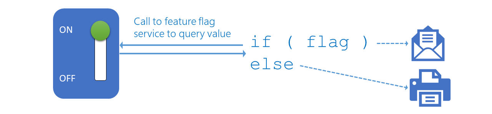
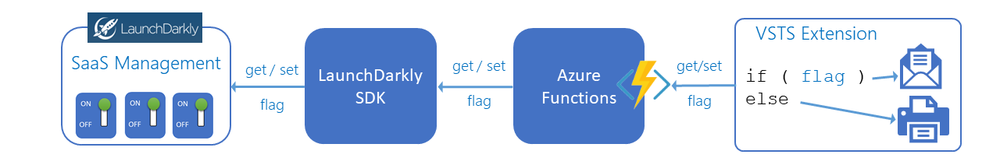
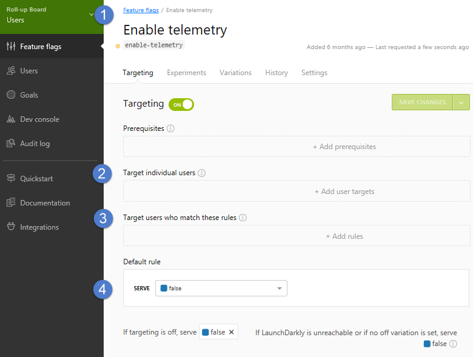

# Explore how to progressively expose your features in production for some or all users 

In today's fast-paced, feature-driven markets, it's important to continuously deliver value and receive feedback on features quickly and continuously. Partnering with end users to get early versions of features vetted out is valuable.

Are you planning to continuously integrate features into your application while they're under development? You probably have a few questions, such as:

- How can you toggle features to hide, disable, or enable features at run-time?
- How can you revert a change deployed to production without rolling back your release?
- How can you present users with variants of a feature, to determine which one performs better?

This topic aims to answer these questions and share an implementation of feature flags (FF) and A|B testing used with Azure DevOps extensions.

## Considerations

Before you introduce feature flags to your engineering process, it's important to consider:

- Which users are you planning to target? For example, do you want to target specific or all users?
- Would you like users to decide which features they want to use?
- What's the value of embracing feature flags as part of your engineering process?
- What's the cost to implement feature flags in your engineering process?

Before you flip your first feature flag in production, take the time to read:
* ["A Rough Patch", by Brian Harry](https://blogs.msdn.microsoft.com/bharry/2013/11/25/a-rough-patch)
* ["Feature Flags with Branching", by LaunchDarkly](https://launchdarkly.com/guide/flagsbranching.html)

## What are Feature Flags (FF)?

> [!NOTE]
> 
> A feature flag is also known as a feature toggle, feature switch, feature flipper, or conditional feature. They were popularized by [Martin Fowler](https://martinfowler.com/bliki/FeatureToggle.html).

Feature flags support a customer-first DevOps mindset, to enable (expose) and disable (hide) features in a solution, even before they are complete and ready for release.

View a feature flag as an ON | OFF switch for a specific feature. As shown, you can deploy a solution to production that includes both an email and a print feature. If the feature flag is set (ON), you'll email, else you'll print.

When you combine a feature flag with an experiment, led by a hypothesis, you introduce A|B testing. For example, you could run an experiment to determine if the email (A) or the print (B) feature will result in a higher user satisfaction.

> [!NOTE]
> 
> A|B testing is also known as Split Testing. It's based on a hypothesis that's defined as:
>
> **For** {user} **who** {action} **the** {solution} **is a** {how} **that** {value} **unlike** {competition} **we** {do better}

As shown, the email feature (option A) is more popular with your users and wins.

## Evaluating Feature Flag solutions

As outlined in [how to implement feature flags and A|B testing](https://blogs.msdn.microsoft.com/visualstudioalmrangers/2017/04/04/how-to-implement-feature-flags-and-ab-testing/), the ALM | DevOps Rangers evaluated a number of FF frameworks and solutions. 

They chose the [LaunchDarkly](https://launchdarkly.com/index.html) solution for several reasons:

- It's a "software as a service" (SaaS) solution
	- No custom solution to maintain
	- No upgrades - you're always using the latest and greatest
	- No servers - [LaunchDarkly](https://launchdarkly.com/index.html) takes care of the machines that LaunchDarkly runs on
	- Always on and optimized for the Internet
- It's integrated with Azure DevOps Services and Team Foundation Server (TFS)
- It's simple and cost-effective for an open-source project

## Common Scenarios

You have a [CI/CD pipeline](https://blogs.msdn.microsoft.com/visualstudioalmrangers/tag/cicd-pipeline/) for every Azure DevOps extension you're hosting on the [marketplace](https://marketplace.visualstudio.com). You are using a ring deployment model and manual release approval checkpoints. The checkpoints are manual and time consuming, but necessary to minimize the chance of breaking the early-adopter and production user environments, forcing an expensive roll-back. You're looking for an engineering process, which enables you to:
* Continuously deploy to production
* Never roll back in production
* Fine-tune the user experience in production

You have probably guessed it - feature flags! 

### Enable | disable a feature for everyone

You would like to include hidden features in your release and enable them for **all** users in production. For example, you want to be able to collect verbose logging data for troubleshooting. Using a feature flag, you can enable and disable verbose logging as needed.

### Enable | disable a feature for selected users

With this scenario, you can target specific users or groups of users. For example, you could enable the verbose logging feature for a specific user experiencing a problem or enable a preview feature for early adopters.

### Enable | disable a feature as selected by user

Lastly, you'd like to give the users a list of preview features and allow each user to decide which feature to enable when. This scenario is key for feature validation, A|B testing, and giving the user flexibility and choice.

## Managing features with feature flags in your engineering process

To protect the flags from malicious users, you need to generate and pass the hash of the user key to the LaunchDarkly API calls. As Azure DevOps extensions can only use client-side code, the ALM | DevOps Rangers chose Azure Functions to help generate the hash, as shown. Read [how we checked and fixed the 503 error and Performance issue in our Azure Function](https://blogs.msdn.microsoft.com/visualstudioalmrangers/2018/04/03/how-we-checked-and-fixed-the-503-error-and-performance-issue-in-our-azure-function/) for details.

Administration of feature flags is straight-forward. 
1. You have a different environment for each extension, allowing you to have different feature flag values for Early Adopters and Users. 
2. Optionally target specific users
3. Optionally target users that match custom rules 
4. You have a default for each feature flag

You have granular control of each feature flag.

## What's the value?

You're able to:

* Decouple deployment of releases and exposure of features
* Make changes (enable|disable features) without redeployment
* Fine-tune a user's features and experience
* Enable a user to optionally select preview features
* Hide an incomplete or faulty feature

## What's the cost?

Aside from the licensing and maintenance cost of a feature flag service, you're adding technical debt to your code:
* With a true or false feature flag, your doubling your code and test paths 
* With multi-value feature flag, you'll add even more code and test paths
* You'll need to identify and remove stale feature flags 
* Understand and test the implications of flipping a feature flag

> [!TIP]
> To minimize the costs associated with the use of feature flags, keep feature flags short lived and prevent multiple feature flags from interfering with each other by affecting the same functionality.

## Conclusion

Now that you've covered the concepts and considerations of feature flags, you should be confident to explore ways to improve your CI/CD pipelines. While feature flags come at a cost, having a game plan to manage exposed features at run-time is invaluable.

## Q&A

### How does the Azure DevOps team use feature flags?

Buck’s [feature flags blog post](https://blogs.msdn.microsoft.com/buckh/2016/09/30/controlling-exposure-through-feature-flags-in-vs-team-services/) and the [presentation/article](/azure/devops/learn/devops-at-microsoft/progressive-experimentation-feature-flags) are great sources to get an understanding of the custom-built feature flag system used with Team Foundation Server (TFS) and Azure DevOps Services.

### How do the ALM | DevOps Rangers use feature flags?

The Rangers use the [LaunchDarkly](https://www.launchdarkly.com/) SaaS solution. You can find their learnings in this [blog series](https://blogs.msdn.microsoft.com/visualstudioalmrangers/tag/launchdarkly/).

### When should you remove feature flags?

As Buck states, “Many feature flags go away and the teams themselves take care of that." The feature teams decide when to go delete the feature flags. It can get unwieldy after a while, so there’s some natural motivation to go clean it up.

### Is there a dependency on deployment rings?

No, rings and feature flags are symbiotic. Read [Feature Flags or Rings](https://aka.ms/vsar-rings-flags) for details.

## Reference information
* [CI/CD pipeline examples](https://blogs.msdn.microsoft.com/visualstudioalmrangers/tag/cicd-pipeline/)
* [DevOps @ Microsoft](https://aka.ms/devops)
* [How to implement feature flags and A|B testing](https://blogs.msdn.microsoft.com/visualstudioalmrangers/2017/04/04/how-to-implement-feature-flags-and-ab-testing/)

> Authors: Willy Schaub | Find the origin of this article and connect with the ALM | DevOps Rangers [here](https://github.com/ALM-Rangers/Guidance/blob/master/README.md)
 
*(c) 2017 Microsoft Corporation. All rights reserved. This document is
provided "as-is." Information and views expressed in this document,
including URL and other Internet Web site references, may change without
notice. You bear the risk of using it.*

*This document does not provide you with any legal rights to any
intellectual property in any Microsoft product. You may copy and use
this document for your internal, reference purposes.*
