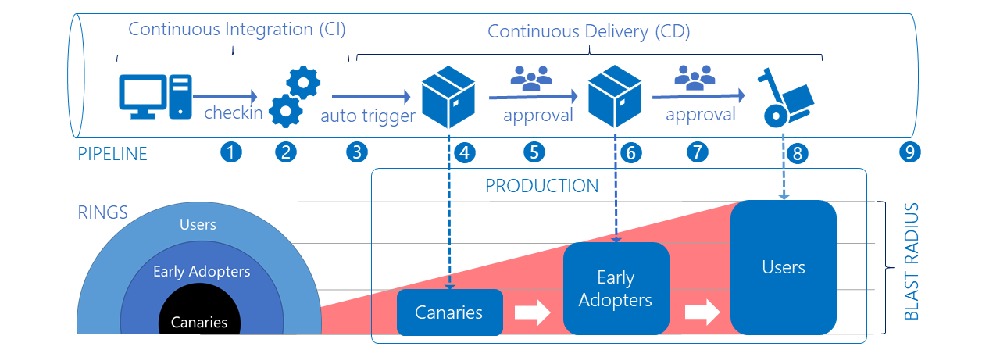
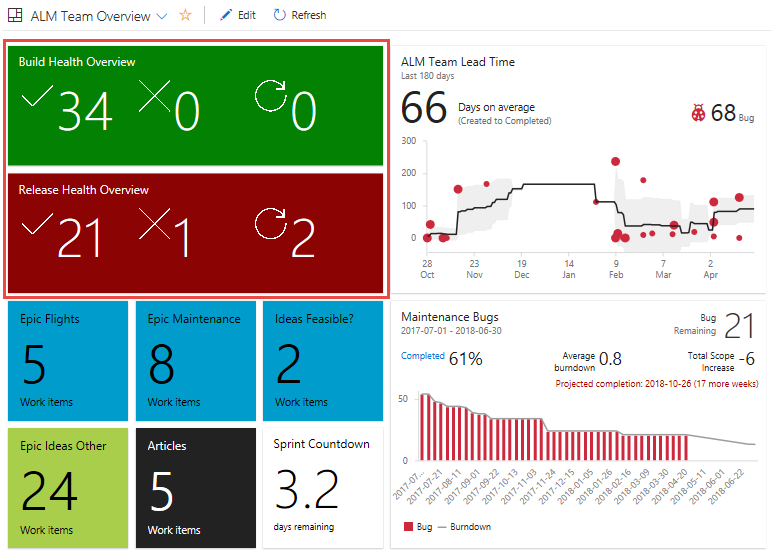
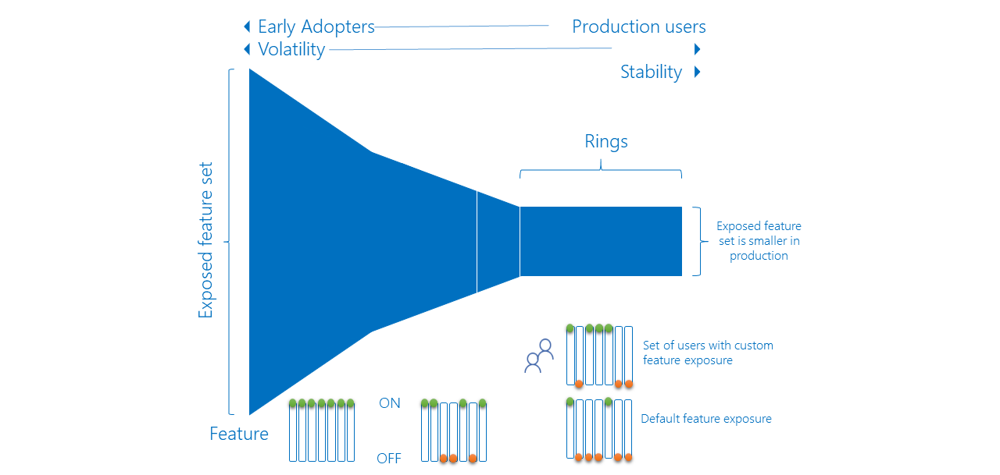

# Use deployment rings with extension releases

[!INCLUDE [version-lt-eq-azure-devops](../includes/version-lt-eq-azure-devops.md)]

With deployment rings, you can gradually deploy and validate changes to your extension in production, while limiting the affect on your users.

We don't recommend deploying to all production environments at the same time, which exposes all users to the changes. A gradual rollout exposes users to the changes over time, validating the changes in production with fewer users.

The following table shows the differences for affected areas when you're using rings vs. no rings.

| Without rings | Affected area  | With rings |
|--------------------|:-:|-----------:|
|Manual and error prone|Build|Automated and consistent|
|Manual and error prone|Release|Automated and consistent|
|Hours|Time to build (TTB)|Seconds|
|Days|Time to release (TTR)|Minutes|
|Call from user|Issue detection|Proactive|
|Days to weeks|Issue resolution|Minutes to days|

For more information, see [Configuring your release pipelines for safe deployments](https://devblogs.microsoft.com/devops/configuring-your-release-pipelines-for-safe-deployments/).

## Prerequisites

* Review [CI/CD Pipelines](../pipelines/get-started/pipelines-get-started.md) and [Approvals](../pipelines/release/approvals/index.md) for detailed documentation of pipelines and the approval features for releases.

## Assign user types

Determine which users are best suited for each user type. Communicate the opportunity to provide feedback and the risk levels at each tier, as it's critical to setting expectations and ensuring success. In the following example, users get divided into three groups in production:

* **Canaries**: voluntarily test features as soon as they're available.
* **Early adopters**: voluntarily preview releases, considered more refined than the canary bits.
* **Users**: consume the products, after they've passed through canaries and early adopters.

## Map the topology

Map the topology of your extension to the ringed deployment model to limit the impact of change on your users and deliver value. For our open-source community extensions, we mostly use ring-based deployment to progressively expose a new release to canary, early adopters, and users.

At the application level, the composition of Azure DevOps extensions is easy to digest, scale, and deploy independently.

Each extension does the following tasks:

* Has one of more web and script files
* Interfaces with Core client
* Interfaces with REST client and REST APIs
* Persists state in cache or resilient storage

At the infrastructure level, the extensions get published to the [Marketplace](https://marketplace.visualstudio.com). Once you install the extension in your organization, it gets hosted by the Azure DevOps service portal, with state persisted to Azure storage or the extension [data storage](../extend/develop/data-storage.md).

The extension topology is perfectly suited for the ring deployment model and to publish the extension to each deployment ring:

* A **private** development version for the canary ring
* A **private** preview version for the early adopter ring
* A **public** production version for the users ring

> [!TIP]
> Publish your extension as *private*, to control exposure to invited users.

## Move changes through deployment rings

See the following example flow of moving changes through deployment rings.

::: moniker range=">= azure-devops-2019"

Use the [Azure DevOps Developer Tools Build Tasks](https://marketplace.visualstudio.com/items?itemName=ms-devlabs.vsts-developer-tools-build-tasks) extension to package and publish extensions to the Marketplace.

::: moniker-end

1. A developer from the [Countdown Widget extension](https://marketplace.visualstudio.com/items?itemName=ms-devlabs.CountdownWidget) project commits a change to the [GitHub](https://github.com/ALM-Rangers/Countdown-Widget-Extension) repository.
2. The commit triggers a continuous integration build.
3. The new build triggers a continuous deployment trigger, which automatically starts the **Canaries** environment deployment.
4. The **Canaries** deployment publishes a private extension to the Marketplace and shares it with predefined organizations. Only the **Canaries** are affected by the change.
5. The **Canaries** deployment triggers the **Early Adopter** environment deployment. A pre-deployment approval gate requires any one of the authorized users to approve the release.
   
6. The **Early Adopter** deployment publishes a private extension to the marketplace and shares it with predefined organizations. Both the **Canaries** and **Early Adopter** are affected by the change.
7. The **Early Adopter** deployment triggers the **Users** environment deployment. A stricter pre-deployment approval gate requires all of the authorized users to approve the release.
   
8. The **Users** deployment publishes a public extension to the marketplace. At this stage, everyone who installed the extension in their organization is affected by the change.
9. It's key to realize that the effect increases as your change moves through the rings. Exposing the change to the **Canaries** and the **Early Adopters** gives you two opportunities to validate the change and hotfix critical bugs before you release to production.

## Monitor issues

Monitoring and alerts can help you detect and mitigate issues. Determine what type of data is important, for example: infrastructure issues, violations, and feature usage. Focus on actionable alerts to avoid users ignoring them and missing high priority issues.

> [!TIP]
> Start with high-level views of your data, visual dashboards that you can watch from afar and drill-down, as needed. Perform regular housekeeping of your views and remove all noise. A visual dashboard tells a better story than lots of notification emails, often filtered and forgotten by email rules.

Use [Team Project Health](https://marketplace.visualstudio.com/items?itemName=ms-devlabs.TeamProjectHealth) and other extensions to build an overview of your pipelines, lead and cycle times, and gather other information. In the sample dashboard, it's evident that there are 34 successful builds, 21 successful releases, 1 failed release, and 2 releases in progress.

## Is there a dependency on feature flags?

No. Sometimes you might need a certain functionality to be deployed as part of a release, but not initially exposed to users. Feature flags give you fine-grained control of features that are included in your change. For example, if you're not fully confident about a feature you can use feature flags to **hide** the feature in one or all of the deployment rings. You can enable all features in the canaries ring, and fine-tune a subset for the early adopters and production users, as shown in the following image.

For more information, see [Progressive experimentation with feature flags](/devops/operate/progressive-experimentation-feature-flags).

## FAQ

### Q: How do you know that a change can be deployed to the next ring?

A: You should have a consistent checklist for the users approving a release.

### Q: How long do you wait before you push a change to the next ring?

There's no fixed duration or "cool off" period. It depends on how long it takes for you to complete all release validations successfully.

### Q: How do you manage a hotfix?

A: The ring deployment model allows you to process a hotfix like any other change. The sooner you catch an issue, the sooner you can deploy a hotfix with no effect to downstream rings.

### Q: How do you deal with variables that span shared release environments?

A: Refer to [Default and custom release variables](../pipelines/release/variables.md).

### Q: How can you manage secrets used by the pipeline?

A: To safeguard cryptographic keys and other secrets used by your pipelines, see [Azure Key Vault](https://azure.microsoft.com/services/key-vault/).

## Related articles

* [Safe deployment practices](/devops/operate/safe-deployment-practices)
* [Progressive experimentation with feature flags](/devops/operate/progressive-experimentation-feature-flags)
* [Configure your release pipelines for safe deployments](https://devblogs.microsoft.com/devops/configuring-your-release-pipelines-for-safe-deployments/).
