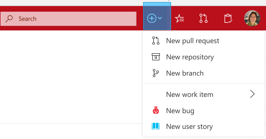
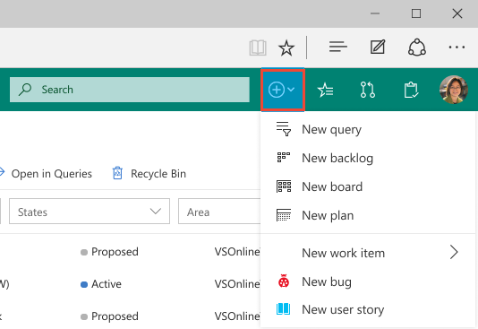
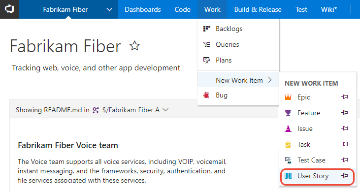
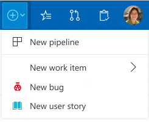

# Add a new artifact or team

**Azure CodeX**  

Select the application or hub to get started adding new artifacts. When you add a team, you automatially create several Codex Agile artifacts, such as a product backlog, Kanban board, portfolio backlogs and more. 

Prior to adding an artifact, make sure that you've [selected the team project and repository](go-to-team-project-repo.md) that you want to work in.  

## Add artifacts to a CodeVault git repository 

# [Vertical navigation](#tab/vertical) 

You can quickly add a pull request, repository, branch, or new work item using the **Add** menu. 

> [!div class="mx-imgBorder"]

# [Horizontal navigation](#tab/horizontal)

From the **Code** hub and a git repository selected, open one of the functional pages to add files or folders, a new branch, or a new pull request.  

> [!div class="mx-imgBorder"]

---

To learn more about Git artifacts, see one of the following topics:
- [Git repository](../git/tutorial/creatingrepo.md)
- [Git branch](../git/create-branch.md)
- [Git pull request](../git/tutorial/pullrequest.md) 

<!---
## Create TFVC artifacts

TBD 
-->

## Add a Codex Agile artifact

# [Vertical navigation](#tab/vertical) 

You can quickly add a query, backlog, board, plan, or work item using the **Add** menu. 

> [!div class="mx-imgBorder"]

# [Horizontal navigation](#tab/horizontal)

From the **Work** hub, you can add a work item from the menu of options as shown in the following image.
 
> [!div class="mx-imgBorder"]

 Or, you can open one of the pages&mdash;**Boards**, **Backlogs**, **Queries**, or **Plans**&mdash;to add an artifact specific to each of these functional pages.
 
---

To learn more, see one of the following topics: 

- [Add a board]
- [Add a backlog]
- [Add a delivery plan](../work/scale/review-team-plans.md)
- [Add a managed work item query](../work/track/using-queries.md) 

---

## Add Codex Pipelines artifacts

# [Vertical navigation](#tab/vertical) 

You can quickly add a pipeline using the **Add** menu. 

> [!div class="mx-imgBorder"]

# [Horizontal navigation](#tab/horizontal)

From the **Build and Release** hub, open one of the functional pages to add a artifact associated with that page.
 
> [!div class="mx-imgBorder"]

---

## Add a team 

Agile tools and dashboards are typically associated with teams. You add teams to a team project. To learn more about teams, see [About teams and Agile tools](../settings/about-teams-and-settings.md). To add a team, see [Add a team and team members](../work/scale/multiple-teams.md). 

### View teams already defined 

# [Vertical navigation](#tab/vertical)

TBD 

# [Horizontal navigation](#tab/horizontal)

To view a list of teams already defined, open the admin context for the team project, and choose **Overview**.  

 

---

## Add a dashboard 

Dashboards are typically associated with teams, however you can create a dashboard not affiliated with a team. How??? Each team can create and configure a number of dashboards. 

- [Add a dashboard](../report/dashboards/dashboards.md)
- [Add and edit a wiki page](../collaborate/add-edit-wiki.md)

## Add a wiki 

If you don't have a wiki yet, you can add one and only one. Once added, you can add and update pages to that wiki. 

- [Create a wiki](../collaborate/wiki-create-repo.md)
- [Add and edit wiki pages](../collaborate/add-edit-wiki.md)

