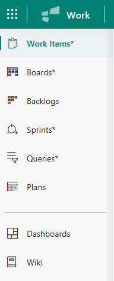

# Navigate to an application or functional area  

If you don't have a team project yet, create one in [VSTS](../accounts/create-account-msa-or-work-student.md?toc=/vsts/accounts/toc.json&bc=/vsts/accounts/breadcrumb/toc.json) or set one up in an [on-premises TFS](../accounts/create-team-project.md). If you don't have access to the team project, [get invited to the team](../work/scale/multiple-teams.md#add-team-members).

## Open a team project or repository 

A team project defines a process and data storage in which you manage your software projects from planning to deployment.  

# [Vertical navigation](#tab/vertical) 

# [Horizontal navigation](#tab/horizontal)

---

## Open an application 

# [Vertical navigation](#tab/vertical)

In vertical navigation mode, you navigate to a different application by clicking the  waffle icon and then selecting from one of the applications listed.  

Within an application, you navigate to different functional areas by clicking one of the tabs provided in the vertical pane.  

# [Horizontal navigation](#tab/horizontal)
<!--- Support horizontal navigation --> 

In horizontal navigation mode, you navigate to a different application by clicking one of the hubs in the horizonal blue bar. Within a hub, you then select a page within the horizontal tabs available.

<!---Optionally, you can choose a page to open from the hub menu of options. --> 

---

 
<!---
The web portal provides support for teams to collaborate through the planning, development, and release cycles. You use the web portal to perform both software development and administrative tasks.  

You can manage source code, plan and track work, define builds, run tests, and manage releases. The web portal connects you to the team project defined for an account in Visual Studio Team Services (VSTS) or within an on-premises Team Foundation Server (TFS). 

  
To be written
-->

## Related content 
- [Configure project and account settings](configure-project-account-settings.md)