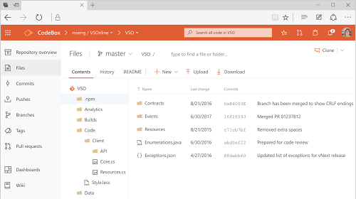

# Navigation basics 

**Azure CodeX**  

Here's what you need to know to get up and running using Azure CodeX or one of its apps.  

- **[Start page](go-to-app-hub-page.md)**: use to switch an app or a team project 
- **[Search box](search-basics.md)**: use to find code, work items, or a wiki page 
- **[Your profile menu](enable-preview-feature.md?toc=/vsts/navigation/toc.json&bc=/vsts/navigation/breadcrumb/toc.json)**: use to set personal preferences, notifications, and preview features  
- **[Settings](../settings/index.md)**: use to add teams, manage security, and configure other project and account-level elements 
- **Help**: use to quickly access the most relevant topics for the page you're on.  

Each app provides you with one or more pages which support a number of features and functional operations. Within a functional view, you may then have a choice of options to select a specific object or artifact or create an artifact.  

You can choose between vertical and horizontal navigation by selecting the option through [Preview Features](enable-preview-feature.md).

# [Vertical navigation](#tab/vertical)

In vertical navigation mode, you select applications&mdash;such as **Codex Repos**, **Codex Pipelines**, and **Codex Agile**&mdash;and pages within those apps. 

 

# [Horizontal navigation](#tab/horizontal)

In horizontal navigation mode, you select an application hub&mdash;such as **Code**, **Work**, and **Build and Release**&mdash;and pages within those apps. 

 

---

Now that you have an understanding of how the user interface is structure, it's time to get started using it.  As you can see, there are a lot of features and functionality.  

If all you need is a code repository and bug tracking solution, then start with the [Get started with Git and CodeVault](../git/gitquickstart.md) and [Manage bugs with Codex Agile](../work/backlogs/manage-bugs.md).  

To start planning and tracking work, see [Get started with Agile tools to plan and track work](../work/backlogs/overview.md?context=vsts/default).

<!---
<table>
<tbody valign="top">
<tr>
<td>
 
</td>
<td>
<ul>
<li>[Add an artifact or team](create-new-artifact-team.md)</li>
<li>[Work with Favorites](work-with-favorites.md)</li>
<li>[Go to a different app, hub, page](go-to-app-hub-page.md)</li>
<li>[Filter basics](filter-basics.md)</li>
<li>[Search across your code base or work items](search-basics.md)</li>
<li>[Enable a preview feature ](enable-preview-feature.md)</li>
<li>[Navigate to a different team project](go-to-team-project-repo.md)</li>
</ul>
</td>
</tr>
</tbody>
</table>
 

<table>
<tbody valign="top">
<tr>
<td>
 
</td>
<td>
<ul>
<li>[Add an artifact or team](create-new-artifact-team.md)</li>
<li>[Favorites](work-with-favorites.md)</li>
<li>[Go to a different app, hub, page](go-to-app-hub-page.md)</li>
<li>[Filter basics](filter-basics.md)</li>
<li>[Search across your code base or work items](search-basics.md)</li>
<li>[Enable a preview feature](enable-preview-feature.md)</li>
<li>[Navigate to a different app](go-to-app-hub-page-repo.md)</li>
<li>[Navigate to a different team project](go-to-team-project.md)</li>
<li>FAQs</li>
</ul>
</td>
</tr>
</tbody>
</table>

-->

## Resources 

- [Project & Account Settings](../settings/index.md) 
