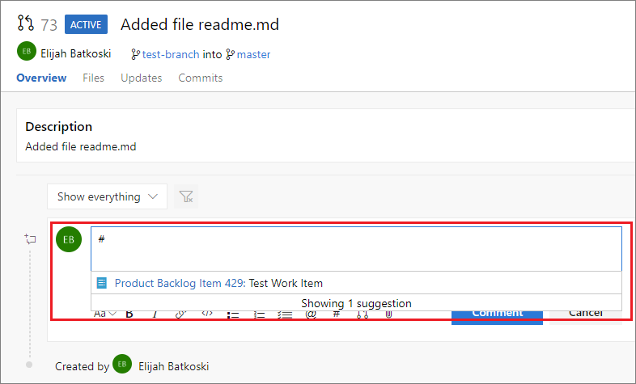

# Use #ID to link to work items  

[!INCLUDE [temp](../_shared/version-ts-tfs-2015-2016.md)]

::: moniker range=">= tfs-2015"
Use the **#ID** control to quickly link objects to work items.

::: moniker-end

::: moniker range="tfs-2015"
> [!NOTE]  
> The **#ID** special control feature is available from TFS 2015 Update 1 and later versions.

::: moniker-end

## Link a pull request to a work item

When you are leaving a code comment in a pull request, you can enter **#** to trigger the **#ID** work item picker. The picker displays a list of 50 work items that you have recently modified or that are assigned to you.

You can narrow the list of suggested work items by entering keywords that match the work item type, ID, or title, or you can enter the exact work item ID.

   
To further filter the list, continue to enter keywords until you've found a match. You can enter up to five keywords.

## Link to work items in pull requests, comments, and commits

You can also use the **#ID** control in pull request discussions, commit comments, changeset comments, and shelveset comments.

::: moniker range="tfs-2015"
> [!NOTE]  
> Requires TFS 2015 Update 2 or a later version.
::: moniker-end

::: moniker range=">= tfs-2018"

## Link to work items from a Wiki page

Use the **#ID** control to link to a work item from within a Wiki page.

To learn more about the built-in wiki, see [Add & edit wiki pages](../project/wiki/add-edit-wiki.md).

::: moniker-end

## Related articles

- [Link work items](../boards/backlogs/add-link.md)
- [Save work with commits](../repos/git/commits.md)
- [Pull requests](../repos/git/pullrequest.md)
- [Check in your work to the team code base](../repos/tfvc/check-your-work-team-codebase.md)

