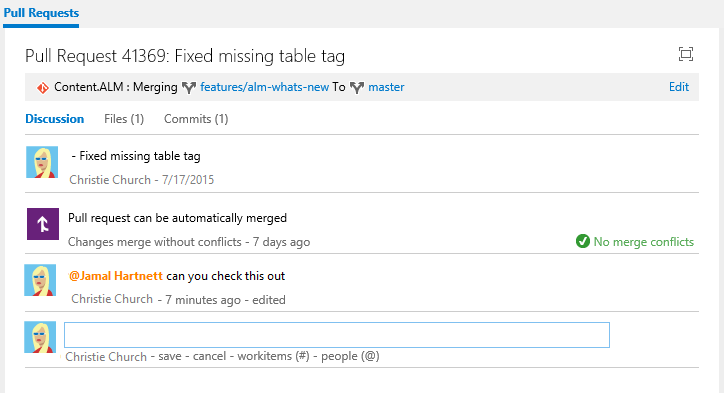

# Use &#64;mentions to further discussion

**VSTS | TFS 2018 | TFS 2017 | TFS 2015.2**

The **@mention** control allows you to quickly pull someone into a discussion.  You can use this control within the Discussion section of a work item form, or a pull request. 

>[!NOTE]    
><b>Feature availability: </b>The **@mention**  control is currently supported from VSTS or the web portal for TFS 2015.2 and later versions. For on-premises TFS, [you must configure an SMTP sever](../tfs-server/admin/setup-customize-alerts.md) in order for team members to receive notifications.    

When leaving a code comment in a pull request, you can type **@** to trigger the **@mention** identity picker. From the identity selector, you'll see a list of those people that you have you've recently mentioned. You can choose one of those names or type in the name of the person you are looking for to perform a directory search.  

To filter the list, enter the user name or alias until you've found a match.

 

To **@mention** a user you've never selected previously, just continue typing to perform your search against the full directory.  

Names of those that you mention appear in blue text. Click the **@mention link name** to open the user's contact card, which can provide you additional context for why they were pulled into the conversation.  

 

Upon completion of your selection and text entry, your **@mention** user will receive an email alerting them about the mention.  

 

When viewing their own mentioned names in conversations, users will notice that their own name is are highlighted in orange text.  

 

You can use the **@mention** control in pull request discussions, commit comments, changeset comments, and shelveset comments. You can also use the **@mention** control in the [Discussion section of work item forms](../work/work-items/work-item-form-controls.md#discussion). 

## Related notes

- [Work item form controls](../work/work-items/work-item-form-controls.md)  
- [Pull requests](../git/tutorial/pullrequest.md)