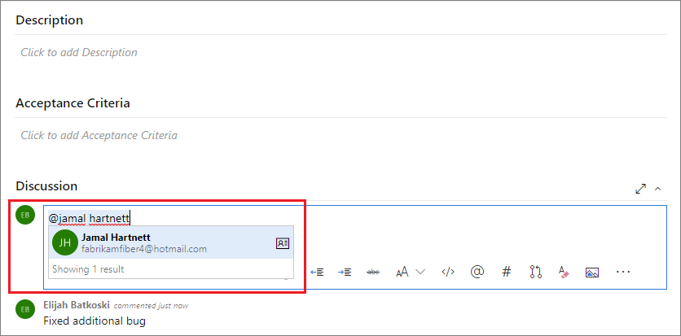

# Use &#64;mentions in work items and pull requests

[!INCLUDE [temp](../includes/version-ts-tfs-2015-2016.md)]

The <strong>@mention</strong> control allows you to quickly add a user to a work item or pull request discussion. You can select a project member from the search list, so they're notified of your comment. 

Use the <strong>@mention</strong> control to start or continue a discussion within the following areas:

::: moniker range=">= azure-devops-2020"

- A work item discussion or any rich-text field
- A pull request discussion
- Commit comments
- Changeset or shelveset comments

::: moniker-end

::: moniker range=">= tfs-2015 < azure-devops-2020"

- A work item discussion 
- A pull request discussion
- Commit comments
- Changeset or shelveset comments

::: moniker-end

::: moniker range="tfs-2015"

> [!NOTE]
> The <strong>@mention</strong> control is available from TFS 2015.2 and later versions.

::: moniker-end

::: moniker range=">= tfs-2015 < azure-devops"

[!INCLUDE [note-smtp-server](includes/note-smtp-server.md)]

::: moniker-end

When you leave a code comment in a pull request, enter **\@** to trigger the **\@mention** identity picker. From the identity selector, you see a list of users you've recently mentioned. Choose a name or enter the name of the user you're looking for to do a directory search. 

> [!NOTE]
> When you @mention a user who isn't part of your organization, you're inviting that user to your organization.

To filter the list, enter the user name or alias until you've found a match.

  

::: moniker range=">= azure-devops-2020"

You can also use group mentions. Enter the name of a team or a security group, choose :::image type="icon" source="../media/icons/search-icon.png" border="false"::: **Search**, and then select from the options listed.

> [!NOTE]
> For feature availability, check the [Feature Timeline](/azure/devops/release-notes/features-timeline).

::: moniker-end

To **\@mention** a user you've never selected previously, just continue to enter the entire name to do your search against the full directory.  

Names of mentioned users appear in blue text. Choose the **\@mention link name** to open the user's contact information. The contact information provides more context for why they were added to the conversation.  

  

Upon completion of your selection and text entry, your <strong>@mention</strong> user receives an email alerting them about the mention.  

Use the **\@mention** control in pull request discussions, commit comments, changeset comments, and shelveset comments.

> [!NOTE]
> Don't copy/paste **\@mention** users from a previous comment. While the resulting formatting looka identical to a properly entered mention, it doesn't register as a true mention nor send an email notification.

## Related articles

- [Work item form controls](../boards/work-items/work-item-form-controls.md)  
- [Pull requests](../repos/git/pullrequest.md)
