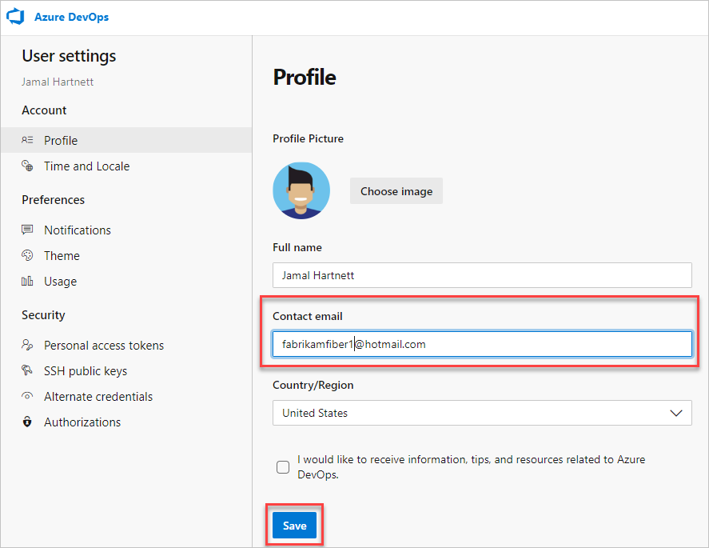

# Change your preferred email address for notifications

[!INCLUDE [temp](../includes/version-ts-tfs-2015-2016.md)]

You can change your preferred email address for notifications from your organization preferences profile page. Notifications are sent by default to the preferred email address for your organization profile. It's typically the email address you signed into Azure DevOps or TFS with.

> [!NOTE]
> Your preferred email address applies across all of your organizations and can't be changed on a per-organization basis.

::: moniker range="azure-devops"

#### [Preview page](#tab/preview-page) 

> [!NOTE]   
> To enable the new user interface for the New account manager, see [Manage or enable features](../project/navigation/preview-features.md).

1. From your home page, open user settings , and then select **Profile**.

   

2. Change your contact information, and then select **Save**.

   

#### [Current page](#tab/current-page) 

1. To change your user preferences, open your profile menu, and then select **User settings**.

   

2. From the **About** page, you can change your profile picture, change your display name, contact information, and country. Select **Save**.

   

* * *

::: moniker-end

::: moniker range=">= azure-devops-2019 < azure-devops"

1. To change your preferred email address, open your organization menu and select **My profile**.

   

2. From your profile and information page, select **Edit profile**.

3. Update the address and select **Save changes**.

::: moniker-end

::: moniker range="<= tfs-2018"

1. To change your preferred email address, open your organization menu and select **My profile**.

   

2. From your profile and information page, select **Edit profile**.

3. Update the address and select **Save changes**.

::: moniker-end

## Related articles

- [Manage personal notifications](manage-personal-notifications.md)
- [Manage team notifications](manage-team-group-notifications.md)
- [Manage organization notifications](manage-organization-notifications.md)
