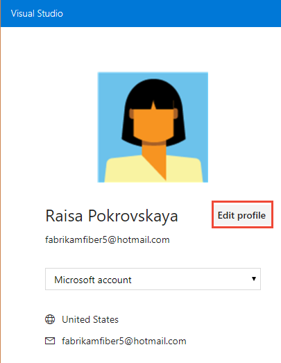
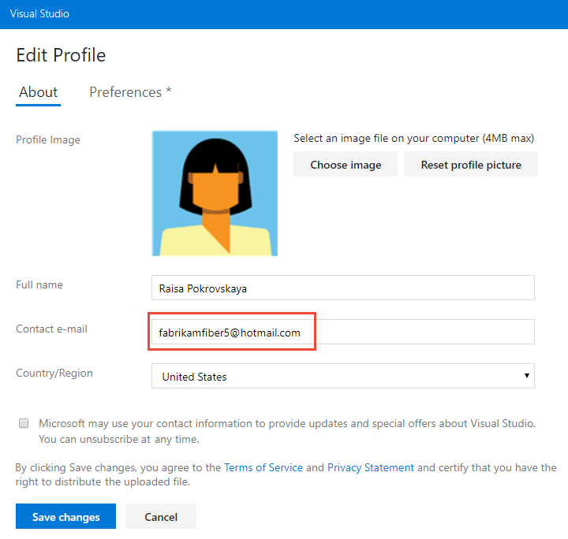

# Change your preferred email address 

**VSTS | TFS 2018 | TFS 2017 | TFS 2015**

Notifications are sent by default to the preferred email address for your account profile. This is typically the email address you signed into Visual Studio Team Services (VSTS) or Team Foundation Server (TFS) with. You can change this address from your account preferences profile page. 

> [!NOTE]   
> Your preferred email address applies across all of your accounts and cannot be changed on a per-account basis. 

1. To change your preferred email address, open your account menu and select **My profile**. 

	   

2. From your Profile/Information page, click **Edit**. 

	  

2. Change the address and save your changes.    

	  

<!---
 Change profile settings (TFS)    

  

Click edit to change a setting. Choose the Locale tab to change a locale preference.  

-->