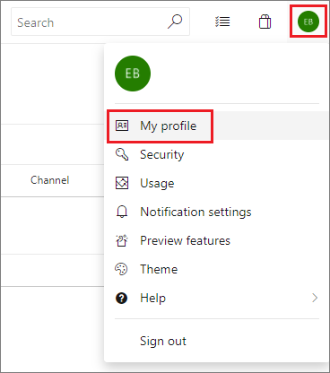

# Change your preferred email address for notifications

[!INCLUDE [version-vsts-tfs-2015-on](../boards/_shared/version-vsts-tfs-2015-on.md)]

You can change your preferred email address for notifications from your organization preferences profile page. Notifications are sent by default to the preferred email address for your organization profile. This is typically the email address you signed into Azure DevOps Services or Team Foundation Server (TFS) with.

> [!NOTE]
> Your preferred email address applies across all of your organizations and cannot be changed on a per-organization basis.

1. To change your preferred email address, open your organization menu and select **My profile**.

::: moniker range=">= azure-devops-2019"
   
::: moniker-end

::: moniker range="<= tfs-2018"
   
::: moniker-end

2. From your profile and information page, select **Edit profile**.

3. Update the address and select **Save changes**.

## Related articles

- [Manage personal notifications](howto-manage-personal-notifications.md)
- [Manage team notifications](howto-manage-team-notifications.md)
- [Manage organization notifications](howto-manage-organization-notifications.md)