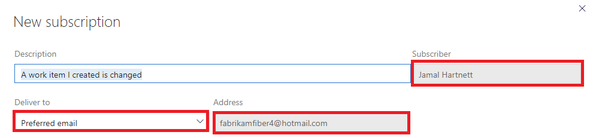
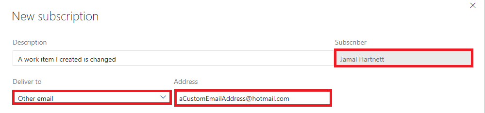
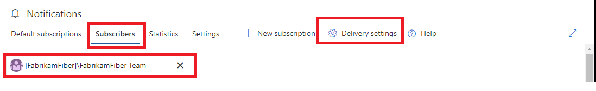
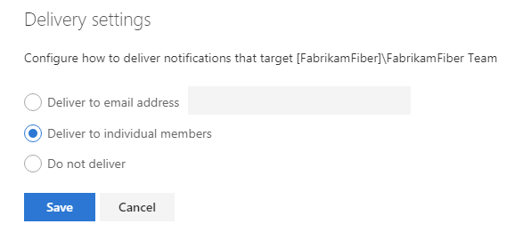
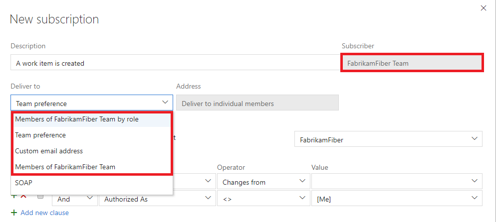
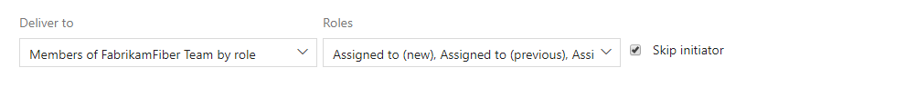
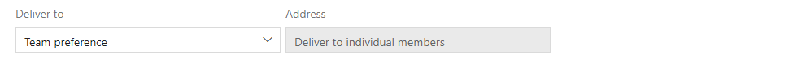
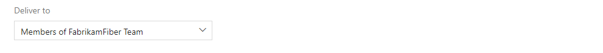
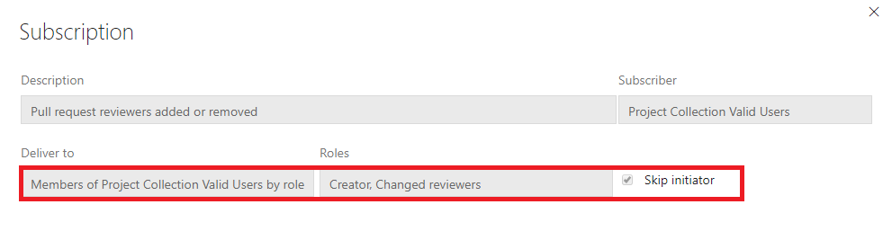

# How email recipients of notifications are determined

[!INCLUDE [version-vsts-tfs-2017-on](../boards/_shared/version-vsts-tfs-2017-on.md)]

> [!NOTE]
> This topic applies to Azure DevOps Services, TFS 2017 Update 1, and later versions. If you work from an on-premises TFS 2017 or earlier versions, see [Set alerts, get notified when changes occur](../work/track/alerts-and-notifications.md). For on-premises TFS, [you must configure an SMTP server](/azure/devops/server/admin/setup-customize-alerts) in order for team members to see the Notifications option from their organization menu and to receive notifications.

Who receives an email notification when an event matches a subscription involves a number of factors. Not understanding these factors can result in your inbox receiving too many (or too few) emails. The following explains how the type of subscription, its delivery settings, delivery preferences, and other factors determine the set of recipients.

## Recipients for custom personal subscriptions

The recipients for a custom personal subscription is the easiest to understand: emails are delivered to the _preferred email address_ of the user that owns the subscription or to the email address configured on the subscription.

**Preferred email address on a personal subscription (the default)**

**Custom email address on a personal subscription**

## Delivery settings for teams and Azure DevOps Services groups

Before we look at the recipients for team and group subscriptions, let's look at the delivery settings for teams and Azure DevOps Services groups in general. These settings control the default delivery behavior when the team or group is the recipient of a notification and the subscription is configured with a delivery option that looks at the recipient's delivery settings.

> [!NOTE]
> Teams are just a special type of group. Subscriptions and delivery settings for a team can be managed in the team level settings UI or at the organization level.

**Team delivery settings button under organization level settings**

**Team Delivery settings dialog**

The following delivery settings are available for a group or team:

* **Deliver to email address:** notifications are delivered to a specific email address.
* **Deliver to individual members:** notifications are delivered to each member of the group or team. This is usually the default option. See the section on "team expansion" below for more details on how this option works.
* **Do not deliver:** notifications are not delivered by default.

If a delivery setting is not explicitly set for a team or group, the value is determined from the [organization-level delivery setting](howto-manage-organization-notifications-settings.md) and is either _Deliver to individual members_ or _Do not deliver_. Note: the delivery settings dialog does not indicate whether the current selection was explicitly set or if it was inherited.

## Recipients for custom team and group subscriptions

The recipients for a custom team or group subscription are controlled by the subscription, but with certain delivery options, the team's default delivery setting is used to determine the set of recipients.

The following delivery options are available for a group or team subscription:

* **Member of team by role:** recipients are members of the team or group that have one of the selected roles (e.g. work item assignee)
* **Team preference:** recipients are determined by the delivery setting of the team or group (_Do not deliver_, _preferred email address_, or _members of team_) 
* **Custom email address:** recipient is the specified email address
* **Members of team:**: recipients are all members of the team or group, except members that have opted out of the subscription. Note: the default delivery setting of each member is honored, including groups that are members of the team or group.

### Option: Member of team by role

The email recipient list is determined by members that had a role in the event. For example, the user assigned the work item has the role _Assigned to (new)_ while the identity that was previously assigned the work item has the role _Assigned to (previous)_. The full list of roles for each event type are shown in the [supported event types](oob-supported-event-types.md).

The option _Skip initiator_, which appears for most event types, controls whether the user or group that initiated (caused) the event should be explicitly excluded from the set of recipients. In general, this option should be "on" since most users do not want to receive a notification about something they did.

### Option: Team preference
The delivery option is taken from the team's delivery setting. It can be one of the following:

* **Deliver to email address:** The email is delivered to the team's preferred email address.
* **Deliver to individual members:** See section below for details of _Members of team_.
* **Do not deliver:** No email is delivered.

The team's delivery setting value is displayed under the _Address_ label and can't be changed.

### Option: Custom email address
The email is sent to the email address chosen for the subscription.

### Option: Members of team
The team or group membership is expanded to determine the email recipients. In the simple case a team or group expands to a list of individuals and each is included on the **To:** line of the resulting email. However, the results of this expansion can be complicated and are explained in more detail in the [team and group expansion](#team-and-group-expansion-for-email-recipients) section.

## Recipients for default subscriptions

The delivery option for a default subscription is usually one or more roles. When viewing a default subscription, you'll notice these values can't be changed. The roles and the _Skip initiator_ option vary depending on the event type. See [supported event types](oob-supported-event-types.md) for a list of roles available for each event type. Note: the _Skip initiator_ option is not available for all event types.

## Team and group expansion for email recipients

When a team (or group) is the recipient of a notification and either the subscription or the team's delivery preference indicates that all members of that team should be notified, the team must be "expanded" to determine the actual set of email recipients. This is a potentially recursive process that starts by looking at the team's direct members.

First, only members that have not opted out of the subscription are considered for the final recipient list. Next, any member that is an individual user or mail-enabled group is added to the recipient list. This leaves only Azure DevOps Services groups remaining. For each group, the group's delivery preferences are examined:

* "Do not deliver": no further evaluation is performed on this group and the next member group is evaluated
* "Deliver to email address": the email address is added to the final recipient list
* "Deliver to individual members": the group is expanded (like its parent group) and the same rules for evaluating its members are followed

Let's look at a few scenarios. For these examples, we use the following symbols to denote the types of members:

* `I`: individual user
* `T`: nested team or group
* `A`: mail-enabled Azure Active Directory (Azure AD) group.

### Scenario 1: A member with _Do not deliver_ preference

The team has members `I1`, `I2`, and `T1`. `T1`'s delivery preference is _Do not deliver_.

What happens: only `I1` and `I2` are notified via their preferred email addresses. Members of `T1` are not notified.

### Scenario 2: A member with _Deliver to individual members_ preference

The team has members `I1`, `I2`, and `T1`. `T1`'s delivery preference is _Deliver to individual members_. `T1` has members `I2` and `I3`.

What happens: `T1` is expanded (because of its delivery preference) and therefore `I1`, `I2`, and `I3` are notified via their preferred email addresses.

### Scenario 3: A nested group

The team has members `I1`, `I2`, and `T1`. `T1` has members `I2`, `I3`, and `T2`. `T1`'s delivery preference is _Do not deliver_. `T2` has members `I4` and `I5`. `T2`'s delivery preference is _Deliver to individual members_. 

What happens: because `T1` is not expanded (because its delivery preference is "do not deliver"), only `I1` and `I2` are notified via their preferred email addresses.

### Scenario 4: A member that is an Azure AD group

The team has members `I1`, `I2`, and `A1`.

What happens: `I1`, `I2`, and `A1` are notified via their preferred email addresses.
