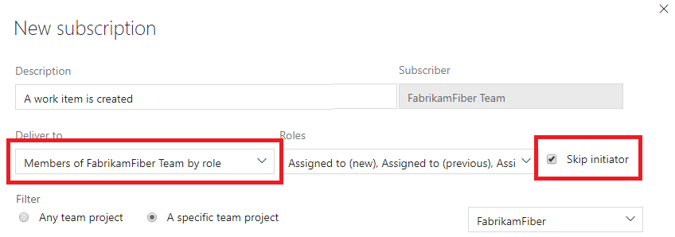

# Exclude yourself from notification emails of events you started

[!INCLUDE [version-vsts-tfs-2017-on](../includes/version-tfs-2017-through-vsts.md)]

When you create a team role-based notification subscription, you can choose the option, _Skip initiator_. The initiator of the event that triggers the email doesn't receive the notification.

For example, if your team has a subscription for a _pull request created_ event, the user who creates the pull request in the project doesn't receive this notification email. Other members of the team receive the notification email.

This option is good for users who don't want notifications of events that they trigger. However, some users may feel left out when their teammates receive the email and they didn't. Let your team decide which option is best.

> [!div class="mx-imgBorder"] 
> 

[!INCLUDE [note-smtp-server](includes/note-smtp-server.md)]

#### Related articles

- [Manage personal notification settings](manage-your-personal-notifications.md)
- [Follow a specific work item](../boards/work-items/follow-work-items.md)  
- [Manage notifications for a team](./manage-team-group-global-organization-notifications.md)  
- [Change your preferred email address](change-email-address.md)