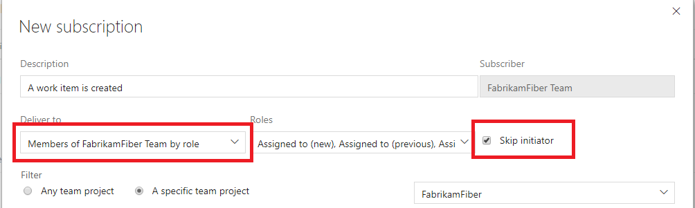

# Exclude yourself from notification emails from events you initiated

[!INCLUDE [version-vsts-tfs-2017-on](../boards/_shared/version-vsts-tfs-2017-on.md)]

> [!NOTE]  
> This topic applies to Azure DevOps Services, TFS 2017 Update 1, and later versions. If you work from an on-premises TFS 2017 or earlier versions, see [Set alerts, get notified when changes occur](../work/track/alerts-and-notifications.md). For on-premises TFS, [you must configure an SMTP server](/azure/devops/server/admin/setup-customize-alerts) in order for team members to see the Notifications option from their organization menu and to receive notifications.

The option _Skip initiator_ is available when creating a team role-based notification subscription.  This option causes emails to be skipped for the initiator of the event which triggered the email.

For example, if your team has a subscription set up for a _pull request created_ event and a user creates a pull request in the project, that user doesn't receive the _pull request created_ notification email, but the other members of the team do.

This option can be beneficial for users who don't want to be notified of events they just triggered, but has caused some users to feel they missed an email when their teammates received the email and they didn't. Leave it up to your team to decide which option is best.

