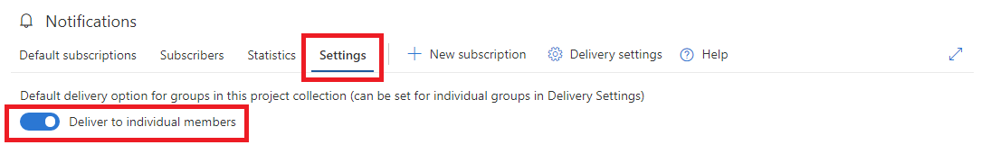

# Manage organization notification settings

[!INCLUDE [version-vsts-tfs-2017-on](../boards/_shared/version-vsts-tfs-2017-on.md)]

> [!NOTE]  
> This topic applies to Azure DevOps Services, TFS 2017 Update 1, and later versions. If you work from an on-premises TFS 2017 or earlier versions, see [Set alerts, get notified when changes occur](../work/track/alerts-and-notifications.md). For on-premises TFS, [you must configure an SMTP server](/azure/devops/server/admin/setup-customize-alerts) for team members to see the Notifications option from their organization menu and to receive notifications.

You can choose to allow or block delivery of emails for all subscriptions owned by a team or a group. This is a default setting which applies only if the team or group has not explicitly set the option.

## Manage the default delivery setting

1. [Navigate to the organization notifications settings page](navigating-the-ui.md#navigating-to-the-organization-level-notifications-page).
2. Select the **Settings** tab.
3. Configure the default the delivery setting.

    