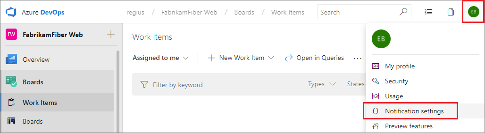

# Manage your notifications

[!INCLUDE [version-vsts-tfs-2017-on](../boards/_shared/version-vsts-tfs-2017-on.md)]

>[!NOTE]  
>**Feature availability**: This topic applies to Azure DevOps Services, TFS 2017 Update 1, and later versions. If you work from an on-premises TFS 2017 or earlier versions, see [Set alerts, get notified when changes occur](../boards/queries/alerts-and-notifications.md). For on-premises TFS, [you must configure an SMTP server](/azure/devops/server/admin/setup-customize-alerts) for team members to see the Notifications option from their organization menu and to  receive notifications.

As changes occur to your code base, builds, work items, and other operations, you can receive email notifications. For example, you can set an alert, so you're notified whenever a bug that you opened is resolved or you're assigned to a work item.

In this tutorial, you learn how to do the following tasks:

> [!div class="checklist"]
> * View your notifications
> * Add a custom subscription
> * Unsubscribe or opt out of a team or project subscription

## View your personal notifications

From the web portal, select the icon with your initials or picture, and then select **Notification settings** from the drop-down menu.
::: moniker range=">= azure-devops-2019"
     
::: moniker-end

::: moniker range="<= tfs-2018"
     
::: moniker-end

## View all subscriptions

This view shows all subscriptions that you have created or that have been created by an administrator. Subscriptions let you control what you are notified about. Those notifications you're subscribed to are indicated with the State as **On**.

::: moniker range=">= azure-devops-2019"

::: moniker-end

::: moniker range="<= tfs-2018"
  
::: moniker-end

A subscription can be just for you, or if you are a team admin, can be shared by everyone in the team.

## Add a custom subscription

With custom personal subscriptions, you can define precise criteria for the events you want to receive notifications for. In contrast to a default subscription, which only notifies the users or groups directly associated with an event, a custom subscription can notify you about any event.

1. From your Notifications page, select **New subscription**.

::: moniker range=">= azure-devops-2019"
   
::: moniker-end

::: moniker range="<= tfs-2018"
   
::: moniker-end

1. Choose the category and template you want to use. For a list of supported templates, see [Default and supported notifications](oob-built-in-notifications.md).

	Here we choose to get notified when a pull request is created within a specific project, Fabrikam Fiber.

	

3. Modify the description to help you identify the subscription later. Also choose an email address for notifications to be delivered to. By default, your preferred email address is used. optionally, include one or more fields to further specify the event criteria.

	

	> [!NOTE]   
	> The fields available for filtering event criteria differ depending on the category and template you select.   

4. Select **Finish** when you're done. The subscription now appears in the list under the category you selected.

	

## Unsubscribe or opt out of a team or OOB subscription

You can choose to not receive notifications for certain team subscriptions by opting out of the subscription.

To unsubscribe from any notification, even one that you've defined, slide the State **On/Off** indicator to the Off position.
 
For example, here we turn off the Build completes subscription.

>[!NOTE]  
>Whether you are an administrator or not, toggling a shared team subscription from your notification settings only impacts you and not other team members.

<!--- TFS 2017 Update 1 settings 
To manage your notification settings, select the Notifications option under the profile menu:
	

Learn more about [team subscriptions](manage-team-notifications.md).

From this view, you can create, edit, disable, or delete custom subscriptions that you have created for yourself. You can also see shared team subscriptions.

## Create a subscription

1. From your Notifications, choose **New**.
	
3. Select the type of activity you want to be notified about.
	
	

4. Provide a description to help you identify the subscription later. Also choose an email address for notifications to be delivered to. By default, your preferred email address is used.

	

5. Choose whether you want to receive notifications about activity in all projects or only a specific project.

	

6. Optionally configure additional filter criteria.

	

7. Select **Finish** to save the new subscription.

## Opt out of a team subscription

You can choose to not receive notifications for certain team subscriptions by opt'ing out of the subscription.

1. Open your notifications settings from the profile menu.
	
	

2. Find the team subscription in the shared subscriptions section.

	

3. Move the toggle to opt out of receiving notifications for this subscription.

    

-->

## Related articles

- [Set your preferences](../organizations/settings/set-your-preferences.md)
- [Default and supported notifications](oob-built-in-notifications.md)
- [Follow a specific work item](../boards/work-items/follow-work-items.md)  
- [Manage notifications for a team](howto-manage-team-notifications.md)  
- [Change your preferred email address](change-email-address.md)

### Limitations

* The user interface no longer supports creating plain text email subscriptions.