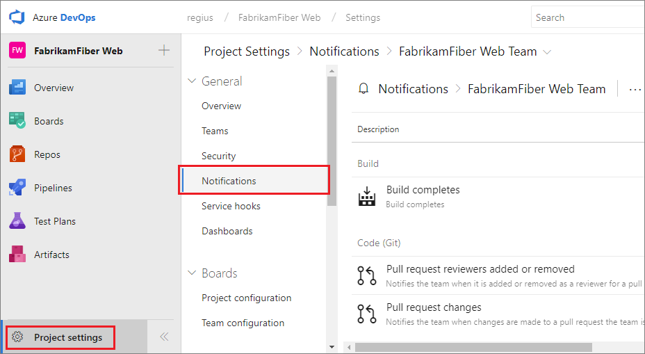
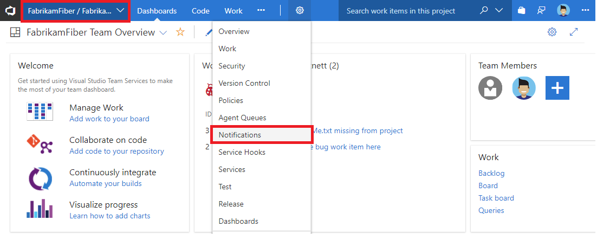

# Manage notifications for a team

<b>Azure DevOps Services | TFS 2018 | TFS 2017.1 | [Previous versions](../boards/queries/alerts-and-notifications.md)</b> 

> [!NOTE]  
> This topic applies to Azure DevOps Services, TFS 2017 Update 1, and later versions. If you work from an on-premises TFS 2017 or ealier versions, see [Set alerts, get notified when changes occur](../boards/queries/alerts-and-notifications.md). For on-premises TFS, [you must configure an SMTP server](/tfs/server/admin/setup-customize-alerts) in order for team members to see the Notifications option from their organization menu and to receive notifications. 
 
As changes occur to work items, code reviews, pull requests, source control files, and builds, your team can be notified via email. For example, when a high priority work item is assigned to your team's area path, an email can be sent to the team.

## Create a custom email subscription

A subscription lets you control what your team should be notified about and how the team will receive those notifications.

1. Open the Notifications page under team settings: `https://dev.azure.com/{organization}/{project}/_admin/_notifications?view=contents`
	
   # [New navigation](#tab/new-nav)
   

   # [Previous navigation](#tab/previous-nav)
   

   ---

2. Click **New subscription**. If you're not a team administrator, [get added as one](../organizations/settings/add-team-administrator.md). You need to be a team, project, or project collection administrator to create team alerts.

   # [New navigation](#tab/new-nav)
   

   # [Previous navigation](#tab/previous-nav)
   

   ---
	
	
3. Select the type of activity you want your team to be notified about.
	
	

4. Provide a description to help you identify the subscription later.

	

5. Choose which team members should receive a notification:

	

   You can choose one of the following delivery options:
   * **Team members by role**: only certain team members associated with the event are notified. For example, for work item changes, you might only want the current assignee of the work item to receive a notification.
   * **Team preference**: use the team's default delivery preference. Learn how to [manage delivery settings below.](#manage)
   * **Custom email address**: send an email to a specified email address.
   * **All team members**: send an individual email to each member of the team.

   For certain activities and when **Team members by role** is selected, you can choose to have the user that initiated the activity receive a notification. This is controlled by the **Skip initiator** checkbox. By default, this box is checked meaning the user that initiates the change will not be notified about it.

6. Choose whether you want to receive notifications about activity in all projects or only a specific project.

	

7. Optionally configure additional filter criteria.

	

7. Click **Finish** to save the new subscription.

<a name="manage" />

## Manage team delivery settings

Choose the default method for your team to receive notifications by updating the **team delivery settings**.

1. Open the Notifications page under team settings: `https://dev.azure.com/{organization}/{project}/_admin/_notifications?view=contents`
	
   # [New navigation](#tab/new-nav)
   

   # [Previous navigation](#tab/previous-nav)
   

   ---

2. Choose **Delivery settings**:

   # [New navigation](#tab/new-nav)
   

   # [Previous navigation](#tab/previous-nav)
   

   ---

3. Choose which option best fits your team's needs:

	

## Related topics

- [Manage personal notification settings](howto-manage-personal-notifications.md)  