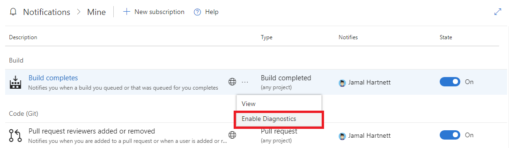

# How to use subscription logging

[!INCLUDE [version-vsts-tfs-2018](../_shared/version-vsts-tfs-2018.md)]

> [!NOTE]  
> This topic applies to Azure DevOps Services, TFS 2018 Update 2, and later versions. For on-premises TFS, [you must configure an SMTP server](/azure/devops/server/admin/setup-customize-alerts) in order for team members to see the Notifications option from their organization menu and to receive notifications.

Subscription logging is a valuable tool for troubleshooting.  It provides diagnostic information from the notifications pipeline and is disabled by default.  Once enabled, up to 25 logs, or one hour's worth of logs, are collected for the subscription.

## Enabling subscription logging

> [!IMPORTANT] 
> There is a known issue in TFS 2018 Update 2 and TFS 2018 Update 3, where enabling subscription logging for default (globe icon) subscriptions may cause issues with notification delivery. If you're on one of those two versions, it's recommended that you not enable subscription logging for default subscriptions.

Complete the following steps to enable subscription logging:

1. Enable diagnostics for your organization by entering the following URL in your browser:

    `https://dev.azure.com/{organization}/_notifications?diagnostics=true`

2. The option _Enable Diagnostics_ appears in the subscription context menu.

    

## View subscription diagnostic logs for event matching

Get all subscription event processing logs by entering the following URL in your browser:

`https://{organization}/_apis/notification/DiagnosticLogs/{event ID}/entries?startTime={date}&endTime={date}`

* _organization_ is your organization (for example, dev.azure.com/fabrikam-fiber)
* _date_ is a date time specification (for example, **2018-06-29** or **2018-06-29 02:00**)
* _event ID_ is **915f48f2-1b64-40d9-a43f-fe2528b4f296** for work item events, or
* _event ID_ is **9a688110-9e33-4cdc-affd-75d16303e7f1** for Git events, or
* _event ID_ is **a4804dcf-4bb6-4109-b61c-e59c2e8a9ff7** for any other event type

The result is JSON-formatted logging information.

## View subscription diagnostic logs for notification delivery

Retrieve all notification delivery logs in a given time frame by entering the URL in your browser.

`https://{organization}/_apis/notification/DiagnosticLogs/{event ID}/entries?startTime={date}&endTime={date}`

* _organization_ is your organization (for example, dev.azure.com/fabrikam-fiber)
* _date_ is a date time specification (for example, **2018-06-29** or **2018-06-29 02:00**)
* _event ID_ is **631f49b3-46e1-42ec-8fff-081bd176c18a** for work item events, or
* _event ID_ is **8833fc71-42ca-441b-ab12-25314877772d** for Git events, or
* _event ID_ is **a96d6177-beef-477a-a2ee-2c31433214d0** for any other event type

The result is JSON-formatted logging information.

