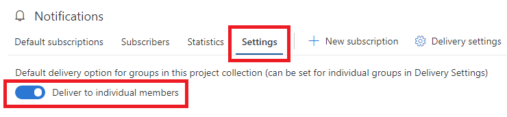

# Manage Global notification settings

[!INCLUDE [version-vsts-tfs-2017-on](../includes/version-tfs-2017-through-vsts.md)]

Choose to allow or block delivery of emails for all subscriptions owned by a team or a group. It's a default setting which applies only if the team or group hasn't explicitly set the option.

[!INCLUDE [note-smtp-server](includes/note-smtp-server.md)]

## Manage the default delivery setting

1. [Open organization notifications settings](navigating-the-ui.md#open-org-level).
2. Select the **Settings** tab.
3. Configure the default the delivery setting.

> [!div class="mx-imgBorder"] 
> 

## Related articles

Learn about the following details at the [organization notifications page](manage-organization-notifications.md):

* [Default subscriptions](manage-organization-notifications.md#default-subscriptions) - view all [default notification subscriptions](./oob-built-in-notifications.md)
* [Subscribers](manage-organization-notifications.md#subscribers) - view notification subscriptions for a specific group, team, or individual
* [Statistics](manage-organization-notifications.md#statistics) - view the most active subscriptions and top event initiators
* [Settings](manage-organization-notifications.md#settings) - manage organization-level settings, such as delivery preferences

