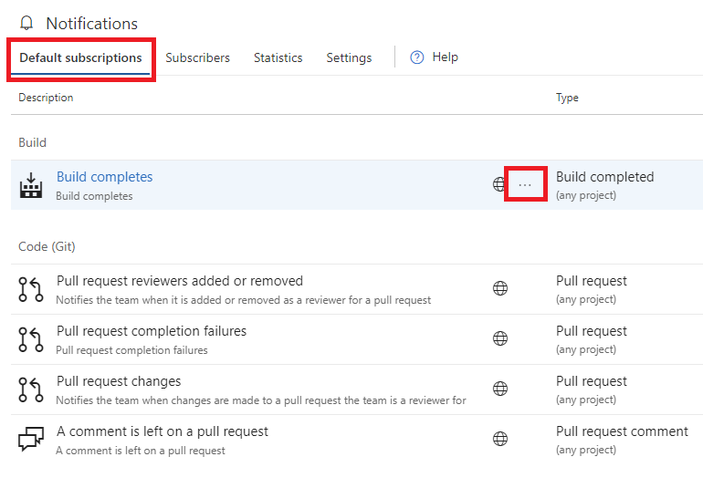
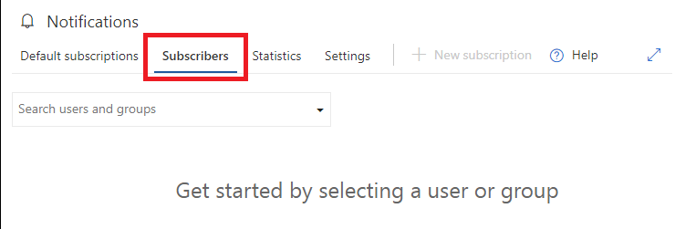
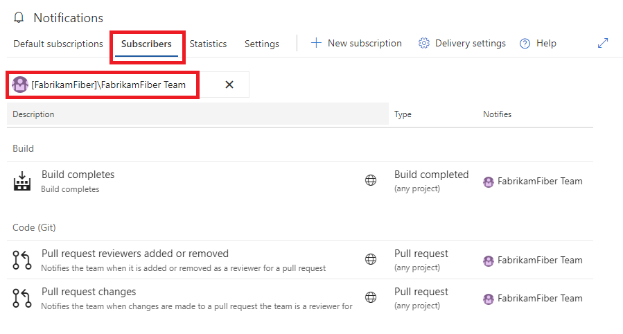
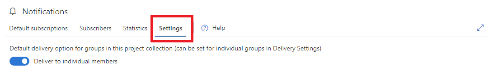

# Manage notifications for an organization

[!INCLUDE [version-vsts-tfs-2017-on](../includes/version-tfs-2017-through-vsts.md)]

In this article, learn about managing notifications for your organization. 

[!INCLUDE [note-earlier-tfs-version](includes/note-earlier-tfs-version.md)]

::: moniker range="azure-devops"

> [!TIP]
> We don't support organization-wide notifications. As an alternative, you can provide an email distribution list that goes to your entire organization. Also, you can generate a banner with the [**az devops banner command**](../organizations/settings/manage-banners.md) that all users see when they sign in.
 
::: moniker-end

::: moniker range="< azure-devops"

> [!TIP]
> We don't support organization-wide notifications. As an alternative, you can provide an email distribution list that goes to your entire organization. 
> 
::: moniker-end

## Organization-level notifications page

See [Navigating the UI](navigating-the-ui.md) to learn how to locate this page.

The organization notifications page consists of the following sections:

* Default subscriptions - view all [default notification subscriptions](./oob-built-in-notifications.md)
* Subscribers - view notification subscriptions for a specific group, team, or individual
* Statistics - view the most active subscriptions and top event initiators
* Settings - manage organization level settings such as delivery preferences

[!INCLUDE [note-smtp-server](includes/note-smtp-server.md)]

## Organization notifications page: Default subscriptions

The `Default subscriptions` section lists all default subscriptions available to the organization. The globe icon on a notification subscription indicates the subscription is a default subscription.

Members of the **project collection administrators** group have permission to enable/disable any default subscription in this view. Any member project collection valid users have permission to view the details of the default subscription. The view and enable options are available in the context menu (`...`) associated with each individual subscription.

> [!div class="mx-imgBorder"] 
>

## Organization notifications page: Subscribers

The `Subscribers` section begins with an empty identity search box. Enter any group, team, or individual to view the list of subscriptions associated with the specified identity.

> [!div class="mx-imgBorder"] 
>

All notification subscriptions for the chosen identity are listed in this view. Management options are available from the context menu (`...`) associated with each subscription. Note, the  icon on subscription row indicates a default subscription.

> [!div class="mx-imgBorder"] 
>

## Organization notifications page: Statistics

The `Statistics` section shows the most active notification subscriptions and the top event initiators (group, team, or individual). The statistics are only for the current day and reset at 00:00 UTC. A benefit of these statistics is identifying unintended high volume subscriptions or event initiators.

> [!div class="mx-imgBorder"] 
>

## Organization notifications page: Settings

The `Settings` section allows organization level notification settings to be managed by any member of the **project collection administrators** group. All teams and groups inherit the _Default delivery option_ setting, which is why it isn't explicitly set at the team or group level.

> [!div class="mx-imgBorder"] 
>

