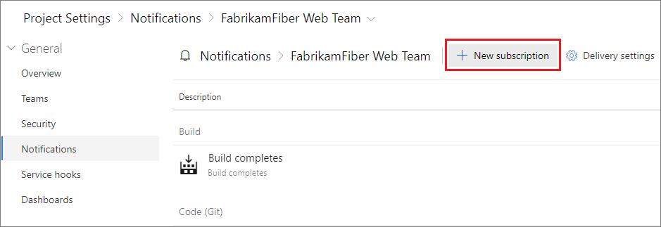
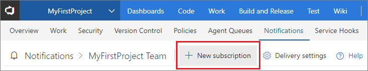
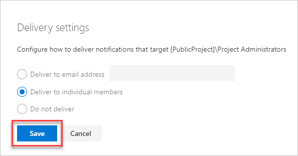
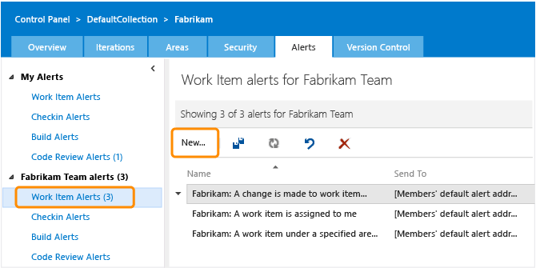
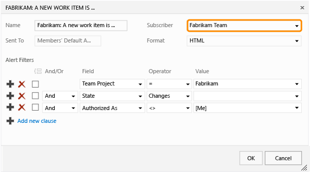
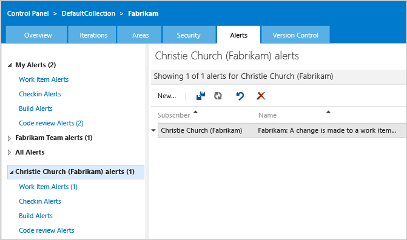

# Manage notifications for a team, group, or organization

[!INCLUDE [version-all](../includes/version-all.md)]

Your team or group can receive email notifications as changes occur to the following items in Azure DevOps:
- work items 
- code reviews
- pull requests
- source control files
- builds

For example, when a high priority work item is assigned to your team's area path, a notification email gets sent to the team.

[!INCLUDE [note-earlier-tfs-version](includes/note-earlier-tfs-version.md)]

## Prerequisites

You must be a Team-, Project-, or Project Collection Administrator to create group and team notifications. If you're not an administrator, [get added as one](../organizations/settings/add-team-administrator.md). For more information, see [Notification types](about-notifications.md#notification-types).

[!INCLUDE [note-smtp-server](includes/note-smtp-server.md)]

::: moniker range=">= tfs-2017"

## Create an email subscription

A subscription lets you control what your team is notified of and how the team receives those notifications. For more information, see [notification types](about-notifications.md#notification-types).

::: moniker-end

::: moniker range="azure-devops"

1. Sign in to your organization (```https://dev.azure.com/{yourorganization}```).
1. Select **Project settings** > **Notifications**.

    :::image type="content" source="media/nav-team-notifications-hub-newnav.png" alt-text="Screenshot of Project settings and Notifications highlighted":::

2. Select **New subscription**. 

     

3. Select the type of activity you want your team to be notified of.

	

1. Provide a description to help you identify the subscription later.

    

1. Choose which team members should receive a notification:

    

   Choose from one of the following delivery options:

     | **Delivery option**    | **Description**   | 
     | --------------------|-------------------|  
     | **Team members by role** | Only certain team members associated with the event are notified. For example, for work item changes, you might only want the current assignee of the work item to receive a notification. |  
     | **Team preference**      | Use the team's default delivery preference. For more information, see [Manage delivery settings](#manage).   |  
     | **Custom email address** | Send an email to a specified email address.    |  
     | **All team members**     | Send an individual email to each member of the team.        |   

   For certain activities, when you select **Team members by role**, you can choose to have the user that initiated the activity receive a notification. This notification is controlled by the **Skip initiator** checkbox. By default, this box is checked, meaning the user that starts the change isn't notified about it.

   > [!TIP]
   > For **Team members by role**, each role is fairly self-explanatory. However, the following two roles may need some further explanation. 
   > 
   > **Changed reviewers** applies to any reviewer that's added or deleted, as a result of policies defined for the set of files. For example, a push to a pull request (PR) could introduce a change to File1.cs. If there’s a policy which says that Person A needs to review changes to File1.cs, they’d be in the Changed reviewers role for that iteration of the PR. 
   > 
   > The **Reset reviewers** role is related to the “reset votes” policy. For example, the repo has configured the policy, “Reset votes on new pushes”. Person B, who was required on the PR, has already approved this PR. Because of the reset votes policy, their vote has been reset. Thus, she’s in the Reset reviewers role for that iteration.

2. Choose whether you want to receive notifications about activity in all projects or only a specific project.

    

3. Optionally, configure additional filter criteria.

    

4. Select **Finish** to save the new subscription.

::: moniker-end  

::: moniker range=">= azure-devops-2019 < azure-devops"

1. Sign in to your organization (```https://dev.azure.com/{yourorganization}```).
1. Select **Project settings** > **Notifications**.

    :::image type="content" source="media/nav-team-notifications-hub-newnav.png" alt-text="Screenshot of Project settings and Notifications highlighted":::

2. Select **New subscription**.

     

3. Select the type of activity you want your team to be notified of.

	

1. Provide a description to help you identify the subscription later.

    

1. Choose which team members should receive a notification:

    

   Choose from one of the following delivery options:

   | Delivery option          | Description                                                                                                                                                                                |
   |--------------------------|--------------------------------------------------------------------------------------------------------------------------------------------------------------------------------------------|
   | **Team members by role** | Only certain team members associated with the event are notified. For example, for work item changes, you might only want the current assignee of the work item to receive a notification. |
   | **Team preference**      | use the team's default delivery preference. For more information, see [Manage delivery settings](#manage).                                                                                 |
   | **Custom email address** | Send an email to a specified email address.                                                                                                                                                |
   | **All team members**     | Send an individual email to each member of the team.                                                                                                                                       |

    For certain activities, when you select **Team members by role**, you can choose to have the user that initiated the activity receive a notification. This notification is controlled by the **Skip initiator** checkbox. By default, this box is checked, meaning the user that starts the change isn't notified about it.

   > [!TIP]
   > For **Team members by role**, each role is fairly self-explanatory. However, the following two roles may need some further explanation. 
   > **Changed reviewers** applies to any reviewer that's added or deleted, as a result of policies defined for the set of files. For example, a push to a pull request (PR) could introduce a change to File1.cs. If there’s a policy which says that Person A needs to review changes to File1.cs, they’d be in the Changed reviewers role for that iteration of the PR. 
   > The **Reset reviewers** role is related to the “reset votes” policy. For example, the repo has configured the policy, “Reset votes on new pushes”. Person B, who was required on the PR, has already approved this PR. Because of the reset votes policy, their vote has been reset. Thus, she’s in the Reset reviewers role for that iteration.

1. Choose whether you want to receive notifications about activity in all projects or only a specific project.

    

1. Optionally, configure additional filter criteria.

    

1. Select **Finish** to save the new subscription.

::: moniker-end  

::: moniker range=">= tfs-2017 <= tfs-2018" 

1. Open the **Notifications** page in **Team settings**: `https://dev.azure.com/{organization}/{project}/_admin/_notifications?view=contents`

    > [!div class="mx-imgBorder"] 
    > 

1. Select **New subscription**. 

   

1. Select the type of activity you want your team to be notified of.

    

1. Provide a description to help you identify the subscription later.

    

1. Choose which team members should receive a notification:

    

   Choose from one of the following delivery options:

   |Deliver to  |Description  |
   |---------|---------|
   |**Members of Azure DevOps by role**    |  Only certain team members associated with the event are notified. For example, for work item changes, you might only want the current assignee of the work item to receive a notification.       |
   |**Team preference**   | use the team's default delivery preference. For more information, see [Manage delivery settings](#manage).        |
   |**Custom email address**    |  Send an email to a specified email address.       |
   |**Members of Azure DevOps**   |  Send an individual email to each member of the team.       |
   |**SOAP**    | Send to an eamil address.      |

   See the following roles and their descriptions:

   |Roles |Description  |
   |---------|---------|
   |


    For certain activities, when you select **Team members by role**, you can choose to have the user that initiated the activity receive a notification. This notification is controlled by the **Skip initiator** checkbox. By default, this box is checked, meaning the user that starts the change isn't notified about it.

2. Choose whether you want to receive notifications about activity in all projects or only a specific project.

    

3. Optionally, configure additional filter criteria.

    

4. Select **Finish** to save the new subscription.

::: moniker-end  

<a name="manage" />

::: moniker range=">= tfs-2017"

## Manage global delivery settings

Global notifications apply to all **projects** defined for an organization or collection. 
Choose to allow or block delivery of emails for all subscriptions owned by a team or a group. It's a default setting which applies only if the team or group hasn't explicitly set the option. For more information, see [Global notifications](about-notifications.md#global-notifications).

::: moniker-end

::: moniker range="azure-devops"

> [!TIP]
> We don't support organization-wide notifications. As an alternative, you can provide an email distribution list that goes to your entire organization. Also, you can generate a banner with the [**az devops banner command**](../organizations/settings/manage-banners.md) that all users see when they sign in.

::: moniker-end

::: moniker range="azure-devops-2020"

> [!TIP]
> You can send an email to all collections in an application tier. See [Configure an SMTP server and customize email for alerts and feedback requests](/azure/devops/server/admin/setup-customize-alerts). Also, you can generate a banner with the [**az devops banner command**](../organizations/settings/manage-banners.md) that all users see when they sign in.

::: moniker-end

::: moniker range="< azure-devops-2020"
> [!TIP]
> You can send an email to all collections in an application tier. See [Configure an SMTP server and customize email for alerts and feedback requests](/azure/devops/server/admin/setup-customize-alerts). 

::: moniker-end

::: moniker range=">= tfs-2017"  

1. Sign in to your organization (```https://dev.azure.com/{yourorganization}```).
2. Select  **Organization settings**.
 
   

3. Select **Global notifications** > **Subscribers**, enter and find your group, and then select **Delivery settings**.

    

4. Choose which option best fits your group's needs, and then select **Save**.  

   

Your group delivery settings are updated for notifications.

::: moniker-end

::: moniker range=">= tfs-2017"  

## Manage team and project delivery settings

1. Sign in to your organization (```https://dev.azure.com/{yourorganization}```).
1. Select **Project settings** > **Notifications**.

    :::image type="content" source="media/nav-team-notifications-hub-newnav.png" alt-text="Screenshot of Project settings and Notifications highlighted.":::

2. Choose **Delivery settings**:

   

3. Choose which option best fits your team's needs:  

    

Your team delivery settings are updated for notifications.

::: moniker-end

<a id="team-alerts"></a>

::: moniker range="<= tfs-2015"

## Set alerts for your team

1. Open team alerts from **Manage TFS Alerts**.

   

1. Expand the team and open Select New Alert Template. 

	

1. Choose an alert type. 

	

1. Notice how the subscriber is set to the team context. Alerts are sent to each team member based on their preferred email address, which they set through their profile.
	
	

   > [!TIP]
   > For the team context, the alert query interprets the <strong>@Me</strong>  variable as anyone who is a member of the team.

You can set filters for as many as 20 different alert types, specify the email addresses for yourself and other team members, and select the delivery format. Also, you can set team alerts to keep all team members notified of important changes. 

## Set alerts for a project

To set alerts for a project, you must be a member of the Project Collection Administrator or Team Foundation Administrator groups. To get added, see [Add an administrator](../organizations/security/set-project-collection-level-permissions.md). If you're not a member of these groups, you won't see the options available for administering alerts.

As an administrator, you can view, create, edit, and delete alerts for team members and teams. 

### View alerts set for a project 

* From the web admin page for a project, open the Alerts tab and expand All alerts. 

	

### Find alerts set for a team member or team

* Choose the name of the team member from the drop-down list, or type the name in the search box. 

	

	

### Create, edit, or delete an alert

1. To create an alert for a team member, first find the alerts defined for that subscriber as described in the previous step. Then, create an alert in the same way that a team member creates alerts. 

	

	To create an alert for a team, first find the alerts assigned to that team, and then create an alert in the same way. The team should appear in the Subscriber field. 

1. To edit or delete an alert, open it from the short cut menu.

	

::: moniker-end

[!INCLUDE [opt-out-notification](includes/opt-out-notification.md)]

## Related articles

- [Manage personal notification settings](manage-your-personal-notifications.md)
- [Set your preferences](../organizations/settings/set-your-preferences.md)
- [Default and supported notifications](oob-built-in-notifications.md)
- [Follow a specific work item](../boards/work-items/follow-work-items.md)  
- [Change your preferred email address](change-email-address.md)
