# Manage your notifications

[!INCLUDE [version-all](../includes/version-all.md)]

As changes occur to work items, code reviews, source control files, and builds, you can receive email notifications for alerts that you define. For example, you can set an alert to be notified whenever a bug that you opened is resolved or a work item is assigned to you. You can set personal alerts, as described in this article, or [team or project alerts](manage-team-group-notifications.md).

[!INCLUDE [note-earlier-tfs-version](includes/note-earlier-tfs-version.md)]

::: moniker range=">= tfs-2017"  

In this tutorial, learn how to do the following tasks:

> [!div class="checklist"]
> * View your notifications
> * Add a custom subscription
> * Unsubscribe or opt out of a team or project subscription

::: moniker-end  

[!INCLUDE [note-smtp-server](includes/note-smtp-server.md)]

::: moniker range="azure-devops"  

## View your personal notifications

> [!NOTE]   
> To enable the new user interface for the Project Permissions Settings Page, see [Manage or enable features](../project/navigation/preview-features.md).

#### [Preview page](#tab/preview-page) 

From the web portal, select the icon with your initials or picture, and then select **Notification settings** from the drop-down menu.

   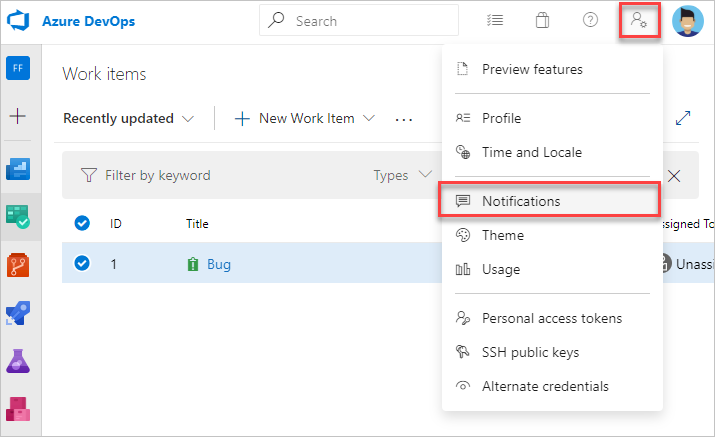  

#### [Current page](#tab/current-page) 

From the web portal, select the icon with your initials or picture, and then select **Notification settings** from the drop-down menu.

     

***

::: moniker-end  

::: moniker range=">= tfs-2017 < azure-devops"  

> [!div class="mx-imgBorder"] 
> 
::: moniker-end  

::: moniker range="< tfs-2017"  

## Set alerts just for yourself

1. Open alerts management (My alerts from your profile menu). If you don't see this option, then you must [configure an SMTP server to support TFS](/azure/devops/server/admin/setup-customize-alerts). 
	
	

2. Enter one or more email addresses. Separate addresses with a semi-colon. 
	
	  

3.	Select the check box for each alert of interest. **My work items** and **My build** refer to work items and builds that you created.
	
	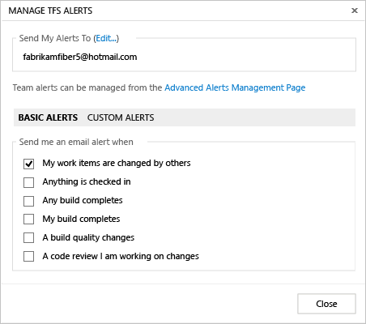

	Alert templates reference a customizable query. 
	
	The following alert types appear when your project is provisioned with Git for version control:  
	- **A commit is pushed to this project**  
	- **A pull request I've participated in is created or updated**  
	- **A build quality changes** 

	> [!TIP]    
	> When you clear an alert, you also clear all email addresses defined for the alert.  

4.	For more options, open custom alerts and choose one of the options available. Also, you can open a basic alert and modify its settings, such as changing the email format from HTML to plain text or SOAP. 
	
	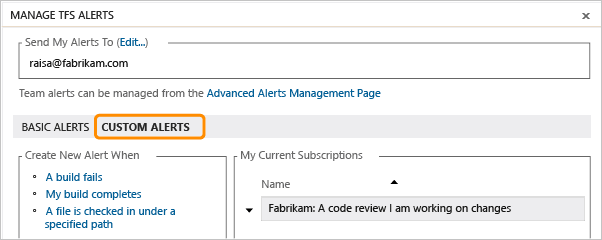

5.	Define alert filters in the same way you define query filters.
	
	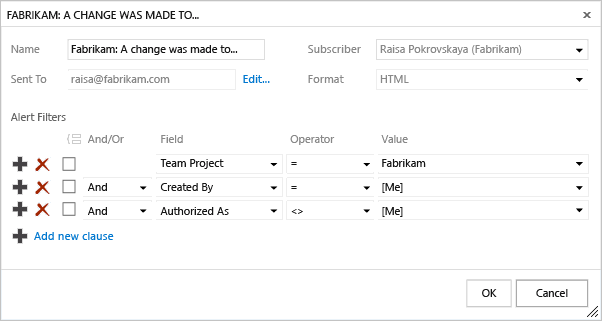
	
	For a list of available fields, see [Index of work item fields](../boards/work-items/guidance/work-item-field.md).

6.	For even more options, open the Select New Alert Template. 
	
	

7.	Choose from one of the several alert types listed.
	
	

::: moniker-end  

::: moniker range=">= tfs-2017"  

## View all subscriptions

This view shows all subscriptions that you've created or that have been created by an administrator. Subscriptions let you control what you are notified about. Subscribed notifications are indicated with the State as **On**.

::: moniker-end  

::: moniker range="azure-devops"  

> [!NOTE]   
> To enable the new user interface for the Project Permissions Settings Page, see [Manage or enable features](../project/navigation/preview-features.md).

#### [Preview page](#tab/preview-page) 

> [!div class="mx-imgBorder"]  
> 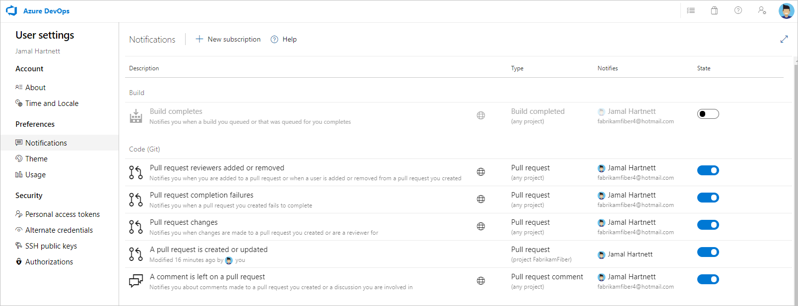

#### [Current page](#tab/current-page) 

> [!div class="mx-imgBorder"]  
> 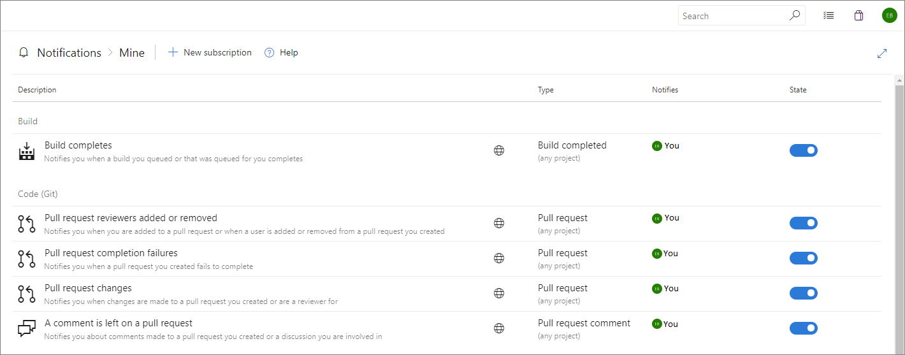

***

::: moniker-end  

::: moniker range=">= tfs-2017 < azure-devops"  

  

::: moniker-end

::: moniker range=">= tfs-2017"   

A subscription can be just for you, or if you're a team admin, can be shared by everyone in the team.

::: moniker-end  

::: moniker range=">= tfs-2017"  

## Add a custom subscription

With custom personal subscriptions, you can define precise criteria for the events you want to receive notifications. A custom subscription can notify you about any event. Default subscriptions differ, as they only notify users or groups directly associated with an event.

::: moniker-end  

::: moniker range="azure-devops"  

> [!NOTE]   
> To enable the new user interface for the Project Permissions Settings Page, see [Manage or enable features](../project/navigation/preview-features.md).

#### [Preview page](#tab/preview-page) 

1. From your Notifications page, select **New subscription**.

	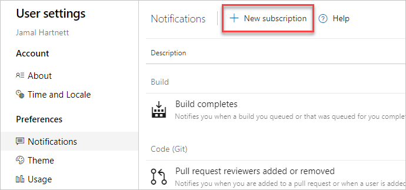

2. Choose the category and template you want to use. For a list of supported templates, see [Default and supported notifications](oob-built-in-notifications.md).

	Here we choose to get notified when a pull request is created within a specific project, Fabrikam Fiber.

	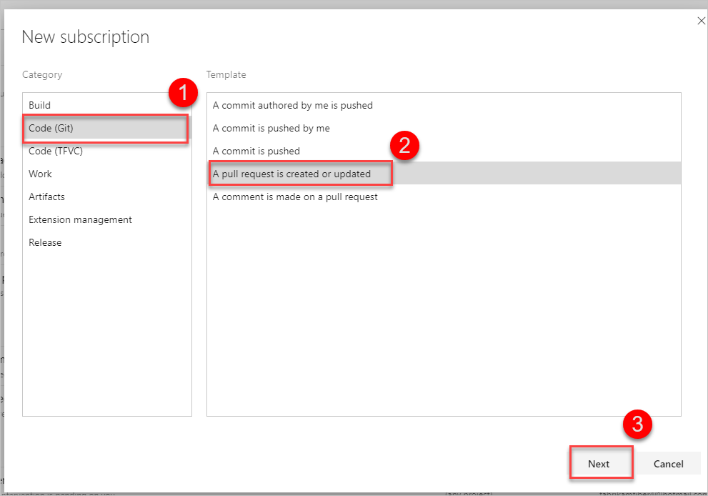

3. Modify the description to help you identify the subscription later. Also choose an email address for notifications to be delivered to. By default, your preferred email address is used. optionally, include one or more fields to further specify the event criteria.

	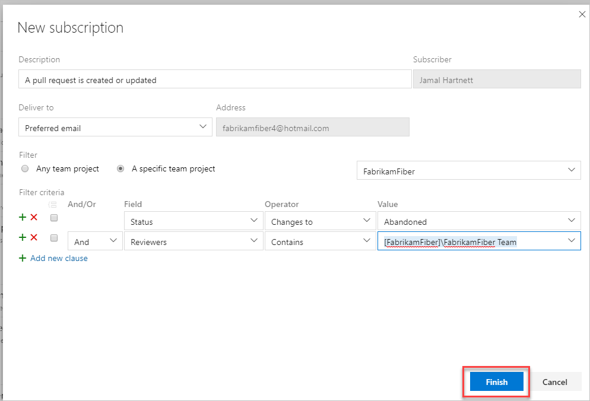

	> [!NOTE]   
	> The fields available for filtering event criteria differ depending on the category and template you select.   

4. Select **Finish** when you're done. The subscription now appears in the list under the category you selected.

	

#### [Current page](#tab/current-page) 

1. From your Notifications page, select **New subscription**.

   

2. Choose the category and template you want to use. For a list of supported templates, see [Default and supported notifications](oob-built-in-notifications.md).

	Here we choose to get notified when a pull request is created within a specific project, Fabrikam Fiber.

	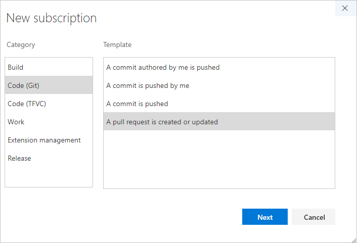

3. Modify the description to help you identify the subscription later. Also choose an email address for notifications to be delivered to. By default, your preferred email address is used. optionally, include one or more fields to further specify the event criteria.

	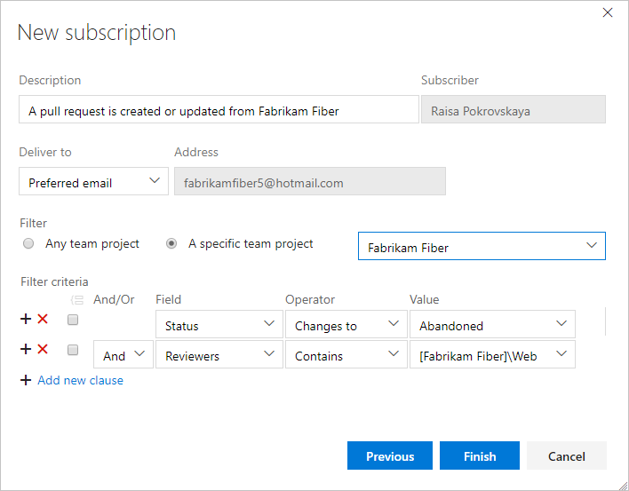

	> [!NOTE]   
	> The fields available for filtering event criteria differ depending on the category and template you select.   

4. Select **Finish** when you're done. The subscription now appears in the list under the category you selected.

	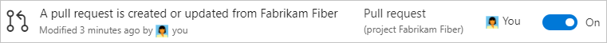

::: moniker-end  

***

::: moniker range=">= tfs-2017 <= tfs-2018"  

   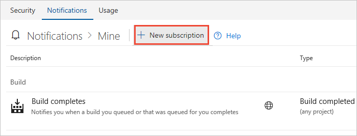

2. Choose the category and template you want to use. For a list of supported templates, see [Default and supported notifications](oob-built-in-notifications.md).

	Here we choose to get notified when a pull request is created within a specific project, Fabrikam Fiber.

	

3. Modify the description to help you identify the subscription later. Also choose an email address for notifications to be delivered to. By default, your preferred email address is used. optionally, include one or more fields to further specify the event criteria.

	

	> [!NOTE]   
	> The fields available for filtering event criteria differ depending on the category and template you select.   

4. Select **Finish** when you're done. The subscription now appears in the list under the category you selected.

	

::: moniker-end  

::: moniker range=">= tfs-2017"  

## Unsubscribe or opt out of a team or OOB subscription

You can choose to not receive notifications for certain team subscriptions by opting out of the subscription.

To unsubscribe from any notification, even one that you've defined, slide the State **On/Off** indicator to the Off position.
 
For example, here we turn off the Build completes subscription.

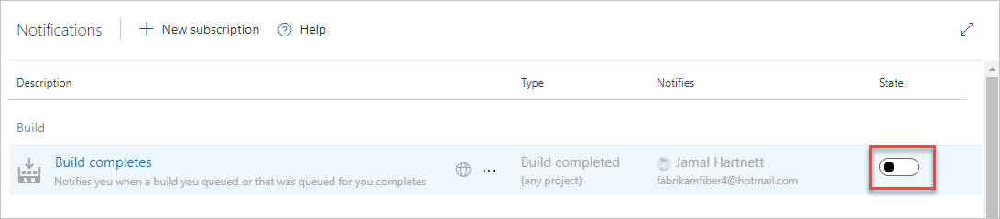

> [!NOTE]  
> Whether you are an administrator or not, toggling a shared team subscription from your notification settings only impacts you and not other team members.

::: moniker-end  

## Related articles

- [Set your preferences](../organizations/settings/set-your-preferences.md)
- [Default and supported notifications](oob-built-in-notifications.md)
- [Follow a specific work item](../boards/work-items/follow-work-items.md)  
- [Manage notifications for a team](manage-team-group-notifications.md)  
- [Change your preferred email address](change-email-address.md)

### Limitations

* The user interface no longer supports creating plain text email subscriptions.

<!--- TFS 2017 Update 1 settings 

To manage your notification settings, select the Notifications option under the profile menu:
	

Learn more about [team subscriptions](./manage-team-group-notifications.md).

From this view, you can create, edit, disable, or delete custom subscriptions that you have created for yourself. You can also see shared team subscriptions.

## Create a subscription

1. From your Notifications, choose **New**.
	
3. Select the type of activity you want to be notified about.
	
	

4. Provide a description to help you identify the subscription later. Also choose an email address for notifications to be delivered to. By default, your preferred email address is used.

	

5. Choose whether you want to receive notifications about activity in all projects or only a specific project.

	

6. Optionally configure additional filter criteria.

	

7. Select **Finish** to save the new subscription.

## Opt out of a team subscription

You can choose to not receive notifications for certain team subscriptions by opt'ing out of the subscription.

1. Open your notifications settings from the profile menu.
	
	

2. Find the team subscription in the shared subscriptions section.

	

3. Move the toggle to opt out of receiving notifications for this subscription.

    

-->