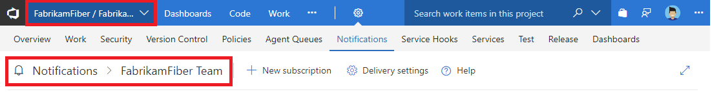

# Navigating the notifications UI

<b>Azure DevOps Services | TFS 2018 | TFS 2017.1 | [Previous versions](../work/track/alerts-and-notifications.md)</b>

> [!NOTE]  
> This topic applies to Azure DevOps Services, TFS 2017 Update 1, and later versions. If you work from an on-premises TFS 2017 or earlier versions, see [Set alerts, get notified when changes occur](../work/track/alerts-and-notifications.md). For on-premises TFS, [you must configure an SMTP server](/tfs/server/admin/setup-customize-alerts) in order for team members to see the Notifications option from their organization menu and to receive notifications.

## The notifications pages

There are the following three notifications pages:

* Organization notifications page
* Team notifications page
* Personal notifications page

Permissions to manage notifications at each page default are  as follows:

* Organization administrators can manage notifications
* Organization and team administrators can manage team notifications
* Each user can manage their personal notifications

## Direct navigation to notifications pages using URL

Organization:
```
https://dev.azure.com/{organization}/_admin/_notifications
```

Team:
```
https://dev.azure.com/{organization}/{project}/{team}/_admin/_notifications
```

Personal:
```
https://dev.azure.com/{organization}/_notifications
```

## Navigating to the organization level notifications page

Choose the Notifications page under organization settings.

   # [New navigation](#tab/new-nav)
   

   # [Previous navigation](#tab/previous-nav)
   

   

   ---

## Navigating to the team level notifications page

Choose the Notifications page under project settings.

   # [New navigation](#tab/new-nav)
   

   # [Previous navigation](#tab/previous-nav)
   

   

   ---

## Navigating to the personal notifications page
Choose Notifications page under your profile

   # [New navigation](#tab/new-nav)
   

   

   # [Previous navigation](#tab/previous-nav)
   

   ---
