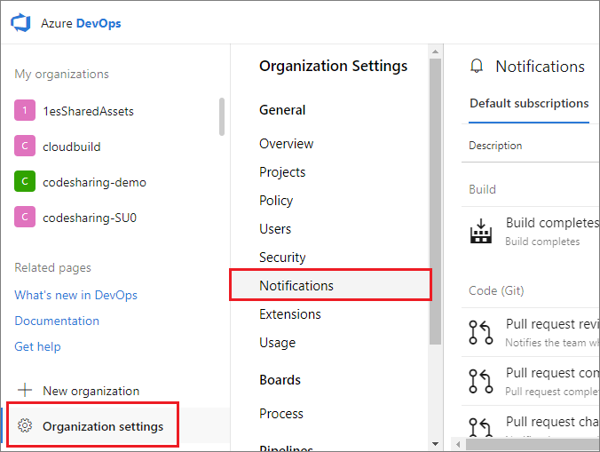
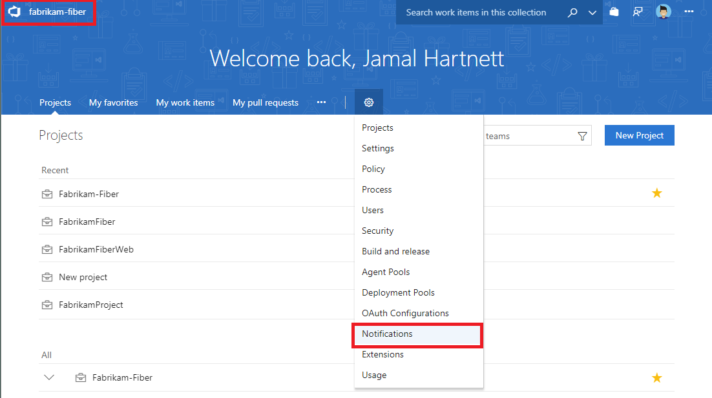
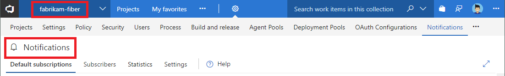
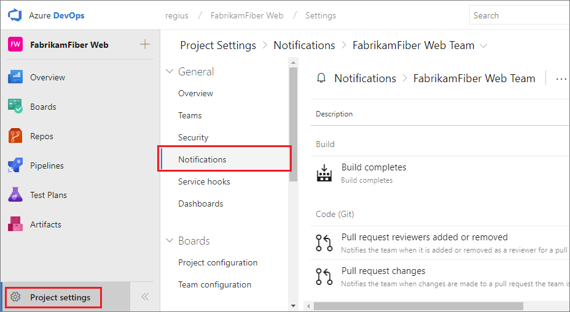
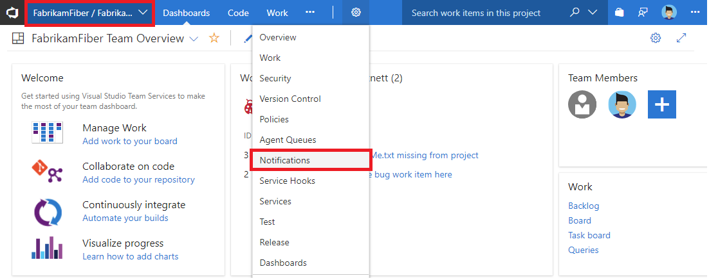
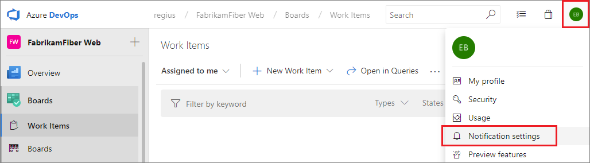
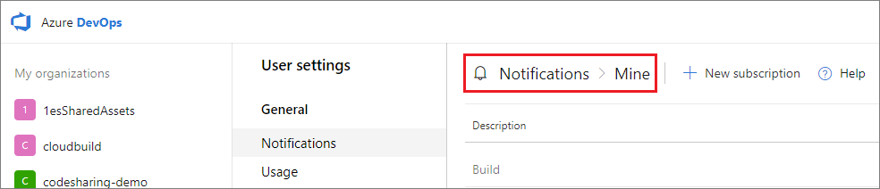

# Navigating the notifications UI

[!INCLUDE [version-vsts-tfs-2017-on](../boards/_shared/version-vsts-tfs-2017-on.md)]

> [!NOTE]  
> This topic applies to Azure DevOps Services, TFS 2017 Update 1, and later versions. If you work from an on-premises TFS 2017 or earlier versions, see [Set alerts, get notified when changes occur](../work/track/alerts-and-notifications.md). For on-premises TFS, [you must configure an SMTP server](/azure/devops/server/admin/setup-customize-alerts) in order for team members to see the Notifications option from their organization menu and to receive notifications.

Learn about navigating the notifications user interface.

## The notifications pages

There are the following notifications pages:

* Personal
* Team
* Project
* Organization or collection (organization for the cloud and project collection for on-premises)

Permissions to manage notifications at each page default are  as follows:

* Organization administrators can manage notifications
* Organization and team administrators can manage team notifications
* Each user can manage their personal notifications

## Navigating to the organization-level notifications page

Select the Notifications page under organization settings.

Personal:
```
https://dev.azure.com/{organization}/_notifications
```

Team:
```
https://dev.azure.com/{organization}/{project}/{team}/_admin/_notifications
```

Project:
```
https://dev.azure.com/{organization}/{project}/_admin/_notifications
```

Organization:
```
https://dev.azure.com/{organization}/_admin/_notifications
```

   ::: moniker range=">= azure-devops-2019"  
     
   ::: moniker-end  

   ::: moniker range="<= tfs-2018"  
     

     

   ::: moniker-end

## Navigating to the team level notifications page

Select the Notifications page under project settings.

   ::: moniker range=">= tfs-2018"  
     
   ::: moniker-end  
   ::: moniker range="<= tfs-2018"  

   

   
   ::: moniker-end

## Navigating to the personal notifications page

Select the Notifications page under your profile.  

   ::: moniker range=">= azure-devops-2019"  
     

     
   ::: moniker-end  
   ::: moniker range="<= tfs-2018"  
     
   ::: moniker-end  
