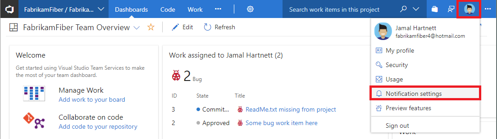

# Navigating the notifications UI

[!INCLUDE [version-vsts-tfs-2017-on](../_shared/version-tfs-2017-through-vsts.md)]

> [!NOTE]  
> This article applies to Azure DevOps, TFS 2017 Update 1, and later versions. If you work from an on-premises TFS 2017 or earlier versions, see [Set alerts, get notified when changes occur](../work/track/alerts-and-notifications.md). For on-premises TFS, [you must configure an SMTP server](/azure/devops/server/admin/setup-customize-alerts) in order for team members to see the Notifications option from their organization menu and to receive notifications.

Learn about navigating the notifications user interface.

## The notifications pages

There are the following notifications pages:

* Personal
* Team
* Project
* Organization or collection (organization for the cloud and project collection for on-premises)

Permissions to manage notifications at each page default are  as follows:

* Organization administrators can manage notifications
* Organization and team administrators can manage team notifications
* Each user can manage their personal notifications

## Navigating to the organization-level notifications page

Organization:

   ::: moniker range=">= azure-devops-2019" 

    ```
    https://dev.azure.com/{organization}/_settings/notifications
    ```

    

   ::: moniker-end

   ::: moniker range="<= tfs-2018" 

    ```
    https://dev.azure.com/{organization}/_admin/_notifications
    ```

     

     

   ::: moniker-end

## Navigating to the team level notifications page

 Project:

   ::: moniker range=">= tfs-2018" 

    ```
    https://dev.azure.com/{organization}/{project}/_settings/notifications
    ```

 
     
   ::: moniker-end

   ::: moniker range="<= tfs-2018"  

    ```
    https://dev.azure.com/{organization}/{project}/_admin/_notifications
    ```

   

   
   ::: moniker-end

## Navigating to the personal notifications page

Personal:

   ::: moniker range=" azure-devops"

       ```
    https://dev.azure.com/{organization}/usersSettings/notifications
    ```

     

   

   ::: moniker-end

   ::: moniker range=" azure-devops-2019"

    ```
    https://dev.azure.com/{organization}/_notifications
    ```

     

   

   ::: moniker-end

   ::: moniker range="<= tfs-2018"

    ```
    https://dev.azure.com/{organization}/_notifications
    ```

   

   ::: moniker-end

