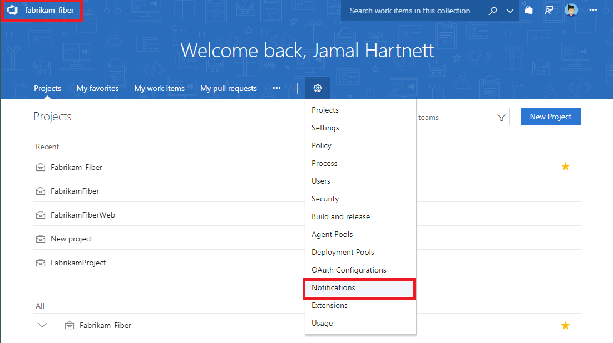

# Navigating the notifications UX

<b>VSTS | TFS 2018 | TFS 2017.1 | [Previous versions](../work/track/alerts-and-notifications.md)</b> 

> [!NOTE]  
> This topic applies to VSTS, TFS 2017 Update 1, and later versions. If you work from an on-premises TFS 2017 or ealier versions, see [Set alerts, get notified when changes occur](../work/track/alerts-and-notifications.md). For on-premises TFS, [you must configure an SMTP server](/tfs/server/admin/setup-customize-alerts) in order for team members to see the Notifications option from their organization menu and to receive notifications.

## The notifications hubs
There are three notifications hubs in the UX:
* Organization notifications hub
* Team notifications hub
* Personal notifications hub

Permissions to manage notification at each hub default as follows:
* Organization administrators can manage accuont notifications
* Organization and team administrators can manage team notifications
* Each user can manage their personal notifications


## Direct navigation to notifications hubs using URL

Organization:
```
https://{organization}.visualstudio.com/_admin/_notifications
```

Team:
```
https://{organization}.visualstudio.com/{project}/{team}/_admin/_notifications
```

Personal:
```
https://{organization}.visualstudio.com/_notifications
```


## Navigating to the organization level notifications hub
Choose the Notifications hub under organization settings.




## Navigating to the team level notifications hub
Choose the Notifications hub under project settings.


## Navigating to the personal notifications hub
Choose Notifications hub under your profile


