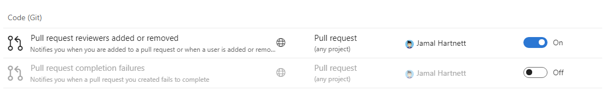

# Not getting emails from Azure DevOps subscriptions or notifications

[!INCLUDE [version-vsts-tfs-2017-on](../boards/_shared/version-vsts-tfs-2017-on.md)]

An email is generated when an [event](oob-supported-event-types.md) occurs within Azure DevOps Services which matches a notification subscription. See the [notifications overview](about-notifications.md) for more information about notification subscriptions.

Learn why you may not be receiving an expected subscription or notification email.

If you're not receiving an expected notification email, it could be for one of the following reasons.

* The email was delivered to an unchecked folder
* The subscription is disabled or opted-out
* The event does not match the specified subscription filter conditions
* The subscription is defined to not send emails to the initiator of an event
* The organization level _do not deliver_ setting is impacting email delivery
* The team or group level [_do not deliver_](troubleshoot-not-getting-email.md#team-and-group-expansion-for-email-recipients) setting is impacting email delivery
* You are not a member of the group or team receiving the email
* You are a member of an AD group and the subscription contains a @Me clause
* You do not have permission to view the event details which are included in the email

Please perform the following step to determine if any of these resolve the issue.

## Step 1: Check other email folders including the junk folder

Ensure the email was not delivered to a different email folder.

## Step 2: Locate the subscription and ensure it is enabled

Navigate to your personal subscriptions and locate the subscription which you feel should have produced an email, but didn't. [Learn how to navigate to your personal subscriptions](navigating-the-ui.md#navigating-to-the-personal-notifications-page).

If the subscription is greyed-out in the user interface, then it is disabled. The following screenshot shows the first subscription enabled and the second disabled.

A default subscription becomes disabled when an administrator opts out at the organization or team level, or if an individual opts out in their personal subscription settings. Custom subscriptions become disabled when an administrator disables the subscription at the organization or team level, or an individual disables a personal custom subscription.

## Step 3: Closely inspect the subscription filter conditions

An email is only generated if an Azure DevOps Services event matches _all_ of the filter conditions of the subscription. You can view the filter conditions by selecting the subscription link in the subscription user interface; you should be able to view the filter conditions even if you don't have permission to change them. Closely inspect _all_ filter conditions to see if they matched the Azure DevOps Services event.

## Step 4: Check the "Skip initiator" option on the subscription

The `Skip initiator` checkbox option on a subscription will cause the initiator of the Azure DevOps Services event to be excluded from the recipient list of the generated email, while all others will receive the event. For example, consider a subscription for a _work item changed_ event. You can choose `Skip initiator` to avoid being emailed for changes you make to the work item. [Learn more about excluding the initiator from notifications](howto-exclude-self-from-email.md).

## Step 5: Check "Do not deliver" setting for the organization

Navigate to the organization level notifications page and select the `Settings` tab. [See how to manage notification settings](howto-manage-organization-notifications-settings.md). If the [delivery setting](troubleshoot-not-getting-email.md#team-and-group-expansion-for-email-recipients) is set to `Do not deliver`, then all teams or groups that don't have explicit delivery settings will inherit this value. This setting alone doesn't necessarily indicate an email wasn't delivered but it could contribute to the problem, continue with the next step to determine if a group or team delivery setting is inheriting this value and blocking delivery to your group or team.

## Step 6: Check "Do not deliver" setting for your team or group

If the team or group defines a delivery setting for **Deliver to individual members**, it's still possible that the team contains other groups which have a different delivery setting. Select [this link](concepts-email-recipients.md) to learn how team membership is expanded and how some members of the team could receive an email while others do not.

## Step 7: Check your configured email address

Check if your preferred email address is set to the address you're expecting the email.  This is a user profile setting.  Hover over profile icon to view your preferred email address. [Learn how to view the configured email address.](../organizations/settings/set-your-preferences.md).

## Step 8: Is this a team subscription which contains a "@Me" filter clause

If a team or group subscription contains an @Me filter clause and the target email recipients which contains an AD group, no members of the AD group will not match the filter clause.  This is due to the fact that AD groups are not expanded for filter matching.

## Step 9: Do you have permission to see the event artifact

Emails will not be sent which contains event artifact data, such as a work item, to a recipient who does not have permission to view the artifact. The only way to know if an email was _filtered_ for this reason is to view notification delivery logs.  [Learn more about enabling and retrieving subscription and delivery logging](howto-use-subscription-logging.md).

## Contact customer support

If you're not able to resolve the issue with the previous steps, consider contacting [customer support](troubleshoot-contact-support.md)