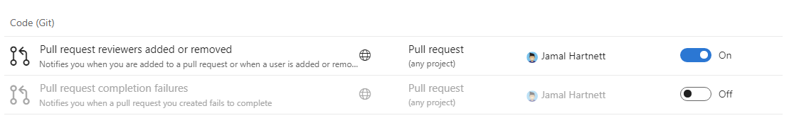

# Not getting emails from subscriptions or notifications

[!INCLUDE [version-vsts-tfs-2017-on](../includes/version-tfs-2017-through-vsts.md)]

An email is sent when an [event](oob-supported-event-types.md) occurs that matches a notification subscription. For more information about notification subscriptions, see the [notifications overview](about-notifications.md).

Learn why you may not be receiving an expected subscription or notification email.

If you're not receiving an expected notification email, it could be for one of the following reasons.

* The email was delivered to an unchecked folder
* The subscription is disabled or opted-out
* The event doesn't match the specified subscription filter conditions
* The subscription is defined to not send emails to the initiator of an event
* The organization level _do not deliver_ setting is impacting email delivery
* The team or group level [_do not deliver_](#check-do-not-deliver-setting-for-your-team-or-group) setting is impacting email delivery
* You're not a member of the group or team receiving the email
* You're a member of an Azure Directory (AD) group and the subscription contains a @Me clause
* You don't have permission to view the event details, which are included in the email

Complete the following tasks to determine if any resolve the issue.

## Check other email folders

Ensure the email wasn't delivered to a different email folder, including the junk folder.

## Locate the subscription and ensure it's enabled

Go to your personal subscriptions and locate the subscription, which you feel should have produced an email. [Learn how to access to your personal subscriptions](navigating-the-ui.md#open-person-level).

If the subscription is grayed-out in the user interface, then it's disabled. The following screenshot shows the first subscription enabled and the second disabled.

> [!div class="mx-imgBorder"] 
>

A default subscription disables when an administrator opts out at the organization or team level, or if you opt out in your personal subscription settings. Custom subscriptions get disabled when an administrator disables the subscription at the organization or team level, or if you disable a personal custom subscription.

## Closely inspect subscription filter conditions

An email is only generated if an Azure DevOps Services event matches _all_ of the filter conditions of the subscription. You can view the filter conditions by selecting the subscription link in the subscription user interface. You can view the filter conditions even if you don't have permission to change them. Closely inspect _all_ filter conditions to see if they matched the Azure DevOps Services event.

## Check the "Skip initiator" option

The `Skip initiator` checkbox option on a subscription causes the initiator of the Azure DevOps Services event to be excluded from the recipient list of the generated email, while all others receive the event. For example, consider a subscription for a _work item changed_ event. You can choose `Skip initiator` to avoid being emailed for changes you make to the work item. [Learn more about excluding the initiator from notifications](exclude-self-from-email.md).

## Check "Do not deliver" setting for organization

Go to the organization-level notifications page and select **Settings**. [See how to manage notification settings](manage-team-group-global-organization-notifications.md). If the [delivery setting](#check-do-not-deliver-setting-for-your-team-or-group) is set to `Do not deliver`, then all teams or groups that don't have explicit delivery settings inherit this value. This setting alone doesn't necessarily indicate an email isn't delivered, but it could contribute to the problem. Next, see if a group or team delivery setting inherits this value and blocks delivery to your group or team.

## Check "Do not deliver" setting for your team or group

If the team or group defines a delivery setting for **Deliver to individual members**, it's still possible the team contains other groups. The other groups have a different delivery setting. To learn more about how team membership expands and how some members of the team could receive an email while others don't, see [How email recipients of notifications are determined](concepts-email-recipients.md).

## Check your configured email address

Check if your preferred email address is set to the address you're expecting the email, which is a user profile setting. Hover over :::image type="icon" source="../media/icons/user-settings-gear.png" border="false"::: **your profile** to view your preferred email address. [Learn how to view the configured email address.](../organizations/settings/set-your-preferences.md).

## Is this a team subscription, which contains a "@Me" filter clause?

If a team or group subscription has an @Me filter clause and the target email recipients are in an AD group, no members of the AD group match the filter clause. AD groups aren't expanded for filter matching.

## Do you have permission to see the event artifact?

Recipients who don't have permission to view the artifact, don't receive an email, which contains event artifact data, such as a work item. The only way to know if an email was _filtered_ is to view notification delivery logs. Learn more about [enabling and retrieving subscription and delivery logging](use-subscription-logging.md).

## Known issue

If a subscription was created or last modified by a user who lost permissions to the project, then the notifications for that subscription won't be delivered and will be filtered silently.

## Contact customer support

If you're not able to resolve the issue with the previous steps, consider contacting [customer support](troubleshoot-contact-support.md)