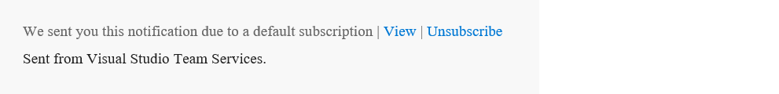

# Why did I get this email

[!INCLUDE [version-vsts-tfs-2017-on](../boards/_shared/version-vsts-tfs-2017-on.md)]

> [!NOTE]  
> This topic applies to Azure DevOps Services, TFS 2017 Update 1, and later versions. If you work from an on-premises TFS 2017 or earlier versions, see [Set alerts, get notified when changes occur](../work/track/alerts-and-notifications.md). For on-premises TFS, [you must configure an SMTP server](/azure/devops/server/admin/setup-customize-alerts) in order for team members to see the Notifications option from their organization menu and to receive notifications.

If you're receiving a notification email that you didn't expect, it could be for one of the following reasons:

* The email is sent to a group of which you are a member
* The email was triggered by a different subscription than you expected

Please perform the following steps to determine if any resolve the issue:

## Step 1: Inspect the 'To:' line on the email

Either your email address is on this line, or you are a member of a group included on it. Users receiving unexpected emails are often included as part of a group which is receiving the email. The subscription administrator might have configured the email delivery preferences to a wider than anticipated group.

## Step 2: Inspect the footer of the unexpected email

All emails have a footer which contains a link to view the subscription which triggered the email.  Select the link and view the subscription. You received the email because this subscription to which your are subscribed.  If it's a organization or team subscription, you have the option to opt out of the subscription.

## Contact customer support

If you're not able to resolve the issue with the steps above, consider contacting [customer support](troubleshoot-contact-support.md).
