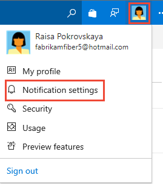

# View your subscriptions, opt-out as needed

[!INCLUDE [version-vsts-tfs-2017-on](../boards/_shared/version-vsts-tfs-2017-on.md)]

If you want to stop receiving select email notifications, you can do so by unsubscribing from them. For a description of each default subscription, see [Default notifications](oob-built-in-notifications.md)  

You start by opening your personal notification settings. If you don't have a project yet, create one in [Azure DevOps](../organizations/accounts/set-up-vs.md).

1. From the web portal, select the icon with your initials or picture, and select **Notification settings** from the drop-down menu.

	

	Those notifications you're subscribed to are indicated with the State as **On**.  

	

	The following image indicates a subscription is a default or out-of-the-box (OOB) subscription:

	

	You can't modify an OOB subscription, but you can view its definition from its context menu.

2. To unsubscribe, slide the state **On/Off** indicator to the *Off* position.

	In the following image the "Build completes" subscription is turned off.

	
