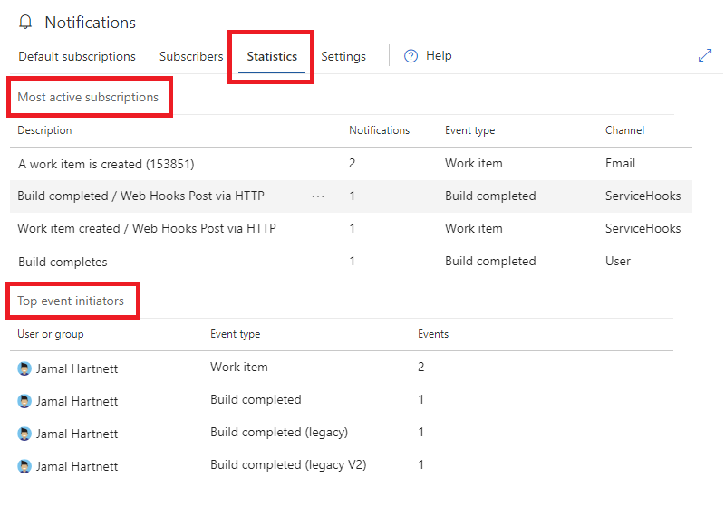

# Analyze organization-level notifications statistics

[!INCLUDE [version-vsts-tfs-2017-on](../includes/version-tfs-2017-through-vsts.md)]

Notification statistics show the top 10 most active subscriptions and top event initiators in your organization, for the current day. Administrators should periodically review statistics to ensure there are no unintended high volume subscriptions or event initiators.

[!INCLUDE [note-smtp-server](includes/note-smtp-server.md)]

## View notification statistics for organization

1. [Open organization notifications settings](navigating-the-ui.md#open-org-level).
2. Select the **Statistics** tab.
3. Analyze the most active subscriptions and top event initiators.

> [!div class="mx-imgBorder"] 
>

#### Notes:

* A context menu (`...`) on the most active subscriptions provides the option to edit, disable, or delete the subscription
* Both email and service hooks subscriptions are eligible for the most active subscriptions
* The integer subscription ID is shown in the description for a custom email subscription
* Results are not a sliding 24-hour window and reset at the beginning of each day (00:00 UTC)
