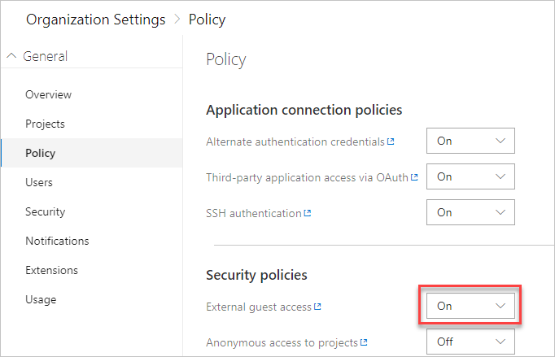
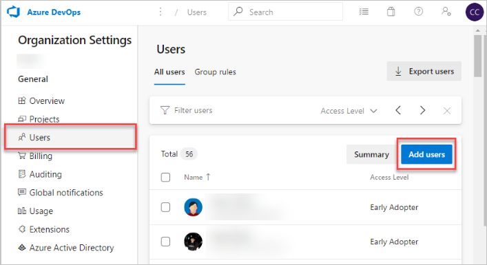

# Add external users to your organization

[!INCLUDE [version-vsts-only](../../_shared/version-vsts-only.md)]

Learn how to invite external users to your organization, if you access Azure DevOps via Azure Active Directory (Azure AD). To do so, you must add the identities of those users to your Azure AD and organizations. Doing this also grants the users some additional privileges. Learn more about the [additional organization-level resources](resources-granted-to-project-members.md).

## Prerequisites

* You must set the policy **External guest access** to **On** for the organization that you want to invite external users to.

   >[!div class="mx-imgBorder"]
   >

* You must be a member of the Project Collection Administrators group for the organization that you want to invite external users to.

* The organization to which you want to invite external users must allow for external invitations. Go to the **Organization Settings** page to confirm.

* The Azure AD tenant to which you want to invite external users must allow you to add new users based on your Azure Active Directory guest policies. Learn [how to become eligible to invite external users on your Azure AD tenant](/azure/active-directory/active-directory-b2b-delegate-invitations).

## Invite an external user to your organization

1. Sign in to your organization (```https://dev.azure.com/{yourorganization}```).

2. Select  **Organization settings**.

   

3. Select **Users**, and then select **Add new users**.

   

4. Enter the external user's email address followed by a semicolon, and then select **Add**. A warning message appears, indicating that an external user is being added from outside your directory.

   

5. Advise the external user to locate the email that they received from Azure DevOps and go to the redemption URL. The external user must navigate through an Azure B2B redemption experience, which adds the user to your organization.

>[!Note]
>If you need to resend the invitation email, go to **Users**, select the user, and select **Resend invite**.

The external user is added to the organization to which they were invited and has immediate access.

## Related articles

* [What is Azure AD B2B collaboration?](/azure/active-directory/active-directory-b2b-what-is-azure-ad-b2b)

* [Migrate to group-based resource management](migrate-to-group-based-resource-management-in-VSTS.md)

* [Assign access levels and extensions to users by group membership](assign-access-levels-and-extensions-by-group-membership.md)
