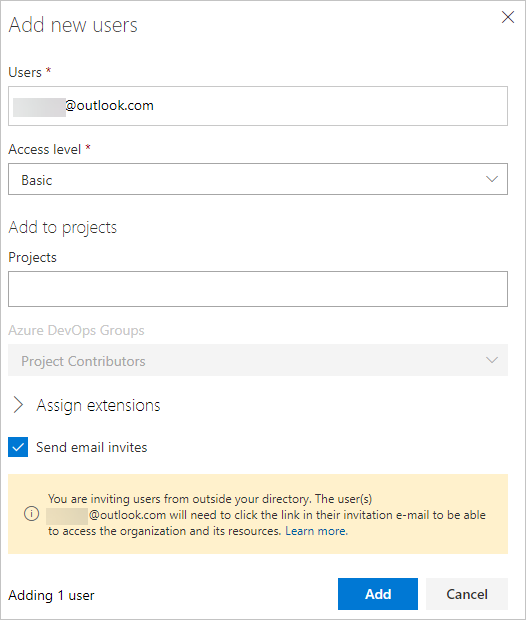

# Add external users to your VSTS account

**VSTS**

If you’re an Azure Active Directory (Azure AD)-backed VSTS account user who wants to be able to collaborate with external users, you can invite an external user to your VSTS account. To do so, you must add the identities of your external users to your Azure AD and VSTS accounts. Doing this will also grant the user some additional privileges. Learn more about the [additional account-level resources](resources-granted-to-project-members.md).

## Prerequisites

* You must set the policy 'External Guest Access' to 'On' for the account which you would like to invite external users to.

> [!div class="mx-imgBorder"]


* You must be a member of the Project Collection Administrators group for the account which you would like to invite external users to.

* The VSTS account, to which you want to invite external users, must allow for external invitations. Go to the account Settings page to confirm.

* The Azure AD tenant, to which you want to invite external users, must allow you to add new users based on your AAD tenant’s guest policies. Learn [how to become eligible to invite external users on your Azure AD tenant](https://docs.microsoft.com/en-us/azure/active-directory/active-directory-b2b-delegate-invitations).

## Invite external users to your VSTS account

1. Sign in to your VSTS account (```https://{youraccount}.visualstudio.com```).

2. Go to the **Users** tab in Settings.

3. Choose **Add new users**.

4. Enter the external user's email address followed by a semicolon, and then choose **Add**. A warning message will appear indicating that an external user is being added from outside of your directory.

> [!div class="mx-imgBorder"]


5. Advise the external user to locate the email they received from VSTS and go to the redemption URL. The external user must navigate through an Azure B2B redemption experience, which will add the user to your tenant.

>[!Note]
>If you need to resend the invitation email, go to the **Users** page, select the user, and choose **Resend invite**.

The external user is added to the VSTS account to which they were invited and has immediate access.

## Related information

* [What is Azure AD B2B Collaboration?](https://docs.microsoft.com/en-us/azure/active-directory/active-directory-b2b-what-is-azure-ad-b2b)

* [Migrate to group-based resource management](migrate-to-group-based-resource-management-in-VSTS.md)

* [Assign access levels and extensions to users by group membership](assign-access-levels-and-extensions-by-group-membership.md)
