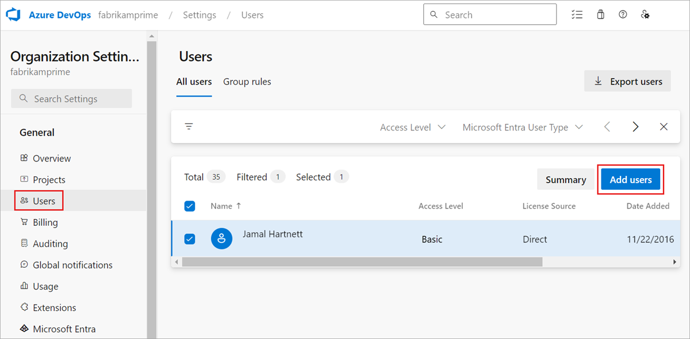
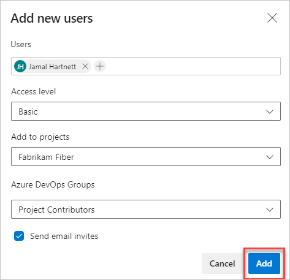
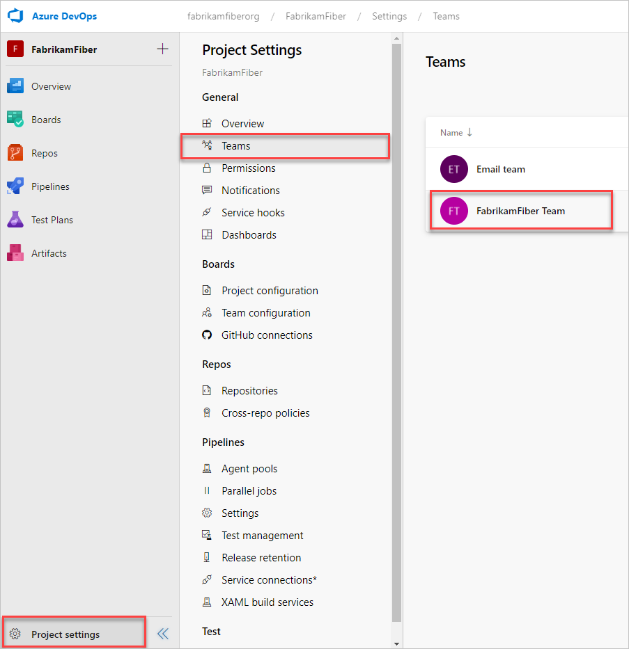
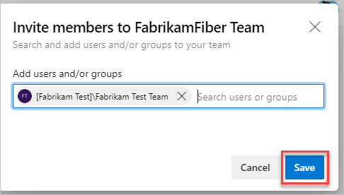
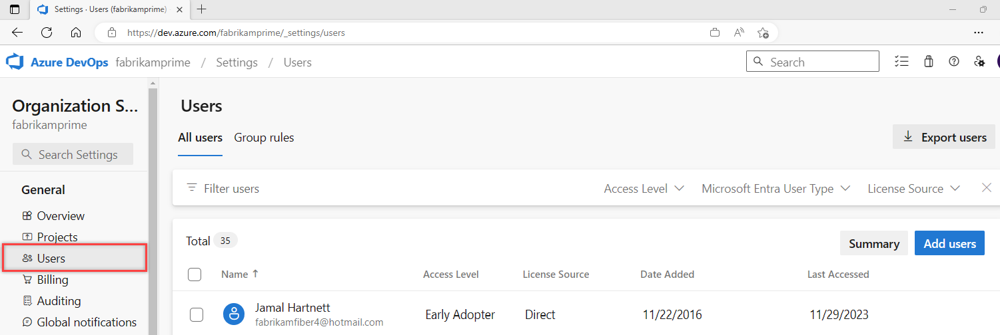
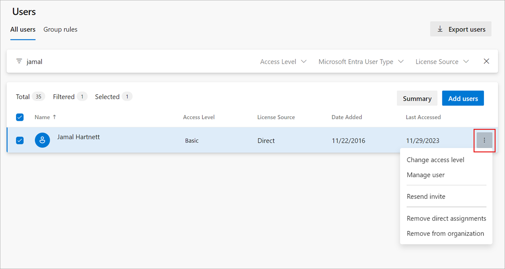
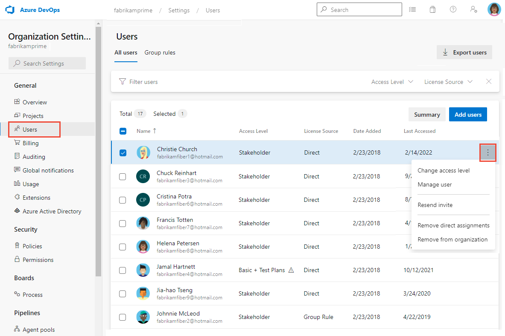

# Add users and manage access in Azure DevOps

[!INCLUDE [version-azure-devops-plus-azure-devops-server-2020](../../includes/version-azure-devops-plus-azure-devops-server-2020.md)]

Learn how to add and manage user access through Direct assignment for Azure DevOps. For an overview of adding users and related concepts, see [About organization management in Azure DevOps](organization-management.md).

The following types of users can join your organization for free:

* Five users who get [Basic features](https://azure.microsoft.com/services/devops/compare-features/), such as version control, tools for Agile, Java, build, release, and more
* Unlimited users who get [Stakeholder features](https://azure.microsoft.com/services/devops/compare-features/), such as working with your backlog, work items, and queries
* Unlimited [Visual Studio subscribers](https://azure.microsoft.com/services/devops/compare-features/) who also get Basic features. More features, such as [Azure Test Plans](https://azure.microsoft.com/services/devops/test-plans/), can be assigned to users by access level, Basic + Test Plans.

[Need more users with Basic features?](../billing/buy-basic-access-add-users.md)

> [!NOTE]
> For information about inviting external users, see [Add external user](add-external-user.md).

## Prerequisites

[!INCLUDE [prerequisites-add-users-org](../../includes/prerequisites-add-users-org.md)]

## Add users to your organization

Administrators can add users to an organization, grant access to appropriate tooling extensions and service access levels,
and add users to groups - all in one view.

> [!NOTE]
> If you have an Azure Active Directory (Azure AD)-backed organization, and you need to add users who are external to Azure AD, first [add external users](add-external-user.md). On the **Tell us about this user page**, under **Type of user**, be sure to choose **User with an existing Microsoft account**. After you complete those steps, use the following steps to add the Azure AD
 > user to Azure DevOps.
 
You can add up to 50 users in a single transaction. When you add users, each user receives a notification email with a
link to the organization page.

::: moniker range=" azure-devops"

> [!NOTE]   
> To enable the new user interface for the New user hub, see [Enable preview features](../../project/navigation/preview-features.md).

::: moniker-end

#### [Preview page](#tab/preview-page) 

::: moniker range=" azure-devops"

To give other users access to your organization, add their email addresses.

1. Sign in to your organization (```https://dev.azure.com/{yourorganization}```).

2. Select  **Organization settings**.

    

3. Select **Users**, and then select **Add users**.
   
   

4. Enter the following information.

   > [!div class="mx-imgBorder"]  
   >

   - **Users:** Enter the email addresses (Microsoft accounts) or GitHub usernames for the users. You can add several email addresses by separating them with a semicolon (;). An email address appears in red when it's accepted. For more information about GitHub authentication, see [FAQs](../security/faq-github-authentication.yml).
   - **Access level:** Leave the access level as **Basic** for users who contribute to the code base. To learn more, see [About access levels](../security/access-levels.md).  
   - **Add to projects:** Select the project you want to add them to.  
   - **Azure DevOps Groups:** Leave as **Project Contributors**, the default security group for users who contribute to your project. To learn more, see [Default permissions and access assignments](../security/permissions-access.md).  

	> [!NOTE]  
	> Add email addresses for [personal Microsoft accounts](https://account.microsoft.com/account) and IDs for GitHub accounts unless you plan to use [Azure Active Directory (Azure AD)](/azure/active-directory/fundamentals/active-directory-whatis) to authenticate users and control organization access. If a user doesn't have a Microsoft or GitHub account, ask the user to sign up for a [Microsoft account](https://signup.live.com/) or a [GitHub account](https://github.com/join).  
5. Select **Add** to complete your invitation.

::: moniker-end

Choose the **Current page** for instructions. 

#### [Current page](#tab/current-page)

::: moniker range="azure-devops-2019 || azure-devops"

1. Sign in to your organization (```https://dev.azure.com/{yourorganization}```).

2. Select  **Organization settings**.

   

3. Select **Users**, and then select **Add new users**.

4. Enter the following information.

  - **Users:** Enter the email addresses (Microsoft accounts) or GitHub usernames for the users. You can add several email addresses by separating them with a semicolon (;). An email address appears in red when it's accepted. For more information about GitHub authentication, see [FAQs](../security/faq-github-authentication.yml).
   - **Access level:** Leave the access level as **Basic** for users who contribute to the code base. To learn more, see [About access levels](../security/access-levels.md).  
   - **Add to projects:** Select the project you want to add them to.  
   - **Azure DevOps Groups:** Leave as **Project Contributors**, the default security group for users who contribute to your project. To learn more, see [Default permissions and access assignments](../security/permissions-access.md).  

   > [!NOTE]  
   > Add email addresses for [personal Microsoft accounts](https://account.microsoft.com/account) and IDs for GitHub accounts unless you plan to use [Azure Active Directory (Azure AD)](/azure/active-directory/fundamentals/active-directory-whatis) to authenticate users and control organization access. If a user doesn't have a Microsoft or GitHub account, ask the user to sign up for a [Microsoft account](https://signup.live.com/) or a [GitHub account](https://github.com/join).  
5. Select **Add** to complete your invitation.

::: moniker-end

The **Users page** isn't available for on-premises server instances. However, you can use Azure DevOps CLI to manage users for Azure DevOps Server 2020.

#### [Azure DevOps CLI](#tab/azure-devops-cli/)

::: moniker range=">= azure-devops-2020"

[Add a user](#add-user) | [List users](../security/export-users-audit-log.md#list-users) | [Remove a user](delete-organization-users.md#remove-user) | [Update a user](add-organization-users.md#update-user) | [Show users](add-organization-users.md#show-users)

<a id="add-user" /> 

### Add a user 

You can add users to an organization by using the [az devops user add](/cli/azure/devops/user#ext-azure-devops-az-devops-user-add) command. To get started, see [Azure DevOps CLI](../../cli/index.md).

```azurecli
az devops user add –-email-id 
		   --license-type {advanced, earlyAdopter, express, professional, stakeholder}
		   [--send-email-invite {false, true}]
           [--org]
```

#### Parameters

- **email-id**: Required. Enter the Microsoft account's email address for the user organization.
- **license-type**: Required. Enter stakeholder, express, professional, or advanced based on the mapping provided in the following table. For Users who contribute to the code base require express or higher level of license-type. To learn more, see [About access levels](../../organizations/security/access-levels.md).
- **send-email-invite**: Optional. Specify whether to send email invite for new user or not.
- **org**: Azure DevOps organization URL. You can configure the default organization using `az devops configure -d organization=ORG_URL`. Required if not configured as default or picked up using `git config`. Example: `--org https://dev.azure.com/MyOrganizationName/`.

The following table provides a mapping of the access level selected through the user interface and the `AccountLicenseType` parameter.

| Access level (user interface)| AccountLicenseType | 
| --------------------------|---------------------|
| Stakeholder | stakeholder | 
| Basic              | express  |  
| Basic + Test Plans | advanced | 

 > [!NOTE]   
 > The `earlyAdopter` AccountLicenseType is an internal value used solely by Microsoft.  

#### Example

The following command adds the user with the email address contoso@contoso.com to your organization. It grants stakeholder level access to the user and shows the result in table format.

```azurecli
az devops user add --email-id contoso@contoso.com --license-type stakeholder --output table

ID                                    Display Name          Email                 License Type    Access Level    Status

------------------------------------  --------------------  --------------------  --------------  --------------  --------
35b1952b-ca8c-45b5-a60c-d6b0086aa584  contoso@contoso.com   contoso@contoso.com   stakeholder     Stakeholder     pending 
```


You can also add the user to an Azure DevOps Group - Project Contributors, the default security group for people who contribute to your project. To learn more, see [Set permissions at the project- or collection-level](../security/set-project-collection-level-permissions.md).

```azurecli
az devops security group membership --group-id vssgp.Uy0xLTktMTU1MTM3NDI0NS0xMTM1NzQ1NzUzLTExNDI0NTQwOTQtMjQ4MjkwODAwNS0xNDU4NjAwODE1LTEtMTY5NTI2NTAyNi00MjM0Mzc1NS0yMTY5ODM4OTczLTI0NDk3NzU5NDE --member-id contoso@contoso.com
```

You can see all security groups in a project using the [az devops security group list](/cli/azure/devops/security/group#ext-azure-devops-az-devops-security-group-list) command.

::: moniker-end

[!INCLUDE [note-cli-not-supported](../../includes/note-cli-not-supported.md)]

* * * 

For more information about user access, read [about access levels](../security/access-levels.md).

> [!NOTE]
> You can add people to projects instead of to your organization. Users are automatically assigned [Basic features](https://azure.microsoft.com/pricing/details/devops/azure-devops-services/) if your organization has seats available, or [Stakeholder features](https://azure.microsoft.com/pricing/details/devops/azure-devops-services/) if not. Learn how to [add members to projects](../security/add-users-team-project.md#add-users-to-a-project).
>
> When user no longer need access to your organization, [delete them](delete-organization-users.md) from your organization.

## Add users to projects or teams

When you add members to projects without setting up billing, they automatically get [Basic access](https://visualstudio.microsoft.com/team-services/compare-features/), until you run out of seats available. If you add members to projects with billing already set up, they get [Basic access](https://visualstudio.microsoft.com/team-services/compare-features/) only if your [default access level](../security/access-levels.md) is Basic. Otherwise, project members get assigned Stakeholder permissions.

[Visual Studio subscribers](https://visualstudio.microsoft.com/products/subscriber-benefits-vs), get Basic access. More features, such as [Azure Test Plans](https://azure.microsoft.com/services/devops/test-plans/), can be assigned to users by access level, Basic + Test Plans.

> [!NOTE]
> To manually assign access levels, [add members to your organization](#add-users-to-your-organization). To control access to resources, see [Change individual permissions, and grant access to specific functions](../../organizations/security/change-individual-permissions.md) or see [Grant or restrict access to selected features and functions](../../organizations/security/restrict-access.md).

1. Sign in to your organization (`https://dev.azure.com/{yourorganization}`) as *Project Administrator*, *Project Collection Administrator*, or *organization Owner*.

   [Why am I asked to choose between my work or school account and my personal account?](faq-user-and-permissions-management.yml#ChooseOrgAcctMSAcct)

2. Open your project, and then select **Project settings** > **Teams**. Then, select your project.

   

3. Select **Add** to invite members to your project.

   

4. Add users or groups, and then choose **Save**.

    

   Enter the email addresses of the new users, separated by semicolons, or enter the display names of existing users. Add them one at a time or all at once.

> [!TIP]
> For more information, see [Add users to a project](../security/add-users-team-project.md#add-users-to-a-project) and [Add users to a team](../security/add-users-team-project.md#add-users-to-a-team).

## Manage users

From your web browser, you can view and edit certain user information. From the Azure DevOps CLI command, you can see details about a specific user and update their access level.

The Users view shows key information per user in a table. In this view, you can do the following tasks:

* See and modify assigned service extensions and access levels.
* Multi-select users and bulk edit their extensions and access.
* Filter by searching for partial user names, access level, or extension names.
* See the last access date for each user. This information can help you choose users to remove access from or lower access to stay within your license limits. For more information, see Manage access with Azure AD.

> [!NOTE]   
> To enable the new user interface for the New user hub, see [Enable preview features](../../project/navigation/preview-features.md).

#### [Preview page](#tab/preview-page) 

::: moniker range=" azure-devops"

1. Sign in to your organization (```https://dev.azure.com/{yourorganization}```).

2. Select  **Organization settings**.

   

3. Select **Users**.

   

4. Select a user or group of users. Then, select **Actions ... ** at the end of the **Name** column to open the context menu.

    In the context menu, select one of the following options:

   * **Change access level**
   * **Manage user**
   * **Resend invite**
   * **Remove direct assignments**
   * **Remove from organization** (deletes user)

     

5. **Save** your changes.

::: moniker-end

Choose the **Current page** for instructions. 

#### [Current page](#tab/current-page)

::: moniker range="azure-devops-2019 || azure-devops"

1. Sign in to your organization (```https://dev.azure.com/{yourorganization}```).

2. Select  **Organization settings**.

   

3. Select **Users**.

4. Select a user or group of users. Then, select the **...** icon at the end of the **Name** column to open the context menu.

    In the context menu, select one of the following options:

   * **Change access level**
   * **Manage user**
   * **Resend invite**
   * **Remove direct assignments**
   * **Remove from organization** (deletes user)

     

5. **Save** your changes.

::: moniker-end

The **Users page** isn't available for on-premises server instances. However, you can use Azure DevOps CLI to manage users for Azure DevOps Server 2020.

#### [Azure DevOps CLI](#tab/azure-devops-cli/)

::: moniker range=">= azure-devops-2020"

[Add a user](add-organization-users.md#add-user) | [List users](../security/export-users-audit-log.md#list-users) | [Remove a user](delete-organization-users.md#remove-user) |[Update a user](#update-user) | [Show users](#show-users)

<a id="update-user" /> 

### Update a user

You can update a user's license type with the [az devops user update](/cli/azure/devops/user#ext-azure-devops-az-devops-user-update) command. To get started, see [Get started with Azure DevOps CLI](../../cli/index.md). 

```azurecli
az devops user update  --license-type {advanced, earlyAdopter, express, professional, stakeholder}
                      --user [--org]
```

#### Parameters

- **license-type**: License type for the user. Accepted values are advanced, earlyAdopter, express, professional, and stakeholder.
- **user**: The email address or ID of the user.  
- **org**: Azure DevOps organization URL. You can configure the default organization using `az devops configure -d organization=ORG_URL`. Required if not configured as default or picked up using `git config`. Example: `--org https://dev.azure.com/MyOrganizationName/`.


#### Example

The following command updates the license type for email address contoso@contoso.com from **Basic** to **Stakeholder** and shows the result in table format.

```azurecli
az devops user update --license-type stakeholder --user contoso@contoso.com --output table

ID                                    Display Name         Email                License Type    Access Level    Status
------------------------------------  -------------------  -------------------  --------------  --------------  --------

35b1952b-ca8c-45b5-a60c-d6b0086aa584  contoso@contoso.com  contoso@contoso.com  stakeholder     Stakeholder     pending
```

<a id="show-users" /> 

### Show users

You can show details for users in your organization with the [az devops user show](/cli/azure/devops/user#ext-azure-devops-az-devops-user-show) command. To get started, see [Azure DevOps CLI](../../cli/index.md).

```azurecli
az devops user show --user [--org]
```

#### Parameters

- **user**: The email address or ID of the user.
- **org**: Azure DevOps organization URL. You can configure the default organization using `az devops configure -d organization=ORG_URL`. Required if not configured as default or picked up using `git config`. Example: `--org https://dev.azure.com/MyOrganizationName/`.
- 
#### Example

The following command returns user details for the email address contoso@contoso.com in table format.

```azurecli
az devops user show --user contoso@contoso.com --output table

ID                                    Display Name         Email                License Type    Access Level    Status
------------------------------------  -------------------  -------------------  --------------  --------------  --------

35b1952b-ca8c-45b5-a60c-d6b0086aa584  contoso@contoso.com  contoso@contoso.com  stakeholder     Stakeholder     active
```
::: moniker-end

[!INCLUDE [note-cli-not-supported](../../includes/note-cli-not-supported.md)]

* * * 

::: moniker range="azure-devops"  

## Restrict users' view to organization projects
 
To limit select users access to organizational information, enable the **Limit user visibility for projects** preview feature and add the users to the **Project-Scoped Users** group. Once added, users in that group won't be able to access projects that they haven't been added to. 

> [!NOTE]   
> Users and groups added to the **Project-Scoped Users** group have limited access to project and organization information as well as limited access to select identities through the people picker. To learn more, see [About projects and scaling your organization, Limit user visibility for projects using the Project-Scoped Users group](../../organizations/projects/about-projects.md#project-scoped-user-group). 

Complete the following steps to add users to the new **Project-Scoped Users** group:

1. Sign in to your organization (```https://dev.azure.com/{yourorganization}```).

1. Enable the **Limit user visibility for projects** preview feature for the organization. To learn how, see [Manage or enable features](../../project/navigation/preview-features.md#account-level). 

	> [!TIP]  
	> The **Project-Scoped Users** group only appears under the **Permissions>Groups** once **Limit user visibility for projects** preview feature is enabled. 

2. Add users or groups to your project(s) as described in [Add users to a project or team](../security/add-users-team-project.md). Users added to a team are automatically added to the project and team group. 

2. Open **Organizations Settings**, choose  **Organization settings**.

   

3. Open **Security>Permissions** and choose **Project-Scoped Users**. Choose the **Members** tab. Add all users and groups that you want to scope to the project(s) you've added them to. 

	To learn more, see [Set permissions at the project- or collection-level](../security/set-project-collection-level-permissions.md). 


::: moniker-end  

## FAQ

#### Q: Which email addresses can I add?

A: 

::: moniker range=" azure-devops"

* If your organization is connected to Azure Active Directory, you can add only email addresses that are internal to the directory.

* Add email addresses of users who have ["personal" Microsoft accounts](https://www.microsoft.com/account) unless you [use your organization's directory](faq-azure-access.yml) to authenticate users and control access through [Azure Active Directory (Azure AD)](/azure/active-directory/fundamentals/active-directory-whatis).

* If your organization is connected to your directory, all users must be directory members. They must sign in to Azure DevOps with work or school accounts that are managed by your directory. If they aren't members, they need to be [added to the directory](add-external-user.md).

::: moniker-end


After you add members to your project, each member gets an invitation email that links to your organization. They can use this link to sign in to your organization and find your project. First-time members might be asked for extra details when they sign in to personalize their experience.

#### Q: What if they don't get or lose the invitation email?

A:

::: moniker range=" azure-devops"

* **Organizations connected to Azure AD**: If you're [inviting users from outside your Azure AD](/azure/active-directory/active-directory-b2b-what-is-azure-ad-b2b), they must use the email. Removing users from the organization removes both their access and their license. However, any artifacts that were assigned to them remain unchanged. You can always invite users back into the organization if they exist in the Azure AD tenant. After they're removed from Azure AD, you can't assign any artifacts (work items, pull requests, and so forth) to them. We preserve the history of artifacts that have already been assigned to the users.

::: moniker-end

* **Organizations with Microsoft accounts**: You can send a link to the project page, which the email contains, to the new team members. Removing users from the organization removes both their access and their licenses. You can no longer assign any artifacts (work items, pull requests, and so forth) to these users. However, any artifacts that were assigned to them remain unchanged.

### Q: Why can't I add any more members?

A: See [Q: Why can't I add any more members to my project?](faq-user-and-permissions-management.yml#q--why-can-t-i-add-any-more-members-to-my-project-). 

#### Q: How is *access* different from *permissions?

A: Access levels control user access to select web portal features, based on the user's subscription. Permissions control a user's access to select operations, based on security group membership or specific Access Control Level (ACL) assignments made to a specific user or group.

## Next steps

> [!div class="nextstepaction"]
> [Create a project](../projects/create-project.md)

## Related articles

* [Connect to a project](../../organizations/projects/connect-to-projects.md)
* [Invite external users](add-external-user.md)
* [Grant or restrict access to select features and functions](../../organizations/security/restrict-access.md)
* [Delete users from Azure DevOps](delete-organization-users.md)
* [Export a list of users and their access levels](../security/export-users-audit-log.md)
