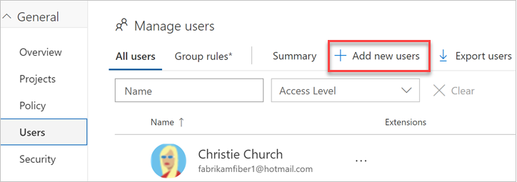
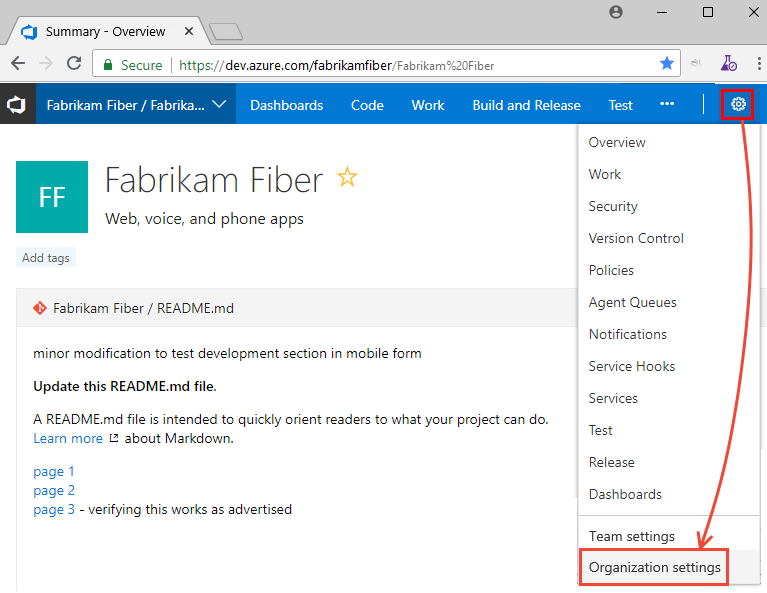

# Add users to your organization or project in Azure DevOps

[!INCLUDE [version-vsts-only](../../_shared/version-vsts-only.md)]

Learn how to add users to your organization and specify the level of features they can use, such as Basic or Stakeholder.
The following types of users can join your organization for free:

* Five users who get [Basic features](https://azure.microsoft.com/en-us/services/devops/compare-features/),
such as version control, tools for Agile, Java, build, release, and more
* Unlimited users who get [Stakeholder features](https://azure.microsoft.com/en-us/services/devops/compare-features/),
such as working with your backlog, work items, and queries
* Unlimited [Visual Studio subscribers](https://azure.microsoft.com/en-us/services/devops/compare-features/)
who also get Basic features, and in some cases, additional features with specific extensions, such as [Test Manager](https://marketplace.visualstudio.com/items?itemName=ms.vss-testmanager-web)

[Need more users with Basic features or Visual Studio subscriptions?](add-basic-or-vs-subscription-users.md)

> [!NOTE]
> You can add people to projects,
> rather than to your organization. They are automatically assigned
> [Basic features](https://visualstudio.microsoft.com/team-services/compare-features/),
> if your organization has seats available,
> or [Stakeholder features](https://visualstudio.microsoft.com/team-services/compare-features/),
> if not. Learn [how to add members to projects](add-team-members.md).
>
> When people don't need access to your organization anymore, [delete them](delete-organization-users.md) from your organization.

## How *access* differs from *permissions*

Access levels control which features are available to users - that is, the full set of organization resources that a user is entitled to access. Permissions then control which of these organization resources the user can act on. To learn more, see [Default permissions and access for Azure DevOps Services and TFS](../../security/permissions-access.md).

## Prerequisites

You need project collection administrator or organization owner permissions. For more information, see [Quickstart: Set permissions at the project level or project collection level](../security/set-project-collection-level-permissions.md?toc=/azure/devops/organizations/accounts/toc.json&bc=/azure/devops/organizations/accounts/breadcrumb/toc.json).

## Add users to your organization

Administrators can now add users to an organization, grant access to appropriate tooling extensions and service access level,
and add users to groups all in one view. You can add up to 50 users at once. You can add more than 50 users by repeatedly
using this Users view. When you add users, each receives a notification email with a
link to the organization page.

 > [!NOTE]
 > If you have an Azure Active Directory (Azure AD)-backed organization, and you need to add users who are external to Azure AD, first [add external users](add-external-user.md) to
 > Azure AD. On the **Tell us about this user page**, under **Type of user**, be sure to choose **User with an
 > existing Microsoft account**. After you complete those steps, use the following steps to add the external Azure AD
 > user to Azure DevOps.

To give other users access to your organization, add their email addresses.

[!INCLUDE [temp](../../_shared/new-navigation-cloud.md)] 

# [New navigation](#tab/new-nav)

1. Sign in to your organization (```https://dev.azure.com/{yourorganization}```).

2. Select  **Organization settings**.

    
 
3. Select **Users** and then select **Add new users** to open the form.

   

4. Complete the form.

   > [!div class="mx-imgBorder"]  
   >

   * **Users**: Enter the Microsoft account's email address for the user organization. You can add several email addresses by separating them with a semicolon (;). Note that in Microsoft accounts, the email addresses appear in red.
   * **Access level**: Leave the access level at **Basic** for users who will contribute to the code base. To learn more, see [About access levels](../../organizations/security/access-levels.md).
   * **Add to projects**: Select the project that you named in the previous procedure.
   * **Groups**: Leave this entry at Project Contributors, the default security group for people who will contribute to your project. To learn more, see [Default permissions and access assignments](../../organizations/security/permissions-access.md).

5. Select **Add** to complete your invitation.

# [Previous navigation](#tab/previous-nav)

1. Sign in to your organization (`https://<yourorganization>.visualstudio.com`).

2. From your web browser, select  and  **Organization settings**.

   

3. Select **Users** > **Add new users** to open the form.

   > [!div class="mx-imgBorder"]  
   >

4. Complete the form.

   

   * **Users**: Enter the Microsoft account's email address for the user. You can add several email addresses by separating them with a semicolon (;). Note that in Microsoft accounts, the email addresses appear in red.
   * **Access level**: Leave the access level at **Basic** for users who will contribute to the code base. To learn more, see [About access levels](../../organizations/security/access-levels.md).
   * **Add to projects**: Select the project that you named in the previous procedure.
   * **Groups**: Leave this entry at Project Contributors, the default security group for people who will contribute to your project. To learn more, see [Default permissions and access assignments](../../organizations/security/permissions-access.md).

5. Select **Add** to complete your invitation.

<!---
Go to Users:


Choose **Add new users** below "Manage users".


Then fill in the "Add new users" dialog:


Next steps: [Manage users in table view](manage-users-table-view.md)
-->

## Related articles

* [Connect to a project](../../organizations/projects/connect-to-projects.md)
* [Change individual permissions, grant select access to specific functions](../../organizations/security/change-individual-permissions.md)
* [Grant or restrict access to select features and functions](../../organizations/security/restrict-access.md)
* [Delete users from Azure DevOps](delete-organization-users.md)
* [Troubleshoot adding and deleting organization users in Azure DevOps](faq-add-delete-users.md)
* [Troubleshoot adding members to projects in Azure DevOps](faq-add-team-members.md)
