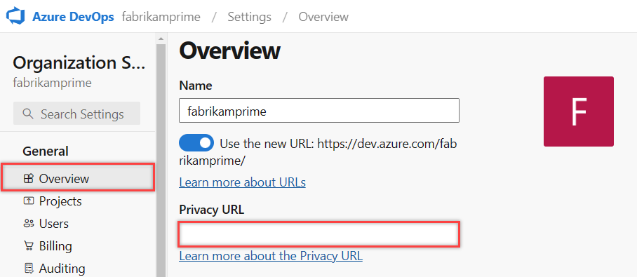

---
title: Add privacy policy URL to comply with the GDPR
titleSuffix: Azure DevOps Services
description: Learn how to add your Organization's privacy policy URL for your public project, which describes how you handle internal and external guest data privacy.
ms.technology: devops-accounts
ms.topic: conceptual
ms.author: chcomley
author: chcomley
ms.date: 06/09/2020
monikerRange: 'azure-devops'
---

# Add a privacy policy URL for your organization

[!INCLUDE [version-vsts-only](../../includes/version-vsts-only.md)]

A privacy policy is a legal requirement for all websites and apps that collect or use personal data from users. Learn how to add your privacy policy URL to your organization in Azure DevOps for public projects. Your privacy policy URL links to your custom document that describes how you handle both internal and external guest data privacy. The custom privacy policy URL displays only in **Organization settings** on the **Overview** page in Azure DevOps. The Microsoft Privacy Statement continues to display throughout Azure DevOps, whether or not you add a privacy policy URL for your organization.

> [!NOTE]
> If you're interested in viewing or deleting personal data, see [Azure Data Subject Requests for the General Data Protection Regulation](/microsoft-365/compliance/gdpr-dsr-azure)(GDPR). If you're looking for general info about GDPR, see the [GDPR section of the Service Trust portal](https://servicetrust.microsoft.com/ViewPage/GDPRGetStarted).

## Prerequisites

You must be a [Project Collection Administrator or an organization Owner](../security/lookup-organization-owner-admin.md) to add a privacy policy URL.

## Add your privacy policy URL in Azure DevOps

1. Sign in to your organization (```https://dev.azure.com/{yourorganization}```).
2. Select  **Organization settings**.
  
   

3. In the **Overview** tab, add your privacy policy URL, and then select **Save**.

   

A link is added to your organization's privacy document.

## Related articles
- [Data Protection Overview](../security/data-protection.md)
- [Azure DevOps data location](../security/data-location.md)
- [Developer Services privacy statement](https://privacy.microsoft.com/privacystatement)
- [Azure DevOps support](https://developercommunity.visualstudio.com/spaces/21/index.html)
- [Developer Services Agreement](../../user-guide/services.md)