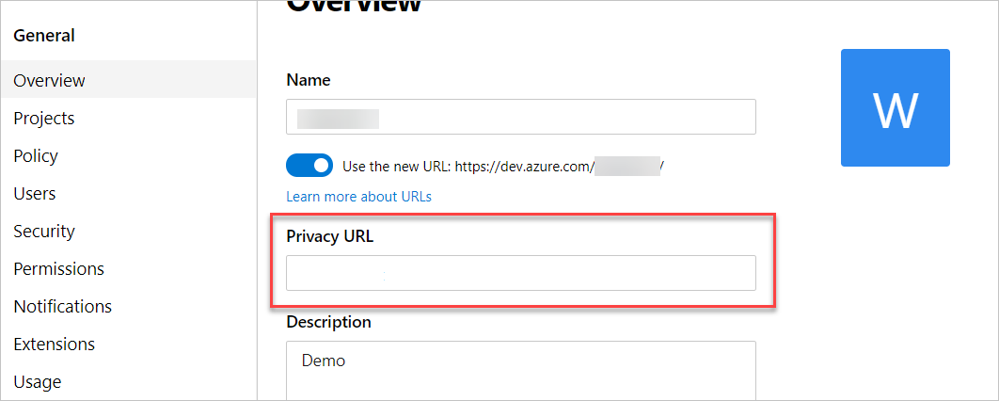

# Add a privacy URL for your organization

[!INCLUDE [version-vsts-only](../../_shared/version-vsts-only.md)]

In this article, we explain how to add your privacy URL to your organization in Azure DevOps. Your privacy URL links to your organization's document that describes how you handle both internal and external guest data privacy. Any member of your organization can add the privacy URL.

> [!NOTE]
> If you're interested in viewing or deleting personal data, please see [Azure Data Subject Requests for the GDPR](https://docs.microsoft.com/microsoft-365/compliance/gdpr-dsr-azure). If you're looking for general info about GDPR, see the [GDPR section of the Service Trust portal](https://servicetrust.microsoft.com/ViewPage/GDPRGetStarted).

## Prerequisites

You need project collection administrator permissions. For more information, see [Quickstart: Set permissions at the project level or project collection level](../security/set-project-collection-level-permissions.md?toc=/azure/devops/organizations/accounts/toc.json&bc=/azure/devops/organizations/accounts/breadcrumb/toc.json).

## Add your privacy URL in Azure DevOps

1. Sign in to your organization (```https://dev.azure.com/{yourorganization}```).
2. Select  **Organization settings**.
  

3. In the **Overview** tab, add your privacy URL, and then select **Save**.

   

A link is added to your organization's privacy document.

To learn more about how we manage and protect your data, read our [Data Protection Overview](../../organizations/security/data-protection.md).