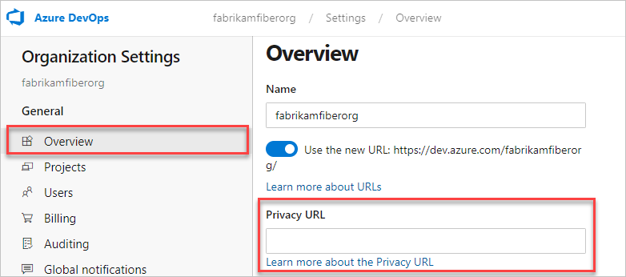

# Add a privacy URL for your organization

[!INCLUDE [version-vsts-only](../../_shared/version-vsts-only.md)]

In this article, we explain how an admin can add your privacy URL to your organization’s Azure Active Directory (Azure AD) tenant, through the Azure portal.

> [!NOTE]
> If you’re interested in viewing or deleting personal data, please see [Azure Data Subject Requests for the GDPR](https://docs.microsoft.com/en-us/microsoft-365/compliance/gdpr-dsr-azure). If you’re looking for general info about GDPR, see the [GDPR section of the Service Trust portal](https://servicetrust.microsoft.com/ViewPage/GDPRGetStarted).

## Add your privacy URL in Azure AD

1. Sign in to the [Azure portal](https://portal.azure.com) as a tenant administrator.
2. On the left navbar, select **Azure Active Directory**, and then select **Properties**.

   

3. Add your privacy URL. Enter the link to your organization’s document that describes how your organization handles both internal and external guest data privacy.
4. Select **Save**.

You can view your privacy URL via Azure DevOps Organization settings.

