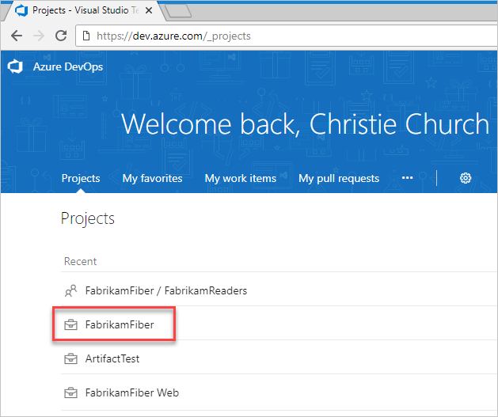
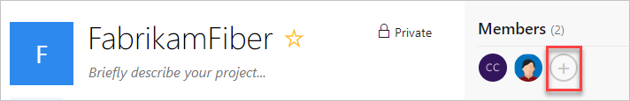

# Add project members in VSTS

**VSTS**

Add members to your project in VSTS, 
so you can share code and work with your team, track their status,
coordinate dev, build, test, and release activities, and more.
For Team Foundation Server, learn [how to add project members here](../../organizations/security/add-users-team-project.md).

When you add members to projects,
VSTS automatically assigns
[Basic access](https://visualstudio.microsoft.com/team-services/compare-features/),
if your organization has seats available, 
or [Stakeholder access](https://visualstudio.microsoft.com/team-services/compare-features/),
if not. When a [Visual Studio subscriber](https://visualstudio.microsoft.com/products/subscriber-benefits-vs)
signs in, they'll get Basic access, and in some cases, additional features with specific extensions,
like [Test Manager](https://marketplace.visualstudio.com/items?itemName=ms.vss-testmanager-web).

> [!NOTE]
> To manually assign access levels,
> [add members to your organization instead](add-organization-users-from-user-hub.md).
> To control access to organization resources, see [Change individual permissions, grant select access to specific functions](../../organizations/security/change-individual-permissions.md) or [Grant or restrict access to select features and functions](../../organizations/security/restrict-access.md).

## Prerequisites

If you don't have a project yet,
[create your project first](../projects/connect-to-projects.md).
To add members to projects, you'll need
[project administrator](../security/set-project-collection-level-permissions.md),
[project collection administrator, or organization owner](faq-add-team-members.md#find-pca-owner) permissions.

## Add members to your project

[!INCLUDE [temp](../../work/_shared/new-agile-hubs-feature.md)] 

# [New navigation](#tab/new-nav)

1. Sign in to your VSTS organization (```https://{yourorganization}.visualstudio.com```) as project administrator, project collection administrator, or organization owner.

   [Why am I asked to choose between my "work or school account" and my "personal account"?](faq-add-team-members.md#ChooseOrgAcctMSAcct)

2. On the landing page (which is your projects page ```https://{yourorganization}.visualstudio.com/_projects```), select your  project.

   

3. Invite members to your project.

   

4. Enter user and team information, and then choose **Add**. 

    

---

# [Previous navigation](#tab/previous-nav)

1. Sign in to your VSTS organization (```https://{yourorganization}.visualstudio.com```) as project administrator, project collection administrator, or organization owner.

   [Why am I asked to choose between my "work or school account" and my "personal account"?](faq-add-team-members.md#ChooseOrgAcctMSAcct)

2. On the organization landing page (which is your projects page, ```https://{yourorganization}.visualstudio.com/_projects```), find and select your project.

   

3. Invite members to your new project...

    

   Or invite them to an existing project.

   

    Adding members from the project page adds them to the default team for the project.

    a. To add a member to a different team, choose the gear cog and **Security** from the menu.

    b. Find the team on the left pane of the security page and select it.

    c. In the right pane, choose the **Members** view (next to **Permissions**), and then you will see a green plus symbol and the **Add...** button.

4. Add your team members.

   

5. Enter the email addresses for your new users, separated by semi-colons. Otherwise, enter the display names for existing users. Add them one at a time or all at once.

	Which email addresses can I add?
	 * If your VSTS organization is Azure Active Directory backed, then you can only add email addresses that are
	 internal to the tenant.
	
	 * You must add email addresses for users who have ["personal" Microsoft accounts](https://www.microsoft.com/account) 
	unless your VSTS organization [uses your organization's directory](faq-add-team-members.md#ConnectedDirectory) 
	to authenticate users and control organization access through 
	[Azure Active Directory (Azure AD)](https://azure.microsoft.com/documentation/articles/active-directory-whatis/). 
	If new users don't have Microsoft accounts, have them [sign up](https://signup.live.com/).

    * If your VSTS organization is connected to your organization’s directory, all users must be directory members and sign in to VSTS with work or school accounts that are managed by your organization’s directory. If they are not members, they will need to be [added to the directory](https://docs.microsoft.com/en-us/vsts/organizations/accounts/add-external-user?view=vsts).

	

	 	

	After you add members to your project, 
	each member gets an invitation email that 
	links to your VSTS organization. 
	They can use this link to sign in to your organization 
	and find your project.
	First-time members might be asked for extra details 
	when they sign in to personalize their experience.

    What if new team members don't receive or lose the invitation email?

    **Azure AD-backed organization**: If you're [inviting a user from outside your Azure AD](https://docs.microsoft.com/en-us/azure/active-directory/active-directory-b2b-what-is-azure-ad-b2b), the user must use the email. Removing a user from the VSTS organization will remove both the access and license from the user. However, any artifacts that were assigned to this user remain unchanged. You can always invite the user back into the organization if the user exists in the Azure AD tenant. Once the user is removed from Azure AD, you will not be able to assign any artifacts (work items, pull requests etc..) to this user. We will preserve the history of artifacts that as already been assigned to this user.

    **MSA-backed organizations**: You can send a link to the project page to the new team members, which is what the email contains. Removing a user from the VSTS organization will remove both the access and license from the user. You will not be able to assign any artifacts (work items, pull requests, etc.) to this user anymore. However, any artifacts that were assigned to this user remain unchanged.

	[Why can't I add any more members?](faq-add-team-members.md#cant-add-users)

## Next steps

* [Connect to a project](../projects/connect-to-projects.md)
* [Change individual permissions, grant select access to specific functions](../../organizations/security/change-individual-permissions.md)
* [Grant or restrict access to select features and functions](../../organizations/security/restrict-access.md)

## Related articles

* [VSTS pricing](https://azure.microsoft.com/pricing/details/visual-studio-team-services/)
* [VSTS billing support](https://visualstudio.microsoft.com/team-services/support/)