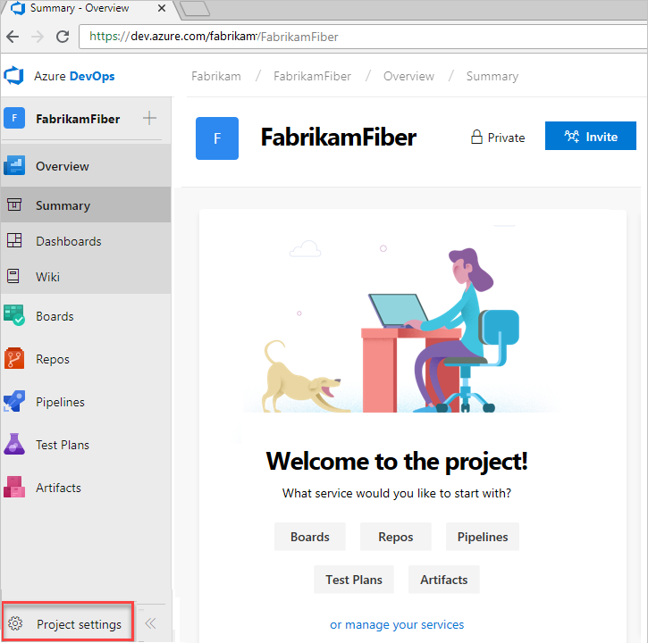
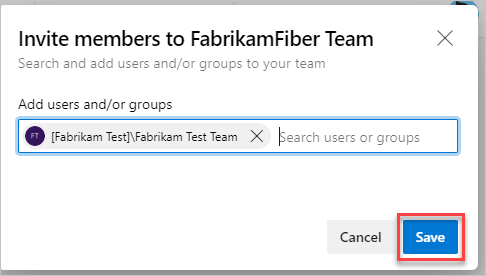

# Add members to projects

[!INCLUDE [version-vsts-only](../../_shared/version-vsts-only.md)]

Add members to your project in Azure DevOps, so you can share code and work with your team, track their status, coordinate dev, build, test, and release activities, and more. For Azure DevOps Server, see [Add users to a team or project](../../organizations/security/add-users-team-project.md).

When you add members to projects, one of the following permissions is automatically assigned:

* [Basic access](https://visualstudio.microsoft.com/team-services/compare-features/),
if you have seats available.
* [Stakeholder access](https://visualstudio.microsoft.com/team-services/compare-features/),
if you *don't* have available seats.

When [Visual Studio subscribers sign in](https://visualstudio.microsoft.com/products/subscriber-benefits-vs), they get Basic access. Additional features are provided with specific extensions, such as [Test Manager](https://marketplace.visualstudio.com/items?itemName=ms.vss-testmanager-web).

> [!NOTE]
> To manually assign access levels, [add members to your organization](add-organization-users.md). To control access to resources, see [Change individual permissions, and grant access to specific functions](../../organizations/security/change-individual-permissions.md) or see [Grant or restrict access to selected features and functions](../../organizations/security/restrict-access.md).

## Prerequisites

* If you don't have a project yet, first [create your project](../projects/connect-to-projects.md).
* To add members to projects, you need [*project administrator*](../security/set-project-collection-level-permissions.md), [*project collection administrator*, or *organization owner*](faq-add-team-members.md#find-pca-owner) permissions.
* If your new members don't have a Microsoft account, have them [sign up for an account](https://signup.live.com/).

## Add members to your project

1. Sign in to your organization (`https://dev.azure.com/{yourorganization}`) as *project administrator*, *project collection administrator*, or *organization owner*.

   [Why am I asked to choose between my "work or school account" and my "personal account"?](faq-add-team-members.md#ChooseOrgAcctMSAcct)

2. On the landing page, which is your Projects page, select   **Project settings**.

   

3. Invite members to your project.

   

4. Add users or groups.

    

 Enter the email addresses of the new users, separated by semicolons, or enter the display names of existing users. Add them one at a time or all at once.

Which email addresses can I add?

* If your organization is connected to Azure Active Directory, you can add only email addresses that are internal to the directory.

* Add email addresses of users who have ["personal" Microsoft accounts](https://www.microsoft.com/account) unless you [use your organization's directory](faq-add-team-members.md#ConnectedDirectory) to authenticate users and control access through [Azure Active Directory (Azure AD)](/azure/active-directory/fundamentals/active-directory-whatis).

* If your organization is connected to your directory, all users must be directory members. They must sign in to Azure DevOps with work or school accounts that are managed by your directory. If they aren't members, they need to be [added to the directory](add-external-user.md).

  

  After you add members to your project, each member gets an invitation email that links to your organization. They can use this link to sign in to your organization and find your project. First-time members might be asked for extra details when they sign in to personalize their experience.

  What if new team members don't receive or lose the invitation email?

  * **Organizations connected to Azure AD**: If you're [inviting users from outside your Azure AD](/azure/active-directory/active-directory-b2b-what-is-azure-ad-b2b), they must use the email. Removing users from the organization removes both their access and their license. However, any artifacts that were assigned to them remain unchanged. You can always invite users back into the organization if they exist in the Azure AD tenant. After they're removed from Azure AD, you can't assign any artifacts (work items, pull requests, and so forth) to them. We preserve the history of artifacts that have already been assigned to the users.

  * **Organizations with Microsoft accounts**: You can send a link to the project page, which the email contains, to the new team members. Removing users from the organization removes both their access and their licenses. You can no longer assign any artifacts (work items, pull requests, and so forth) to these users. However, any artifacts that were assigned to them remain unchanged.

   [Why can't I add any more members?](faq-add-team-members.md#cant-add-users)

## Next steps

* [Connect to a project](../projects/connect-to-projects.md)

## Related articles

* [Change individual permissions, and grant access to specific functions](../../organizations/security/change-individual-permissions.md)
* [Grant or restrict access to specific features and functions](../../organizations/security/restrict-access.md)
* [Azure DevOps pricing](https://azure.microsoft.com/pricing/details/devops/azure-devops-services/)
* [Azure DevOps billing support](https://azure.microsoft.com/support/devops/) 