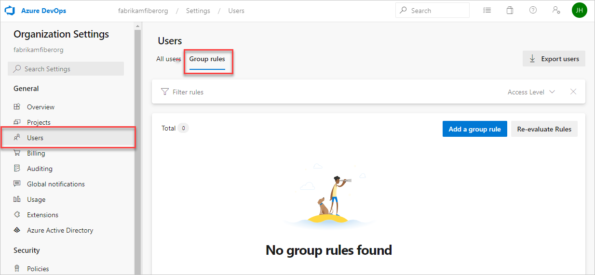

# Add a group rule to assign access levels and extensions

[!INCLUDE [version-vsts-only](../../includes/version-vsts-only.md)]

Azure DevOps includes group-based licensing for Azure Active Directory (Azure AD) groups and Azure DevOps groups. You can add a group rule to assign an access level or extension to a group. Resources in Azure DevOps are assigned to all members of the group. Group rules can also be used to add users to team projects and other specific groups, like Contributors, Readers, and Administrators.

When users leave the group, the licenses are freed and returned to your pool. You don't need to automate license management to reflect changes in your organizational structure on a per-user basis.

> [!NOTE]
> We recommend that you reevaluate rules regularly on the **Group** rules tab of the **Users** page. Clarify whether any group membership changes in Azure AD might affect your organization. Automated reevaluation occurs every six hours and any time the group rule changes.

## Prerequisites

To manage licenses and group rules, you must be a Project Collection Administrator (PCA) for the organization. If you're not a member of the **Project Collection Administrators** group, [get added as one](../../organizations/security/set-project-collection-level-permissions.md).
To assign an extension to a user (and consequently, a group) a PCA must first [install the extension](../../marketplace/install-extension.md) on the organization.

## Add group rule

1. Sign in to your organization (```https://dev.azure.com/{yourorganization}```).

2. Select  **Organization settings**.

   

3. Go to the **Permissions** tab, and then check the membership of the **Project Collection Administrators** group.

   

4. Go to the **Users** tab, and then select **Group rules**. This view shows you all of your created group rules.

   

5. Select **Add a group rule**.

   

6. Complete the dialog box for the group for which you want to create a rule. Include an access level for the group and any optional project access or extensions for the group. Select **Add**.

   

A notification displays, showing the status and outcome of the rule. If the assignment couldn't be completed (for example, because your organization didn't have enough purchased licenses), select **View status** to see the details.


> [!IMPORTANT]
> Group rules only apply to users without direct assignments and to users added to the group going forward. [Remove direct assignments](#remove-direct-assignments) so the group rules apply to those users.

## Manage group members

1. Highlight a group rule and from the command bar, select **Manage members**.

   

   > [!NOTE]
   > Leave existing automation for managing access levels or extensions for users running as-is (for example, PowerShell). The goal is to reflect the same resources that the automation is applying to those users.

2. Add members, and then select **Add**.

   

When the same access level or extension is assigned to the user, both directly and through a group, the user consumes only one access level or extension. No additional licenses are required.

## Verify group rule

- Verify that the resources are applied to each group. On the **Group rules** tab, look to the top right for the Summary.

   :::image type="content" source="media/assign-access-levels/group-rule-summary.png" alt-text="Select Group rules, highlight rule and see the summary to the right":::

- Verify individual user resources. On the **Users** tab, look to the top right for the Summary.

## Remove direct assignments

To manage a user's resources only by the groups that they're in, you must remove the direct assignments. Resources that are directly assigned to a user via individual assignment stay assigned to the user, whether the resources are assigned or taken away from the user's groups.

> [!NOTE]   
> To enable the new user interface for the New user hub, see [Enable preview features](../../project/navigation/preview-features.md).

#### [Preview page](#tab/preview-page) 

1. Sign in to your organization (```https://dev.azure.com/{yourorganization}```).

2. Select  **Organization settings**.

   

3. Select the **Users** tab.

   

4. Select all users with resources that should be managed only by groups.

   

5. To confirm that you want to remove the direct assignments, select **Remove**.

   

Direct assignments are removed from the users.

> [!Note]
> If a user isn't a member of any groups, then the user isn't affected.

#### [Current page](#tab/current-page)

1. Sign in to your organization (```https://dev.azure.com/{yourorganization}```).

2. Select  **Organization settings**.

   

3. Select the **Users** tab.

   

4. Select all users with resources that should be managed only by groups.

   

5. To confirm that you want to remove the direct assignments, select **Remove**.

Direct assignments are removed from the users.

> [!Note]
> If a user isn't a member of any groups, then the user isn't affected.

* * *

## Related articles

* [Buy and install extensions](../../marketplace/install-extension.md)
* [Install Active Directory and Azure Active Directory users or groups to a built-in security group](../security/add-ad-aad-built-in-security-groups.md)


