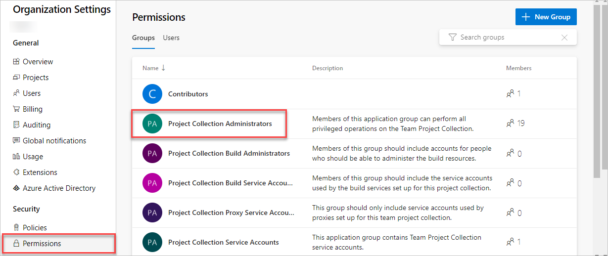
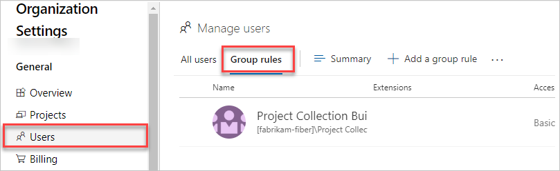
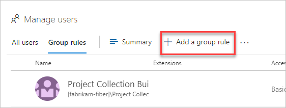
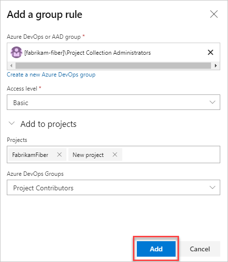
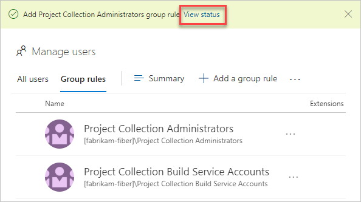

# Add a group rule to assign access levels and extensions to users

[!INCLUDE [version-vsts-only](../../_shared/version-vsts-only.md)]

Azure DevOps includes group-based licensing for Azure Active Directory (Azure AD) groups and Azure DevOps groups. You can assign an access level or extensions to a group. Resources in Azure DevOps are assigned to all members of the group. Group rules are used only for *licensing* and not for permissions.

When users leave the group, the licenses are freed and returned to your pool. You don't need to automate license management to reflect changes in your organizational structure on a per-user basis.

## Prerequisites

To manage licenses and group rules, you must be a project collection administrator (PCA) for the organization. If you're not a member of the **Project Collection Administrators** group, [get added as one](../../organizations/security/set-project-collection-level-permissions.md).
To assign an extension to a user (and consequently, a group) a PCA must first [install the extension on the organization](../../marketplace/install-extension.md).

## Assign required licenses

1. Sign in to your organization (```https://dev.azure.com/{yourorganization}```).

2. Select  **Organization settings**.

   

3. Go to the **Security** page and check the membership of the **Project Collection Administrators** group.

   

4. Select **Users** > **Group rules** . This view shows you all of your created group rules.

   

5. Select **Add a group rule**.

   

6. Complete the dialog box for the group for which you want to create a rule. Include an access level for the group and any optional project access or extensions for the group. Select **Add**.

   

A notification is displayed that shows the status and outcome of the rule. If the assignment couldn't be completed (for example, because your organization didn't have enough purchased licenses), select **View status** to see the details.



## Resolve assignment errors

As users sign in to your organization, they're assigned access levels and extensions based on their group memberships. If there aren't enough licenses or extensions to assign the specified resources to the user, based on their group memberships, Azure DevOps notifies all **Project Collection Administrators** via email that further resources need to be purchased. To find users in an error state, the Project Collection Administrator can do the following steps:

1. Go to the **Users** page in **Organization settings**. A notification on the page indicates there are users who are missing extensions or basic access levels.
2. To see how many of each resource are missing, choose **Fix assignment errors**.
3. Complete purchases for any missing resources, and then choose **Fix errors** to have the purchases automatically assigned to the specified users.

## Related articles

* [Buy and install paid extensions](../../marketplace/install-paid-extension.md)
* [Install Active Directory and Azure Active Directory users or groups to a built-in security group](../security/add-ad-aad-built-in-security-groups.md)